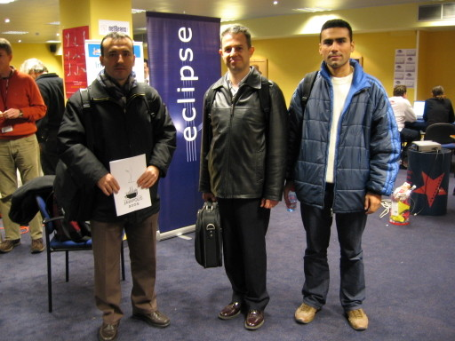
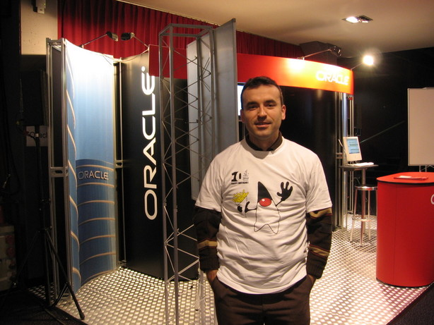
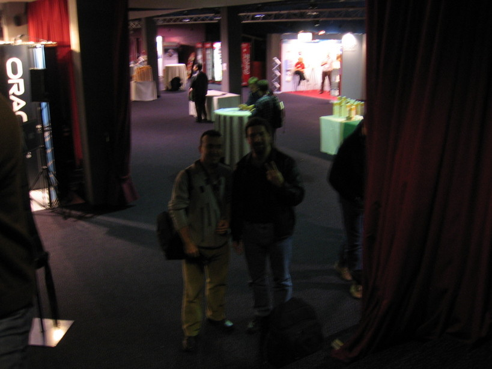
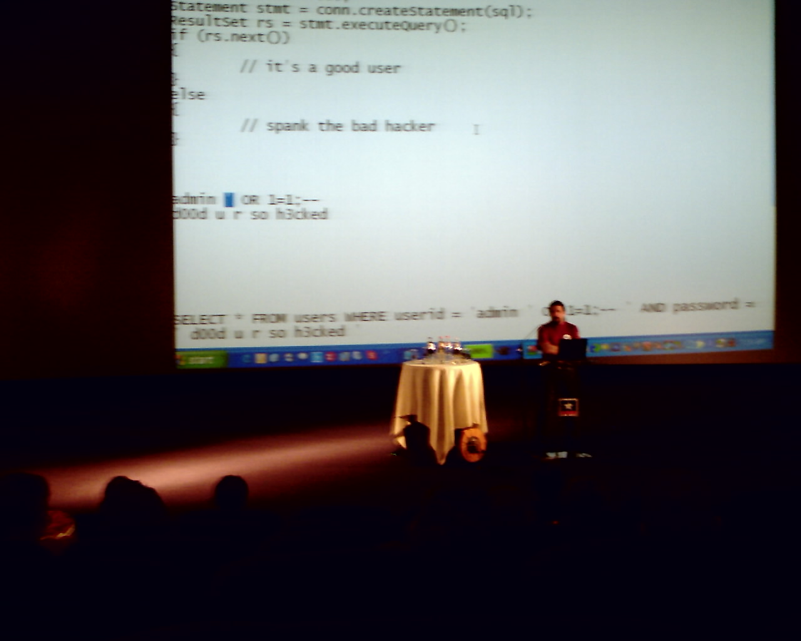
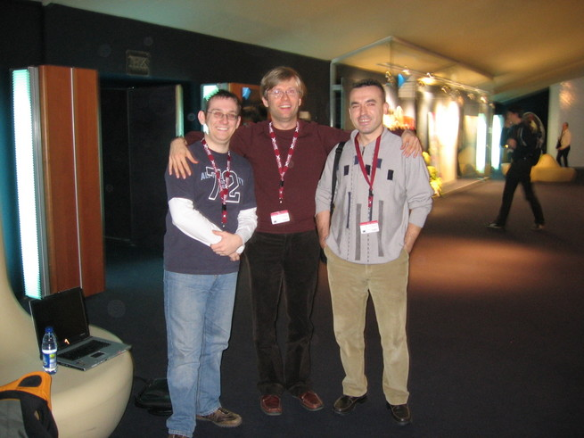
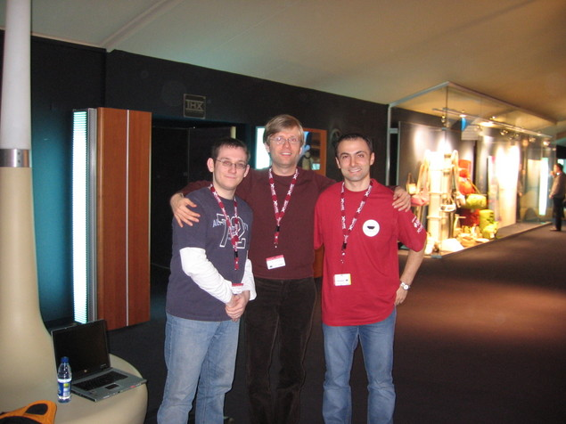
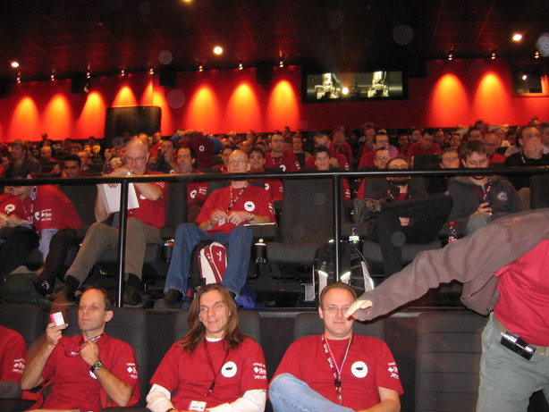
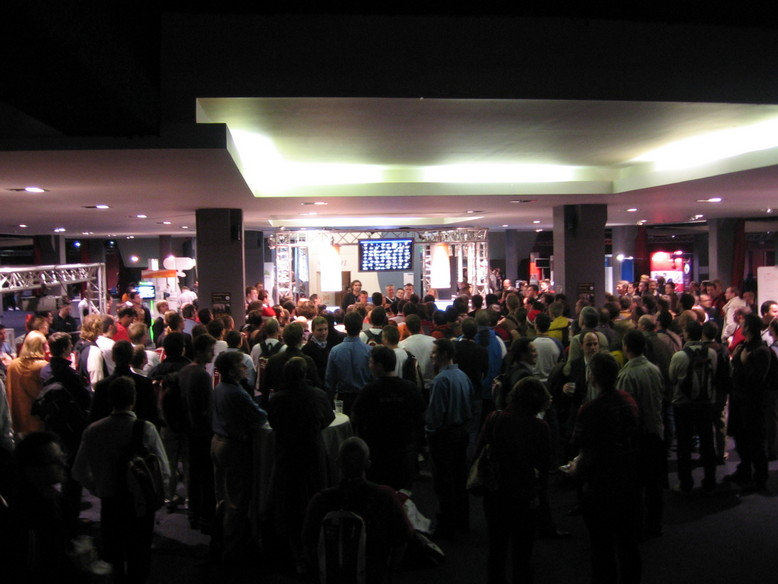
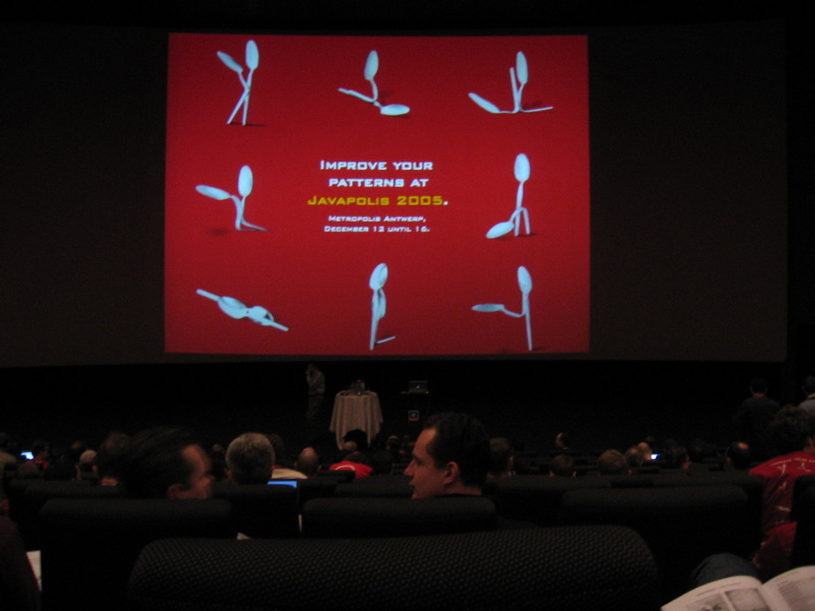

# Notes and Pictures from JavaPolis 2005 – Part I
This year, I had a chance to attend `JavaPolis 2005` in Antwerpen, Belgium with 3 of my colleagues. I want to provide day 
by day information about this year's workouts, and other interesting happenings in my blog. This year's activity had 
consisted mainly of University, Conference, BOF, Quicky sessions and lasted 5 days between 12th and 16th of December.

|   |   |
|---|---|
| Kenan Sevindik, H. Faruk Safi, and Hasan Türksoy  | Kenan Sevindik  |

When I recall presentations from University sessions, held on days Monday and Tuesday, the best one I remember immediately 
is *Effective Enterprise Java* by Ted Neward. It took almost 3 hours, and he presented ideas, which are very useful for 
anyone who works on enterprise software system development and deployment. He delivered the content, which consists of 
items from his samely named book, in such a funny and laughing manner that, at the end of the presentation, we all decided 
that this book is a must-read for all enterprise software developers.

|   |   |
|---|---|
| Kenan Sevindik, Ted Neward  | Ted Neward, during his presentation, showing sql injection attack  |

The other presentation I attended on Tuesday was from Spring Team, namely *Spring Business Tier*. Rob Harrop and Jürgen 
Höller together performed this one. They mentioned about upcoming features with Spring 2.0 release. Those newest features 
are about xsd enabled xml bean definitions, xml tags for commonly used elements in Spring bundle, and the possibility to 
define and use custom bean tags, new AOP support, included in Spring, with newest aspect-oriented programming capabilities, 
using AspectJ directly with Spring Framework, and about synchronous and asynchronous JMS messaging support.

|   |   |
|---|---|
| Rob Harrop, Jürgen Höller, Kenan Sevindik  | Rob Harrop, Jürgen Höller, Nurettin Çetinkaya  |

Wednesday was the first day of JavaPolis 2005 conferences. Stephan Janssen, chairman of BEJUG, gave a welcome speech in 
the morning. He mentioned that more than 2000 attendees were present this year, and they were distributed in more than 40 
different countries all over the world, except from Portugal. The presentation made by Jeff Jackson from Sun Microsystems 
followed this opening talk. Sun guys threw java t-shirts against the audience by means of their homemade "weapon"! The 
other thing I remember from this talk was a failed JSF demo, performed by a Java Technical Director using Sun Java Studio 
Creator. The last talk in the opening ceremony came from one of BEA's staff, Bill Roth. He made a little joke about that 
fiasco by saying, "Today, demo God isn't very happy, so I won't perform any demo in my talk," and indicated the previous 
failure of Sun's executive staff in a funny way.

I was totally upset with JBoss's Seam presentation on Wednesday. Thomas Heute performed incredibly bad in his talk. What 
I remember from this presentation was only, he said in a French accent that, "JSF is a great technology, EJB 3.0 is also 
a great technology, but there are some missing parts in this view, and Seam will close the gap," and if my mind doesn't 
mislead me now, we weren't able to see more slides related to Seam than JSF or EJB 3.0 in general. I recalled Henry Ford's 
infamous saying, "I am ready to provide you with a new car, as long as you prefer a black and four doors one" here. JBoss 
looks like trying to make people only use JSF and EJB 3.0, and only with their application server in this area. Okay, 
Thomas also said that, it was possible to replace JSF with any other web framework, and EJB 3.0 with any other persistency 
framework, and application server just with Tomcat for example, but there were no solid indicators of those promises in 
the scene as far as Seam's short life was considered.

|   |   |
|---|---|
| JavaPolis 2005 attendees  | Scene from JavaPolis Booths  |

The other catastrophe of Wednesday was EJB 3.0 Simplified Components presentation. I guess Linda De Michiel had little or 
no preparation at all for her EJB 3.0 talk this year because the whole stuff looked as if almost the same as the previous 
year's slides! After Linda's turn, Mike Keith appeared on the scene. He revealed a sentence, stating that choosing between 
annotations and XML-based deployment descriptors is a matter of personal taste. Hence, he reduced annotations to an ordinary 
level by saying so. One could probably ask him, why then we have all looked for a mechanism in order to get rid of all 
those DD hell, otherwise it would be just good enough to invest more in XDoclet philosophy. David Geary, during his Shale 
presentation, criticized such an understanding of the whole annotations concept with a little joke.

I wouldn't skip this day without mentioning Neal Gafter and Joshua Bloch's presentation, called *More Java Puzzles*. Their 
performance really deserved a big applause. Well, actually, I wasn't able to correctly answer any of their 8 Java puzzles, 
anyway the whole talk was very entertaining. They had worn blue worker dressings and were looking in them like auto mechanics. 
What about calling them as "heavy java workers with blue collars"?

|   |
|---|
|JavaPolis 2005 Spoonsutra :)|

The last talk I attended on Wednesday was David Geary's *Shale, the Next Struts*. His presentation has partially cleared 
some of my negative opinions about JSF. JSF has definitely missing functionalities in several areas of the presentation 
layer and Shale aims to close those gaps, in some way or other, and David presented those efforts in a very neat way during 
his talk. The presentation consisted of topics, including client and server-side validations, based on Commons Validator 
Framework, reusable views, derived from Tapestry, and Web Flows, which are also inspired from Spring Framework's Web Flow. 
David joked about this situation by saying something similar that, "We have stolen reusable views from Tapestry, and web 
flow from Spring, too." At the end of the Shale presentation, I might say yes for JSF + Shale combination, but only without 
IBM JSF implementation, and RSA IDE, which is a real memory and CPU exhauster. I would prefer MyFaces open-source JSF 
implementation, and a lightweight ide, such as MyEclipse or Exadel Studio. They are just good enough for many real projects. 
By the way, I had just forgotten to say that Struts and Shale have no relationship at all, except in terms of their developers!
