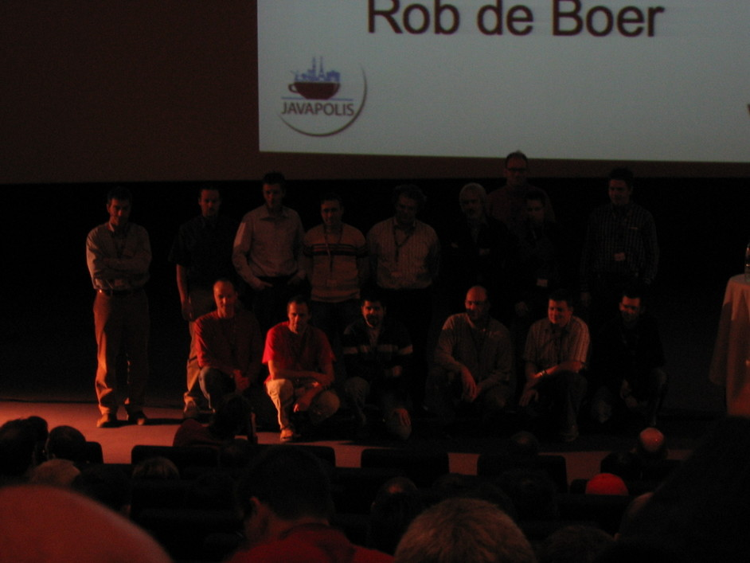
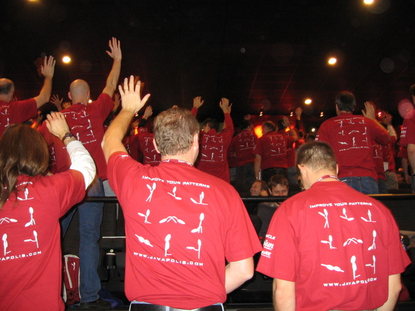
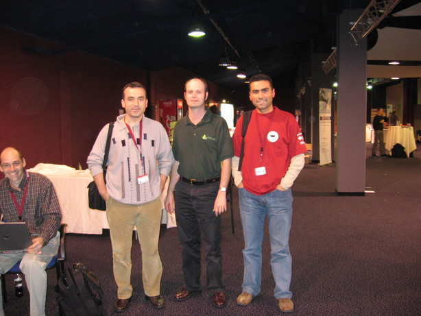
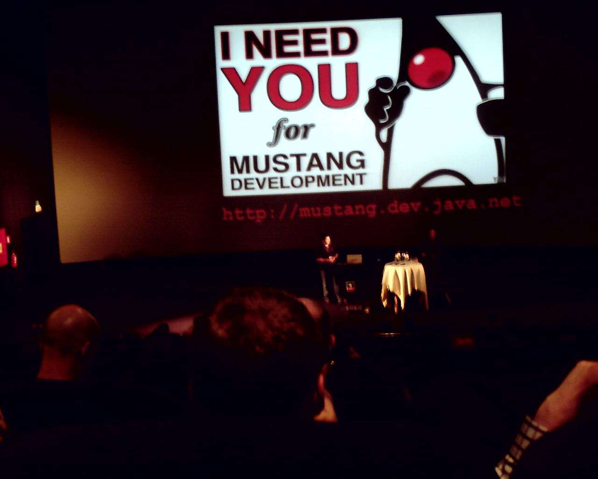
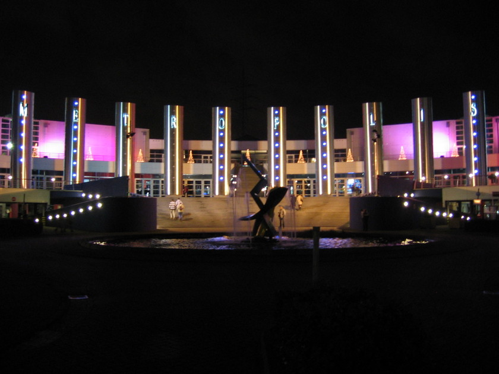

# Notes and Pictures from JavaPolis 2005 – Part II
[..Continued from Part I](20051226_notes-and-pictures-from-javapolis-2005-part-i.md)
Thursday morning was opened with Stephan’s speech again, and continued with RAD Race results, into which 24 teams attended, 
and 19 of them were able to produce some sort of deliverable versions in just 12 hours. There were 3 distinct teams, honored 
as winners by the jury. What was more interesting with that result was that, two of the winning teams had employed `Oracle ADF` 
components and `JDeveloper` in their development. I am still confused about the result, as it looks like an indisputable 
approval of JDeveloper.

|   |   |
|---|---|
|  RAD Race Results |  JavaPolis 2005 T-Shirts :) |

Spring Update presentation, from Rod Johnson, was probably one of the most awaited talks during this year’s conference.
Unfortunately, Rod’s presentation was mainly composed of some executive stuff, advertisement for `Spring-BEA` partnership, 
and some technical content, some of which had previously appeared during Rob and Jürgen’s presentation on Tuesday. Upcoming 
M1 release of `Spring 2.0` looks mainly like polishing the old version up and having some add-ons to JMS support, except 
for `AspectJ` integration. AspectJ integration with Spring and the joining of Adrian Colyer to Spring team looks like many 
of innovations in Spring will give birth in AOP field. `BeanConfigurer` in `aspectj` package, for example, configures 
beans and performs dependency injection into them after they are instantiated, even outside Spring’s application context. 
There is already a hot discussion about the use of `BeanConfigurer` to solve an anemic domain model problem in Craig Walls’ 
blog. Anyway, Rod’s overall performance was above average, and in my opinion, the most vital moment of his talk was 
emphasizing `Spring 2.0`’s `JDK 1.3` compatibility, in addition to newly added many `J2SE 5.0` specific features in the 
framework.

|   |
|---|
| Kenan Sevindik, Rod Johnson, Hasan Türksoy  |

I also attended Teodor Danciu’s `Jasper Reports` in Action presentation on Thursday. I was especially interested in this 
session, as we have recently developed a small reporting framework, based on `Jasper Reports`, and employed it to solve 
a relatively complex reporting requirement. Teodor announced in this talk of his and `iReport Designer’s` join to 
`JasperSoft`. Even though they have joined to JasperSoft, he said that both of the products will be kept as open source. 
Teodor talked in his session about new and upcoming features of `Jasper Reports`. Some of the most interesting ones are 
as follows: crosstabs, which have dynamic rows and columns used to display aggregated data, special dataset support for 
charts and crosstabs, as they simply require data that the containing report doesn’t simply iterate over, remote image 
delivery in HTML exports with servlets is possible, at last RTF generation is also available from now on, large page size 
problem is also solved with serializing a large number of report pages during report generation, only keeping a limited 
number of pages in memory at one time, direct `HQL` support added and so on. I asked Teodor, during Q&A part, if he 
considers adding support for inheriting resource bundle and font definitions of sub-reports from their master reports, 
and he found the idea very interesting. My other question was if supporting different types of data sources in one report 
at the same time would be possible in the future releases. Teodor’s approach to this concept is to solve this problem with 
employing sub-reports. In short, we have to employ a new sub-report every time when we need a new data source. I guess 
that this is a rather architectural choice of `Jasper Reports`, and doing it the other way may probably require a 
considerable amount of effort.

On the closing day, I preferred to attend three case study sessions and Cameron Purdy’s Distributed Caching talk. We 
started Friday morning with Fabiane Bizinella Nardon’s presentation from Brazil. She mentioned their enterprise project, 
called Brazilian Health System. It has been built upon `J2EE` technologies. It was very impressive that such a huge system 
had just gone into deployment and production after 4 months of the development period. She started talking with the 
requirements of the system and continued with explaining their architecture and technologies applied in each layer, `Struts` 
for presentation, `Session Beans` for business, and some `Entity Beans`, just because of some legacy requirements, and 
`POJOs` for data access layers. She emphasized that they preferred automatic code generation wherever possible, first with 
`XDoclet`, then with `Java 5 annotations`, and said that this approach had greatly helped their developers’ productivity. 
During the first period of the project, `XDoclet` was just good enough to generate codes automatically, up to some point, 
where the build process took almost 13 minutes. At that moment, they had decided on switching to annotations from `XDoclet` 
tags and turned their build process into an incremental manner with the help of annotations. They also coded their project 
compatible with `EJB 3.0 annotations`, and just generated `EJB 2.x` compatible wrappers from those codings at the moment, 
but by doing so, they expect a smooth migration path to `EJB 3.0` when it becomes ready for production.

|   |
|---|
|Call for Participating Mustang Development   |

The other case study that I liked to see was Thomas Huusom Christensen’s Zero Calories `J2EE` presentation from Denmark. 
He didn’t mention anything very different than the current state of the art related to developing web applications, using 
technologies like `Tapestry`, `Spring`, and `Hibernate`. What I liked in his session was problems mentioned about and 
solutions, especially with lazy loading, detached objects, and approaches to solve them by using `OpenSessionInViewFilter`, 
Hibernate’s initialize, load, and merge methods, etc., were almost identical to ones in our current project. During the 
presentation, I sometimes just thought that I were listening to experiences learned from our project.

Finally, I want to finish my blogging about JavaPolis 2005 with a common saying, appeared at the end of each presentation. 
If you remember only one thing, this year’s organization in terms of its content and speakers wasn’t as good as the previous 
year’s one. Anyway, we had a very nice week in Metropolis, found a chance to meet with many people from Java community, 
and learn what is new from the first hands. Thanks for all guys who involved in such an organization.

|   |
|---|
| Metropolis Business Center at Night  |
