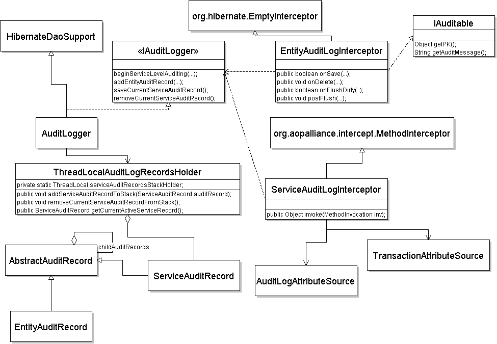
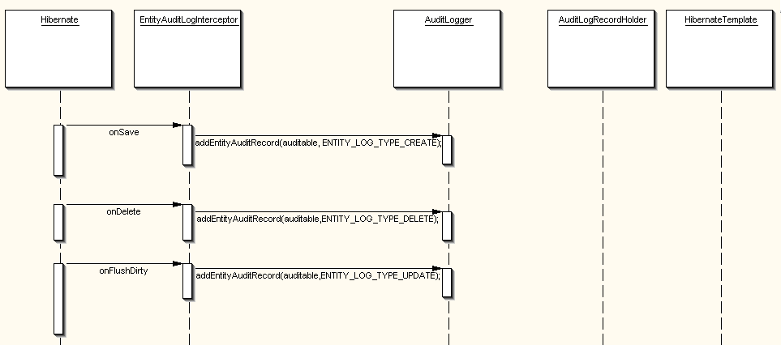
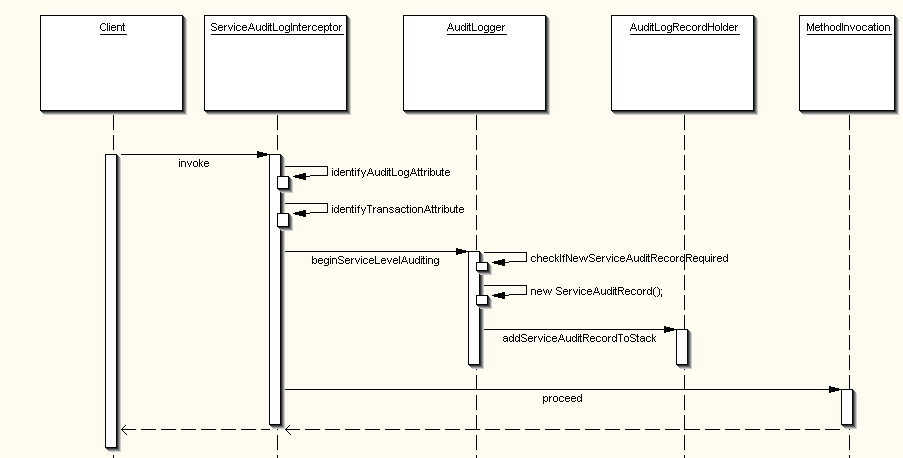
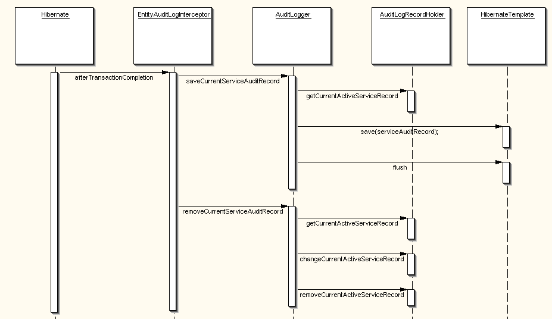

# Audit Logging at Service Level
### What is Service Level Auditing?

Many enterprise business applications have such requirements that they should log their users’ operations; who performs 
and when, records that are inserted into, deleted from database, or are changed during those operations, with a meaningful 
description about current state of those records. Hibernate already provides an interceptor mechanism at `SessionFactory` 
level. Hibernate fires events indicating new records are inserted, old ones are deleted, detection of updates, and other 
events related with transaction status, session flush etc. By that way one can easily track changes on persistent entities 
in his application.

I had actually wrote a blog entry about using Hibernate Interceptor, and summarized our experiences while using it in 
developing an auditing infrastructure. It easily identify, and track users’ activities at the level of persistent entities, 
but this is too fine grained when we look at them at the level of use case scenarios. For example, let’s take so common 
money transfer example between two accounts. When a user transfers some amount from account A to account B, there occurs 
two update operations on those account objects, which result in two separate audit log entries in the database. What is 
worse is that, those two audit entries are totally unrelated from each other. When someone wants to examine past audit 
entries, it will be very difficult for him to drive a useful information from that raw data. He will only see changes on 
those two account objects, but possibly won’t be able to conclude that those changes are related with the money transfer 
operation. We need to interrelate those two changes at a higher level than that fine grained entity level.

### Enabling Service Level Auditing Decleratively

Service level operations look as good candidates in order to make this interrelation, because they usually correspond 
directly to use case scenarios. If we create an audit log entry at the beginning of a service method, then we can somehow 
connect those entity level audits with it, and finally persist them all in database. Yes, as you probably noticed that 
such an auditing operation is obviously a middleware issue, and like many other middleware issues, it is also a crosscutting 
concern. We could easily deal with such a requirement using AOP constructs. I personally, very satisfied with aopallience’s 
`MethodInterceptor` mechanism for implementing concerns before and after method invocations.

Moreover, we need a way to indicate our interceptor to begin a service level auditing operation at the beginning of method 
execution, and it would be very flexible to do this in a declerative way. Commons attributes is a nice tool in order to 
implement such a declarative mechanism. We could easily define audit log directives as attributes, which indicate start 
of service level auditing. They might also be used to provide additional information about auditing, such as type of 
operation, some explanation about current operation etc. Type information is simply defined in terms of business domain 
of application, for example, money transfer, account creation etc.

### Main Components of Our Solution

The following class diagram depicts main parts of the solution. Service level and entity level auditing work together, 
and in a close coordination with `IAuditLogger` interface, which actually performs creation, and persistence of audit log 
records.



`ServiceAuditLogInterceptor` starts auditing at service level by delegating actual work to `AuditLogger` class. We need 
to clarify something right here. Service beans are obviously stateless, and may serve many clients simultaneously. Between 
the begining and end of current service method execution, each client may perform many entity level operations concurrently. 
We somehow need to isolate resulting audit informations of clients from each other. As each client request is handled in 
a separate thread context, a `ThreadLocal` variable is a good candidate to keep temporary audit data. We have created an 
`AuditLogRecordsHolder` utility class, in which we define a `ThreadLocal` variable, in order to safely keep audit data 
during service, and dao operations.

### An Example: Transferring Money form One Account to Another

It will be easier to explain internal workings of service level auditing with the help of a simple example. This will also 
help those who want to employ auditing in their projects. Let’s take our previously mentioned topic; transferring money 
between two accounts. First of all, we need to distinguish auditable objects from others,as `EntityAuditLogInterceptor` 
intercepts save, update, delete operations performed on all objects managed by Hibernate. It will then selectively create 
audits only for those objects that are marked as auditable. We have created `IAuditable` interface for this puspose.

```java
public interface IAuditable {
    public Object getPK();
    public String getAuditMessage();
}
```

### How `EntityAuditLogInterceptor` Logs Save, Update and Delete Operations that Occur on Entities?

In our example we have create `Account` in our domain model, and want to log operations performed on objects of that `Account` 
type. Therefore our `Account` class should implement `IAuditable` interface. There are two methods in `IAuditable` that 
need to be implemented. `getPK()` method returns primary key information of domain object. `getAuditMessage()` method 
returns descriptive information about object that is being audited, simply it will appear in audit log record.
```java
public class Account implements Serializable, IAuditable {
 	private Long id;
 	private Integer balance;
 	private String name; 

    //other code... 

	public Long getPK() {
        return id;					
    }  

    public String getAuditMessage() {
  		return "Account :" + name + ", with balance :" + balance;
 	}
}
```
We have already identified our auditable type, and come to a point that we need a way to get notified when there occurs 
a change (save, update, delete, or if you want on select) on those persistent objects. Our `EntityAuditLogInterceptor` 
simply extends `org.hibernate.EmptyInterceptor` that also implements `org.hibernate.Interceptor`. EmptyInterceptor provides 
with empty implementations of method declerations in `Interceptor` interface. The following code piece samples what we do 
when a new entity is saved, an old one is deleted, or is identified as dirty(ie. updated). `EntityAuditLogInterceptor` 
receives those events, and checks current persistent entity whether it implements `IAuditable` interface. If it is an 
auditable object already, then it delegates the work to `AuditLogger` to create a new `EntityAuditRecord` for that entity.
```java
public class EntityAuditLogInterceptor extends EmptyInterceptor{
 
 	protected Log logger = LogFactory.getLog(getClass());
 
 	private IAuditLogger auditLogger;
 
 	public boolean onSave(Object entity, Serializable id, Object[]state, String[] propertyNames, Type[] types) {
 		if(entity instanceof IAuditable) {
  		 	getAuditLogger().addEntityAuditRecord((IAuditable)entity, AuditLogConstants.ENTITY_LOG_TYPE_CREATE);
 	 	}
  		return false;
 	}		public void onDelete(Object entity, Serializable id, Object[]state, String[] propertyNames, Type[] types) {
  		if(entity instanceof IAuditable) {
  		 	getAuditLogger().addEntityAuditRecord((IAuditable)entity, AuditLogConstants.ENTITY_LOG_TYPE_DELETE);
		}
 	}
 
 	public boolean onFlushDirty(Object entity, Serializable id, Object[] currentState, Object[] previousState, String[] propertyNames, Type[] types) {
  		if(entity instanceof IAuditable) {
   			getAuditLogger().addEntityAuditRecord((IAuditable)entity, AuditLogConstants.ENTITY_LOG_TYPE_UPDATE);
  		}
  		return false;
 	}

	//...
}
```
The following diagram shows the sequence of operations mentioned above.



So far so good. We are already able to intercept changes on our persistent entities, and create audit log records for any 
changes that occur on them. However, we are at a point that we create log records at entity level, and those audits are 
independent and unaware of each other. Therefore, we need a mechanism to interrelate those audits with each other and with 
their belonging business service so that user activities could be tracked on a higher level. As stated at the begining 
part of this article, service methods are very good candidates for this. What we need is to provide a non intrusive way 
to activate auditing at service level so that we can trace activities of our users in a more meaningful manner.

We declare a service interface for those account related business operations. It is named as `IAccountService` as shown 
below.
```java
public interface IAccountService {
  
 	/**
  	* @@com.ksevindik.auditing.attribute.AuditLogAttribute(com.ksevindik.auditing.AuditLogConstants.SERVICE_LOG_TYPE_CREATE)
  	* @@org.springframework.transaction.interceptor.DefaultTransactionAttribute (propagationBehaviorName="PROPAGATION_REQUIRED")
  	*/ 
 	public void transferMoney(Integer amount, Account srcAccount, Account destAccount);
}
```
You may have already noticed that we make use of commons attributes to declare our `transferMoney` method both as 
transactional and auditable. What we have to do in `AccountService` class is only to implement business logic of `transferMoney` 
method.
```java
public class AccountService implements IAccountService {
    private IAccountDAO accountDAO;
 
    public void transferMoney(Integer amount, Account srcAccount, Account destAccount) {
        int tempVal = srcAccount.getBalance().intValue() - amount.intValue();
		srcAccount.setBalance(new Integer(tempVal));
  		tempVal = destAccount.getBalance().intValue() + amount.intValue();
		destAccount.setBalance(new Integer(tempVal));
  
		getAccountDAO().update(srcAccount);
		getAccountDAO().update(destAccount);
	}
}
```
The business logic is very simple here. We extract given amount from source account object’s balance, and add it to target 
one’s, and than call account DAO object’s update method for both of them. `AccountHibernateDAO` simply delegates update 
operation to `HibernateTemplate` as you see below.
```java
public class AccountHibernateDAO extends HibernateDaoSupport implements IAccountDAO {  
    public void update(Account account) {
		getHibernateTemplate().update(account);
	}	 
}
```
We employ `ServiceAuditLogInterceptor` to manage start of auditing at service level. It is a `MethodInterceptor` that 
intercepts some method invocations and enables developers to perform operations just before and after of those invocations. 
Creating and configuring those interceptors using Spring Framework is a really easy task. You only need to define for 
which beans those interceptors should be created, and Spring provides those beans as wrapped by interceptors to client 
code using its dependency injection mechanism.
```xml
<bean id="autoProxyCreator" class="org.springframework.aop.framework.autoproxy.BeanNameAutoProxyCreator">
    <property name="beanNames">
        <value>*Service</value>
    </property>
    <property name="exposeProxy">
        <value>true</value>
    </property>
    <property name="interceptorNames">
        <value>serviceAuditLogInterceptor,transactionInterceptor,debugInterceptor</value>
    </property>
</bean>

```
Spring provides `BeanNameAutoProxyCreator` to create proxies for the beans, which are specified with matching `beanNames` 
attribute and wraps those beans with listed interceptors. Above application context configuration piece shows that beans 
with the name suffix of `Service` will be intercepted with both `serviceAuditLogInterceptor`, and `transactionInterceptor` 
instances in the written order.

### What Happens When `ServiceLevelAuditLogInterceptor` Intercepts a Method Invocation?

The following sequence diagram shows what happens when `ServiceAuditLogInterceptor` intercepts any method based on above 
criteria. It first try to identify available auditing and transaction attributes for that method in the containing class 
or interface, then delegates creation of a new `ServiceAuditRecord` to `AuditLogger` class. `AuditLogger` decides on 
creating a new `ServiceAuditRecord` instance if current method is executing inside a transaction and there is no other 
active `ServiceAuditRecord` exist in `AuditLogRecordsHolder`. Finally, our interceptor proceeds with its normal method 
invocation.



### How Do We Save Audit Information at the End?
After starting service level auditing, all entity level operations in the current transaction are logged by 
`EntityAuditLogInterceptor` until transaction completes. When transaction is completed, either it is commited or is 
rollbacked, Hibernate calls `afterTransactionCompletion` method of `EntityAuditLogInterceptor`. `EntityAuditLogInterceptor` 
checks status of completed transaction, and if TX is commited it calls `saveCurrentServiceAuditRecord()` method of 
`AuditLogger`. `AuditLogger` gets current active `ServiceAuditRecord` from stack and persist it using `HibernateTemplate`. 
Finally, `EntityAuditLogInterceptor` removes current `ServiceAuditRecord` so that logs belonging to rollbacked transactions 
won’t be persisted.



Some service beans that enable auditing may call other service beans’ methods that may also trigger auditing. Currently 
we only create a new `ServiceAuditRecord` when a new transaction is created for those service methods. For example `methodA` 
may be a top level service method that is transactional and auditable. Hence, only some other method called directly or 
indirectly from `methodA`, which has a Spring’s transaction attribute `PROPAGATION_REQUIRES_NEW` will trigger creation of 
a new `ServiceAuditRecord`. Otherwise, all entity level activities will be logged under `ServiceAuditRecord` instance of 
`methodA`.

We currently provide following Audit logging operation types for both service and entity level audits. It is always possible 
to extend this constant list, and define new constants for your specific needs. Our current example actually creates its 
own `AccountAuditLogConstants` interface and define `SERVICE_LOG_TYPE_MONEY_TRANSFER` constant.
```java
public interface AuditLogConstants {
 	public static final int ENTITY_LOG_TYPE_READ = 0;
 	public static final int ENTITY_LOG_TYPE_CREATE = 1;
 	public static final int ENTITY_LOG_TYPE_UPDATE = 2;
 	public static final int ENTITY_LOG_TYPE_DELETE = 3;
 
 	public static final int SERVICE_LOG_TYPE_READ = 4;
 	public static final int SERVICE_LOG_TYPE_CREATE = 5;
 	public static final int SERVICE_LOG_TYPE_UPDATE = 6;
 	public static final int SERVICE_LOG_TYPE_DELETE = 7;
 
 	public static final int SERVICE_LOG_TYPE_LOGIN = 8;
 	public static final int SERVICE_LOG_TYPE_LOGOUT = 9;
}
```

### Conclusion

Auditing is a commonly appearing requirement in many enterprise business applications, and it is an ordinary middleware 
issue that need to be solved in a non-intrusive way. Spring Framework and Hibernate together provide a nice infrastructure 
for us to implement such a requirement in generic and reusable fashion. As a result, developers are only in charge of 
implementing an interface for entities that need auditing, and pointing start of auditing at service level on it.

You can find source code of service level auditing with a simple example [here](#). There might be slight differences 
between sequence diagrams and actual executing code, as I had reshaped code after writing this article. Anyway, you 
shouldn’t have a great difficulty in using service level auditing in your project.
