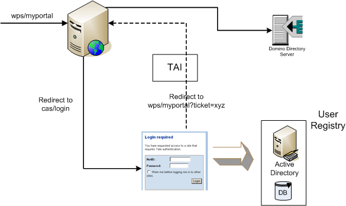

# Delegating Websphere Portal Authentication to CAS via Trust Association Interceptor (TAI)
In our current enterprise project, we have a single sign-on requirement, and IBM Portal is planned to be used as the main 
gateway in our system. Basically, we need to provide an authentication mechanism through which users should only need to 
log in to the portal and then be able to access all of their authorized web applications without being authenticated again. 
They could also be able to access those web applications directly if they know their URLs; this time, they have to get authenticated before using any of them.

We have chosen to use Central Authentication Service (CAS), which is an open-source enterprise web single sign-on application, 
in order to implement our SSO requirements. We have also chosen Acegi Security Framework as our security infrastructure 
and are very happy with it. We have many security requirements that are very common to many enterprise systems and are 
able to resolve them easily via Acegi. Acegi also has support for Central Authentication Service.

The problem here was to integrate IBM Portal with our security infrastructure. IBM provides a single sign-on mechanism 
among its family of products based on LTPA token. We didn’t want to depend on such a solution as it is more specific to 
IBM products. CAS provides a much less intrusive and more open platform SSO mechanism.

Luckily, IBM Websphere Application Server provides an interceptor mechanism called Trust Association Interceptor (TAI) 
in its security infrastructure. Basically, WAS supports identity assertion instead of requiring proof of identity. Clients 
pass identity information to WAS via TAI, and WAS trusts that passed identity information and doesn’t require authentication 
further. Once authentication has occurred, it creates an LTPA token and sends it as a session cookie to the user’s browser. 
As a result, other IBM products, such as portal, get authenticated via this LTPA token automatically.

The following diagram shows our IBM portal and CAS SSO integration architecture via TAI. I want to explain what is going 
on when an unauthenticated request arrives at our portal.



When an unauthenticated request comes to the portal’s main page (`wps/myportal`), normally users are redirected to the 
portal’s login page. In our solution, we modified that login page and redirected users automatically to the CAS’s login 
page, providing the portal’s main page URL (`wps/myportal`) as the CAS service URL.

When users arrive at the CAS login page, they provide their credential information, and CAS authenticates them by looking 
at our user registry. In our system, we have users both defined in Active Directory and in a relational database. This 
user registry structure brings some oddness to portal-Active Directory integration, but I will mention it later.

If CAS has authenticated users successfully, it redirects them to the service URL (`wps/myportal`), by the way, providing 
a service ticket as a request parameter.

TAI is configured to get activated and begin its work when it sees that ticket request parameter in coming requests.
```java
public boolean isTargetInterceptor(HttpServletRequest request) throws WebTrustAssociationException {
        String value = request.getParameter("ticket");
        boolean result = StringUtils.isNotEmpty(value);       

        return result;
}
```
If
it sees the ticket request parameter, it begins its work. Basically, what it does in its public
`TAIResult negotiateValidateandEstablishTrust(HttpServletRequest request, HttpServletResponse response)` method is
explained below:
- First, it extracts the service ticket value from the request and validates it through the CAS validation URL.
- Then, it looks for user information via received netid from CAS validation process through Domino Directory Server, which is configured as a user registry for IBM portal. The reason behind using it instead of Active Directory lies in our user registry configuration as I said above, and I will mention it later on.
- If it doesn’t find any entry corresponding to the current netid, it creates one user definition, utilizing our current user information, which resides either in Active Directory or a relational database. If the portal were using Active Directory and Active Directory were our user registry alone, there wouldn’t be such a step here.
- It prepares a JAAS subject corresponding to that user entry in Domino Directory Server.
- Finally, it returns a successful `TAIResult`, containing that `Subject` instance in it.

After the return of TAI, the portal trusts that authentication information and lets the user get into its main page. 
Following user queries necessary for portal execution are done through Domino Directory Server, which is configured as 
the portal’s user registry.

As a result, we have a cleanly integrated IBM portal into our SSO infrastructure, and from that point on, the portal can 
be seen as if an ordinary web application in our big picture!
