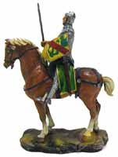

# Kıssadan Hisse

Mevlana’nın Mesnevi adlı eserinde bir hikaye vardır. Günlerden birgün cins bir ata binmiş silahlı iri cüsseli bir er 
ormana dalmış gidiyordu. Usta bir okçu onu görünce yayını gerdi, onu vurmaya hazırlandı. Oku fırlatmadan hemen önce, er 
bunu fark ederek:

– “Sakın görünüşüme bakıp aldanma ben savaş eri değilim,” diye bağırdı.

Bunun üzerine okçu:

– “Az kalsın seni vuracaktım, haydi yürü git işine,” dedi ve onu vurmaktan vazgeçti.

Mevlana hikayenin sonunda der ki: “Zaloğlu Rüstem’in silahlarını bile kuşansan ehli olmadıktan sonra canından olursun.”

İşte kıssadan al hisseyi misali yazılım geliştirmede kullanılan araçlar, yöntemler ve süreçler bu erin silahları gibidir. 
Önemli olan ekibin bilgisi ve deneyimidir. Ekip sahip olduğu bu silahları hangi durumda nasıl kullanacağını biliyorsa ancak 
o zaman bu silahlardan bir fayda beklenebilir. Aksi takdirde çalışanların ve projenin doğasına uymayan yöntemleri ve 
süreçleri ittire kaktıra uygulatmak, probleme uygun olmayan teknolojileri ve geliştirme araçlarını kullanmak, kodlamaya 
hiç faydası olmayan ve gerçeklerden uzak analiz ve tasarım raporları ile yazılımcıları boğmak, haftaları hatta ayları heba 
etmek, UML ile diagramlar çizmek vs. nihai aşamada yazılımın prematüre doğmasına hatta hiç doğmamasına neden olacaktır.

Unix Power Tools kitabında hoş bir benzetme vardı. Unix45’lik bir magnum gibidir. Ne yaptığını bilen kullanıcı ister. 
Şayet ne yaptığınızı tam olarak bilmiyorsanız, Unix ile kendi kendinizi vurmanız işten bile değildir.