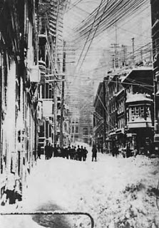

# Telegraph Road

I am a big fan of the British music band Dire Straits. Their “Telegraph Road” song is among the ones I like the most and 
listen to over and over again. It tells the story of a lone man settling down in the wilderness, and his followers coming 
one after the other. It traces the development of a big city out of a small community, all the way down to Telegraph Road.

It is hard to say that Java Specification Groups have learned enough lessons from the history of development. A long time 
ago, the Servlet specification came with its own pack, then came JSP, and then came Portlet specifications. Unfortunately, 
all those aim to be bricks on the wall and well integrated with each other; however, the reality is a big disappointment.

Take the Servlet Filter mechanism as an example. Although portlets are valid JEE web applications, there is no way for 
Filters, defined in the web.xml, to get applied when a portlet request comes in. Hence, people all around the community 
started to develop “patches” to accommodate this necessity. Spring Portlet MVC employs HandlerInterceptor, or Apache tries 
to simulate them with PortletFilters.

When the JSF specification arrived in town, it just appeared that nobody had cared enough to leave room for healthy growth. 
We need to employ “legacy” bridges to make our JSF-enabled portlets work within portals. The Portlet specification assumed 
that content is not a full web page, but only a fragment of it. Some JSF developers, on the other hand, developed codes 
that expect full-page content to operate. Just look at those ExtensionsFilter and AddResource stuff in MyFaces.

The Portlet specification says that a portal is a web application in addition to being a portlet container, and individual 
portlets could also be separate web applications, as mentioned above. But that’s all; they didn’t go further, didn’t settle 
down enough rules for how communication between the portlet container and its individual portlets will be performed, and 
left us in a fog.

I think we wait for lawyers to arrive first, and then rules will come along.
