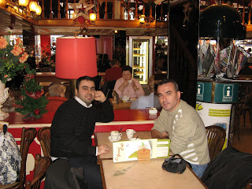
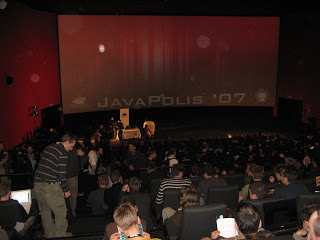
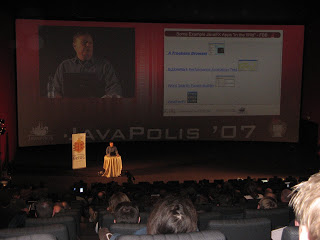

# JavaPolis07-1
Bir sene aradan sonra tekrar Belçika’da düzenlenen Javapolis’07 konferansına katıldım. Bu sene biraz daha erken orada 
olup konferans öncesi Brüksel’de dolaşmak istedim. Şimdiye kadar sadece mesajlardan birbirimizi tanıdığımız, bir süredir 
orada çalışan ve turkishcontractors google grubunun kurucusu Mesut Çelik’i ziyaret etme fırsatı buldum. Mesut ile Pazar 
günü Brüksel’de bulutuk, kısa bir şehir turundan sonra bir kafede oturup hem sohbet ettik, hemde sıcak birşeyler içtik.

Mesut ile konuşmamızdan ve de hafta içi konferanstaki pek çok insanla diyaloglarımdan gördüğüm kadarı ile Avrupa’da 
nitelikli yazılımcılara çok ciddi talep var. Özellikle güncel teknolojilere hakim programcılar açısından cazip iş 
olanakları gözüküyor. Pek çok Avrupa’lı firma artık yazılım projelerini Hindistan gibi yerlere outsource etmekten 
vazgeçiyor. Şu ana kadar bu yöntemin iletişim ve proje yönetimi ağırlıklı pek çok sorun çıkardığı ve bu problemlerin 
proje maliyetlerini ve iş kalitesini ciddi manada olumsuz yönde etkilediği görüşündeler. Ayrıca Hindistan’daki ücretlerin 
de oldukça yükseldiğini belirtiyorlar. Bunun yerine ya fiziksel olarak kendileri ile beraber çalışacak yazılımcıları 
Avrupa’ya getirmeyi, ya da daha rahat iletişim kurdukları ve maliyet olarak da daha düşük ücretlerle çalışan eski doğu 
bloku ülkelerinin yazılımcılarına yöneliyorlar.

Bu seneki Javapolis’de katılmayı planladığım konuların başında OSGI geliyordu. OSGI aslında değişik sistemlerin standard 
bir biçimde birbirlerine bağlanmasını, bir network oluşturup sistem özelliği sergilemelerini hedefliyor. Bu nedenle de 
sık sık JINI ile kıyaslanıyor. Ancak zaman içerisinde OSGI, enterprise Java dünyasındaki modülarite probleminin çözümüne 
yönelik bir evrime maruz kalmış durumda. OSGI ile enterprise uygulamaların dinamik olarak yönetilebilen modüller şeklinde 
geliştirilebilmesi hedefleniyor. OSGI ile sistemin çalışması kesintiye uğramadan yeni modüllerin eklenebilmesi, 
çalıştırılabilmesi, diğer modüllerden bazılarının durdurulması veya kaldırılması, aynı modülün birden fazla versiyonunun 
sistem içerisinde birbirlerini etkilemeden çalışabilmesi sağlanıyor. Hali hazırda Eclipse platformu OSGI üzerine kurulmuştur. 
OSGI, Java dünyasındaki kronikleşmiş classpath ve classloading problemlerine de çözüm olarak görülüyor. Pazartesi günü 
akşam OSGI ile ilgili bir BOF oturumu düzenlendi. BOF’lar kanaatimce gün içerisindeki oturumların pek çoğundan daha verimli 
olabiliyor. Bu BOF’da OSGI hakkında genel bir fikir sahibi olmak, OSGI’ın hali hazırda enterpise Java dünyasına doğru dümen 
kırması ile ilgili olarak tartışmak açısından çok verimli geçti. BOF sırasında sorulan bir soru OSGI’ın şu an için 
enterprise Java projelerinde tam olarak kullanılabilir bir platform sunmadığını ortaya koyması açısından önemliydi. 
Katılımcılardan birisi, Log4J’yi bir OSGI bundle olarak sisteme deploy etmek istiyordu. Diğer OSGI bundleları da bu Log4j 
bundleından log servisi alacaklardı. Bu bundleların loglama ile ilgili bilgileri Log4j bundleına geçmeleri için log4j.xml 
dosyalarını kullanmak istiyordu. Ancak mevcut “bundle dependency modeli”nde, Log4j bundle hiç bir biçimde diğer 
bundle’lardan haberdar olamadığı için bunların sağladığı konfigürasyon doslayarına da erişemiyordu. Sonuç olarak mevcut 
pek çok açık kaynak kodlu kütüphane ve framework OSGI ugumlu olmadığı için enterprise Java uygulamalarında OSGI şu an için 
çok kolay uygulanabilir gözükmüyor. Ancak konuşmacılardan Sergei ile daha sonra bu konuyu tartıştığımızda OSGI komitesinin 
gidişatın farkında olduğunu, yakın dönemde bu tür problemleri adreslemek için çalışmalar yapacağını öğrendim. Cuma günü 
de OSGI komitesinin önde gelenlerinden Peter Kriens’in bir sunumu vardı. Kriens’in sunumu da OSGI hakkında genel bir fikir 
edinmek ve OSGI’ın bundan sonraki yol haritasını öğrenmek açısından faydalı oldu. Kriens sunumunda Sun’ın pek çok yarım 
yamalak JSR ile OSGI’ın dinamik modül konseptini baltalamaya çalışmasından şikayet edip, kronik sorunlara birbirlerine 
benzer konularda birbirlerinden habersiz biçimde çözüm üretmeye çalışan JSR’ler ile çözüm getirilemeyeceğini belirtti.

SOA burada da “hot topic” konular arasında yer alıyordu. Pazartesi günü “Open Source ESBs” oturumuna katıldım. Oturum da 
Apache ServiceMix, Mule ESB ve OpenESB çözümleri üzerinde duruldu. Bugünlerde “Spring enabled” veya Spring’i desteklemek 
anahtar kelimelerden. ESB cözümleri, hatta daha sonra bahsedeceğim clustering çözümleri sürekli bu özelliklerini 
vurguluyorlar. Perşembe günkü “Mule 2 and Beyond” oturumunda Mule hakkında daha geniş bilgi sahibi olma fırsatı yakaladım. 
Açık kaynak kodlu ESB çözümleri arasında gördüğüm kadarı ile Mule konfigürasyon ve kullanım kolaylıkları açısından 
diğerlerinden daha önde gözüküyor. SOA çözümlerinde farklı sistemlerin ne kadar kolayca bir araya getirilip birbirleri 
ile konuşturulabildiği en önemli nokta olarak gözüküyor. Mule, version 2 ile konfigürasyon işlemlerini olabildiğince 
sancısız hale getirmeye gayret ediyor.

Konferans boyunca yine çok konuşulanlar arasında yer alan konulardan birisi olan Seam ile ilgili olarak “Seam in Action” 
oturumu vardı. Doğrusu Seam kafamdaki geliştirme platformunda yer almıyor. Ancak birinci ağızlardan Seam ne durumda, neleri 
hedefliyor ve rakibi Spring Web Flow ile kıyaslamada bilgi sahibi olabilmek niyetiyle oturuma katıldım. Oturumda Seam 
hakkında genel bilgilerin ve yeniliklerin yanında ilk dönemlerinden itibaren Seam ile proje geliştiren bir ekibin olumlu 
olumsuz deneyimlerini de dinleme fırsatımız oldu. Seam’ı Spring Web Flow’la olan yarışında öne çıkaran nokta conversation 
boyunca EntityManager nesnesinin (Hibernate Session) tutulması ile Hibernate dünyasındaki baş ağrıtıcı lazy initialization 
ve sesssion closed problemlerinin önüne geçmeye daha önceden başlamış olmasıdır. Aslında bu yaklaşım Hibernate’in ilk 
zamanlarındaki Session’ları uzun süre açık tutmanın kötü bir pratik olarak sayılması ile çelişiyordu. Bu nedenle pek çok 
web uygulaması “Session per Request” yaklaşımını uygulamıştır. Ancak detached nesne problemi o kadar baş ağrıtıcı bir hale 
dönüştü ki şimdilerde session per conversation patternı hem Seam’da hem de Spring Web Flow’da kullanılmaya başlandı. 
Spring Web Flow 2 bu konuya mimarisel değişiklikler ile eğiliyor. Ancak Seam’i benim için olumsuz kılan en önemli noktalar 
kendisini başından beri sadece JSF ve EJB kullanımını promote etmeye yönelik olarak konuşlandırmasıydı. Bu yaklaşımında 
da herhangi bir değişiklik göremedim.

Javapolis’07 deki en büyük hayal kırıklığım JSF ile ilgili oturumların kalitesizliği oldu. JSF 2.0’ın spec co-lead’ı olan 
Ed Burns’ü konuşmacılar arasında görünce JSF ile ilgili önemli tip ve trickler hakkında bilgi sahibi olabileceğimi, 
JSF 2.0 spesifikasyonu ile framework’ün yeni rotasını etraflıca görebileceğimi düşünmüştüm. Salı günkü “Be Productive with JSF” 
oturumuna Ed Burns yanında Brezilyalı bayan bir konuşmacı ile beraber katıldı ve oturum seviyesi JSF 101’i geçemedi. Ucuz 
bir Netbeans demosu da cabasıydı. Brezilyalı hanım oturum sırasında bol bol hatıra fotoğrafı çekti. Bu tür organizasyonlarda 
“I was here!” demek sanırım başka yerlerde oldukça prim yapıyor. Oturumun son 45 dk’sında kahve almak için dışarıya çıktım 
ve geri dönmedim. Perşembe günkü “JSR 314 Java Server Faces 2.0” oturumunda Ed Burns yanlızdı, ama Brezilyalı hatun da 
peşindeydi. Farkındayım iş biraz paparazziliğe döndü ama ne yapalım. Malesef Ed Burns bu oturumu da havadan sudan konulardan 
bahsederek geçiştirdi. Yeni spesifikasyonla ilgili düşündüklerinden birisini de Facelets modifikasyonu ile göstermeye çalıştı. 
Yeni spesifikasyon korkarım hali hazırda üretilmiş çözümlerin bir derlemesinden ve Ajaxification ihtiyaçlarına birkaç çözüm 
getirmekten öteye gitmeyecek gibi.

Perşembe günü Emmanuel Bernard’ın “Hibernate Search” oturumuna katıldım. Emmanuel gerçekten güzel bir sunum ve demo yaptı. 
Hibernate Search ile normal SQL sorgularıyla ancak platform dependent yapılabilecek ve yine de sınırlı kalacak metin tabanlı 
sorgulamaların Hibernate Search ile nasıl kolayca yapılabildiğini örnekledi. Hibernate Search gördüğüm kadarı ile hemen 
her uygulamada karşımıza çıkan bu tür sorgulamalar için Hibernate ve Lucene üzerine güzel bir çözüm sunuyor. Lucene ile
metin tabanlı sorgulamalar yazmak mümkün. Ancak karmaşık bir nesne modelinin indekslenmesi, bu indekslerin güncel tutulması,
indeks yapısı ile nesne model arasındaki uyumsuzluğun izale edilmesi gibi zorluklardan dolayı bir ara katmana ihtiyaç 
duyuluyor. Hibernate Search ile nesne ve indeks eşleştirmesi otomatik olarak yapılıyor, indeksler transparan biçimde 
yönetiliyor ve klasik sorgulama API’si aynen kullanılmak suretiyle metin tabanlı sorgulamalar yapılabiliyor.
