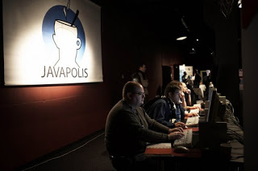
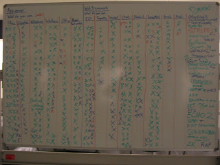
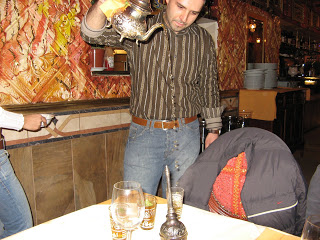
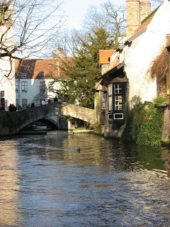
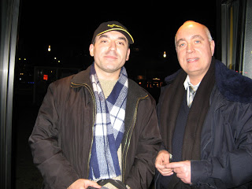

# JavaPolis07-2
Perşembe gününün bir diğer güzel sunumunu “Offline Web apps with Google Gears” ile Dion Almaer yaptı. Dion tıfıl ama bir 
o kadar da sempatik bir çocuk ve de yaptıklarından anlaşılan yetenekli bir yazılımcı. Dion sözlerine “Almaer” soyadının 
ve kendi ailesinin köklerinin 2. Dünya Savaşı’nda Belçika’ya kadar uzandığını geçenlerde onunla bağlantı kuran bir 
Belçika’lıdan öğrendiğini, bu nedenle de kendini bir şekilde oralı hissettiğini belirterek başladı. Google Gears ile web 
uygulamalarının herhangi bir duruma geçildiğinde de offline çalışabilmesini sağlayacak altyapıyı oluşturmaya çalışmışlar. 
Dion hali hazırda geliştirilmiş web uygulamalarının sihirli bir değnekle bir çırpıda offline çalışabilecek hale getirilmesinin 
imkansızlığından, uygulamaların temelinden itibaren offline çalışabilecek biçimde bir mimarisel yapılandırmaya tabi 
tutulmalarının gerektiğinden bahsetti. Hatta uygulamaların bütün servislerini offline desteklemenin bile mümkün olamayacağını 
belirtti.

Cuma gününün güzel bir sunumu Kanban hakkında idi. “A Kanban system for Software Engineering” adlı bu oturumda genel olarak 
Kanban sisteminden ve bunun yazılım projelerine uygulanmasından bahsedildi. Konuşmacı doğrudan kendi firmalarında uzun süredir 
uygulanan bu sistemle ilgili deneyimlerini bizimle paylaştı. Özünde aynı anda üzerinde çalışılan konu miktarını sınırlamaya 
ve müşteriye sürekli olarak faydalı bir çıktı üretmeye odaklanan bu sistemle çevik süreçlerin efektif biçimde yönetimi 
hedefleniyor. Sanırım ekibin üzerinde çalıştığı konuları olabildiğince sınırlandırması ve mümkün olduğunca birbirleri ile 
alakalı işleri bir arada yürütmeye çalışması ekip verimliliğini çok ciddi etkileyen noktalardan birisi olsa gerek. Pek çok 
iş ilanında malesef “aynı anda birden fazla iş ile uğraşabilecek yeteneklere sahip…” mealinde ifadelere rastlıyoruz. Ben 
bu tür ilanları gördüğümde bu firmaların projelerindeki işleri başarılı biçimde önceliklendiremediğini, çalışanlarına 
değişik konularla aşırı derecede yüklendiğini düşünüyorum. Gün içerisindeki context switch maliyeti hem çalışanın psikolojisi 
açısından hemde proje verimliliğine olumsuz etkisi yönünden ciddi olarak değerlendirilmeli.

Bir süredir yakından takip ettiğim konulardan biri de clustering ve virtualization çözümleriydi. Bu konudaki sunumları da 
kaçırmamaya dikkat ettim. Bu alanda önce çıkan iki firma ve bunların kendilerine has iki tür çözümleri var. Birincisi 
Terracotta. Terracotta ile ilgili Cuma günü Geert Bevin bir sunum yaptı. Geert Bevin RIFE ve orjinal continuation çözümüyle 
tanınıyor. Terracotta clustering problemini bytecode ve JVM düzeyinde manipülasyonlarla uygulama kodlarından bağımsız, 
uygulamaların mimarilerinde herhangi bir değişiklik gerektirmeden çözmeye çalışıyor. Siz shared edilecek nesnelerle ilgili 
Terracotta sunucusuna konfigürasyon dosyaları ile direktifler veriyorsunuz, Terracotta sunucusu da bu nesnelerin yaratılmasını, 
erişimlerini JVM düzeyinde kendisi yönetiyor. Terracotta’nın aksine Gigaspaces ise clustering probleminin ancak mimarisel 
değişiklikle sağlıklı biçimde çözülebileceğini iddia ediyor. Gigaspaces ile layered sistemler her biri kendi başına bir 
application/data processing unit şeklinde spacelere dönüştürülüyor. Böylece sınırsız derecede ölçeklenebilir sistemlere 
sahip olmak mümkün oluyor. Bu arada Gigaspaces’da “spring enabled” olmakla kendini ön plana çıkaran firmalardan. Açıkçası 
her bir çözümün farklı yerlerde avantajları ve dezavantajları olabilir. Ancak mevcut uygulamalardaki bazı performans ve 
ölçekleme sorunlarını, özellikle HttpSession clustering gibi yaygın problemleri çözmede Terracotta daha pratik bir çözüm 
gibi gözüküyor. Ayrıca Pazartesi akşamı Gigaspaces firmasının Ar-Ge bölüm şefi Guy Nirpaz dağıtık sistemlerin geliştirilmesinde 
çevik yöntemleri uygularken edindikleri deneyimleri paylaştığı bir BOF düzenledi. BOF’daki ana fikir bu tür sistemlerin 
entegrasyon testlerinin olabildiğince erken gerçekleştirilmesi, her bir iterasyona sistem entegrasyonu işlerinin de yayılması 
gerektiği oldu.

Hafta boyunca bir diğer ilginç etkinlik de oturumların yapıldığı salonların bulunduğu yere konan yazı tahtaları oldu. 
Katılımcılar bu tahtalarda pek çok değişik fikri, isteği, eleştiriyi paylaştılar. Kendilerince anketler düzenlediler. 
Java7 de yer almasını istedikleri özelliklerden bahsettiler, bunlar için oylama yaptılar. Halihazırda hangi web framework’ü 
kullanıyorsunuz sorusuna verilen cevaplar ilginçti. Struts ve Spring MVC at başı gittiler. Struts az biraz daha önde yer aldı. 
Bunları hemen arkalarından JSF takip etti, hatta hafta sonuna doğru her üçü de birbirlerine çok yakın hit almışlardı. 
Tapestry ve Webwork ise çok daha gerilerde kaldılar. Annontation’larla ilgili yazılan yorumlarda çok ilginçti. 
@AnnotationsWillKillYou bunlardan birisiydi. Gerçekten’de olur olmaz yerde Annontation kullanımı, XML konfigürasyon 
dosyalarından kurtulmak amacıyla Annotation’lara sarılmak java programcılarının başına iş açacağa benziyor. Örneğin, 
Bob Lee’nin JSR-229 Web Beans sunumundaki bir örnekte yarım sayfa annotation’a sahip bir sınıf tanımı karşısında salondakiler 
kendilerini gülmekten alamadılar.

Bu seneki konferansta Türkiye’den gelen diğer arkadaşlarla beraberdik. Bir hafta boyunca hem Antwerp gecelerine aktık hem 
de değişik ülke mutfaklarını test etme fırsatı bulduk. Merkez istasyon yakındaki Mısır ve Lübnan lokantalarını herkese 
tavsiye edebiliriz. Ama Lübnan restoranında demleme çay sanarak istediğimiz “mount tee” hariç.

Bir hafta boyunca Lipton sallama çayını içmekten bunalmış arkadaşlardan birisi menüde “mount tee” ifadesini görünce bu 
olsa olsa demleme çaydır diye atladık, ama çay niyetiyle neredeyse bal şerbetinden daha tatlı bir sıvı servisi yapıldı. 
Bunların yanında 2005’de çok hoşuma giden Hint lokantası'nın yerinde yeller esiyordu. Bir de GroteMarkt denen yerdeki 
Giovanni İtalyan pizzacısına gittik. Pizzalar ve ortam gerçekten muhteşemdi.

Hafta boyunca arkadaşlarla Javapolis’deki oturumları değerlendirirken konuştuklarımızdan biri de neden buna benzer 
organizasyonların Türkiye’de de yapılmadığı idi. Bu tür organizasyonları dışarıda gördüğümüzde benzer soruları zaman zaman 
kendimize sorarız. Amacım klişe sözler üretmek değil. Ancak yaklaşık 3200 kişinin katıldığı Avrupa’daki Java ile ilgili 
en büyük organizasyonlardan birisi olan Javapolis’in düzenlendiği ortam ile ilgili birkaç tespitte bulunmak istiyorum. 
Konferanslar Metropolis adındaki bir sinema kompleksinde yapılıyor. Burada 25-30 civarında değişik büyüklükte sinema 
salonları var. Bu salonlardan 5 tanesi bir hafta boyunca bu organizasyon için ayrılıyor. Salonlardaki ses, ve oturma düzeni 
gerçekten mükemmel. Bütün oturumlar anında videoya alınabiliyor ve içerik dev ekrana yansıtılabiliyor. Konferans’ın 
düzenlendiği Antwerpen “Avrupa’nın ulaşım hub”ı olarak nitelendiriliyor. Kara, deniz ve demir yolları’nın kesişim noktası. 
Bu nedenle Avrupa’nın pek çok yerinden katılımcılar çok kolay biçimde buraya gelebiliyorlar. Hatta Hollanda’dan günü birlik 
gelip oturumlara katılanları bile görmek mümkün. Şehir içi toplu taşıma sistemi de çok güzel, tren, tramvay ve otobüslerle 
şehirde istediğiniz yere rahatlıkla gidebiliyorsunuz. Hatta Belçika içindeki pek çok değişik bölgeye ulaşım bile şehir içi 
ulaşım kadar kolay diyebiliriz.

Konferans sonunda iki günlüğüne Antwerp’den ayrılıp Brügge ve Oestende şehirlerini de dolaşma fırsatım oldu. Cuma günü 
Antwerp’den trenle Brüj’e geçtim. Brüj şehir merkezindeki hotel fiyatları çok yüksek olduğu için biraz şehir dışında 
Jabbeke yakınlarında bir kır evinde kalmayı tercih ettim. Brüj Belçika’nın en tarihi yerlerinden birisi ve çok hoş bir 
şehir. İnsanlar hala 16, 17. ve 18. yy’dan kalma evlerde yaşıyorlar. Brüj sokaklarında dolaşırken üzerinde 1795 yazan 
küçük bir evden bir yaşlı amca çıktı, bahçesi ile ilgilenmeye koyuldu. Belki de büyük büyük… babasından kalan bu evde 
ömrünün son dönemlerini yaşıyordur. İnsanların geçmiş ve şimdiki zaman arasındaki bağlarının korunması açısından Brüj 
çok güzel bir örnek.

Brüj şehir merkezinde dolaştım, kanal turu yaptım ve saat kulesine tırmandım. Ayak üstü birşeyler atıştırdıktan sonra bir 
arkadaşımın tavsiyesi ile kıyı şehri Ostendeye gitmek için yola koyuldum. Ostende Brüj’den trenle 10 dk mesafede. Ancak 
cumartesi günü trenlerde grev vardı ve sadece çok az noktaya tren seferi düzenleniyordu. Bende otobüs ile gitmeye karar 
verdim. Malesef otobüs neredeyse kıyı şeridindeki her bölgeyi dolaşıp Ostende’ye 1.5 saatte vardı. Şehirde biraz dolaştım, 
okyanus kıyısına gittim. Akşam bir restoranda yemek yedikten sonra Brüje dönmek için otobüs terminaline geçtim. Ama Brüj’e 
giden son otobüsü kaçırmışım. Trenler de grevde olduğu için tam Ostende’de mahsur kaldım diye düşünürken Belçika’daki 
otobüs hatlarını işleten Lijn’de görevli bir bayan ve bir vatmanın yardımı ile iki buçuk saatlik maceralı bir yolculuğun 
ardından Brüj’e geri dönebildim.

Tramvay vatmanı Jan adında 20 senedir Belçika’da yaşayan bir İngilizdi. Lijn hattındaki bayanla birlikte benim için Brüj’e 
bir yol haritası çıkardık. Önce Jan ile birlikte tramvayla Knokke’ye gidecektim. Ardından WestKapelle’ye otobüs ile geçip,
oradan da Roterdam’dan gelip Brüj’e giden bir otobüs ile devam edecektim. Belçika’daki toplu taşıma araçlarının dakikliği 
gerçekten takdir edilecek düzeyde, en azından Türkiye ile kıyaslandığında imrenilecek düzeyde. Lijn hattındaki görevli 
elindeki zaman çizelgesinden 20:00 da WestKapelle’deki otobüs kalkıyor, 20:16’da Roterdam’dan gelen otobüs’e bineceksin 
diyordu. Gerçekten de bütün araçlar tam zamanında geldiler ve ben akşam 21:30 civarı AvondLijn diye tabir edilen gece 
otobüsüleri ile hotele geri dönebildim. Vatman Jan’a o akşam bana yardımlarından dolayı ne kadar teşekkür etsem azdır.
