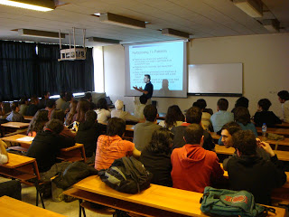

# Güncel Yazılım Mühendisliği Pratikleri ve Kurumsal Java Teknolojileri Hacettepe Sunumu

Daha önce ODTÜ Bilgisayar Mühendisliği Bölümü’nde yaptığım Güncel Yazılım Mühendisliği Pratikleri ve Kurumsal Java 
Teknolojileri sunumunu 15 Mayıs 2008 Perşembe günü Hacettepe Bilgisayar Mühendisliği öğrencilerine de yapma fırsatı buldum. 
Genellikle son sınıf öğrencilerinden oluşan bir toplulukla zevkli bir 2 saat geçirdik. Hacettepe Bilgisayar Mühendisliği 
öğrencilerinin tasarım kalıpları ve prensipleri konularındaki güncel bilgileri hoşuma gitti. Sunum sonunda hem konu ile 
alakalı hem de genel iş yaşantısı, iş görüşmeleri ve kariyer planları hakkında fikirlerimizi paylaşma fırsatımız oldu. 
Son olarak bu organizasyonu yapan [Erkan Yasan](http://www.facebook.com/profile.php?id=545474002&ref=ts) ve 
[Mustafa Daşgın](http://mdasgin.blogspot.com/)‘a da çok teşekkürler.