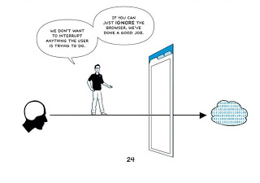

# Google Chrome ile Neyi Amaçlıyor?

Günlerdir Google’ın yeni tarayıcısı hakkında pek çok şey söyleniyor, diğer tarayıcılarla kıyaslamalar yapılıyor, hızından 
bahsediliyor. Yapılan pek çok yorumda yeni tarayıcının performansı üzerinde duruluyor, getirdiği yenilikler ve açık kaynak 
kodlu olması hasebiyle tarayıcı pazarından ne kadar pay alacağı değerlendiriliyordu.

Ürünleri açısından bakıldığında tamamen web üzerine kurulu, hatta web uygulamalarının tanımını kökten değiştiren bir 
şirketin tarayıcılarla ilgili hiç bir adım atmaması beklenemezdi. Aslında Firefox ile bu pazara belli bir oranda destekte 
veriyordu. Ancak Chrome doğrudan kendi içinden çıktı ve ortaya attığı fikirler, özellikler açısından değerlendirildiği 
vakit innovatif çözümler de ortaya koymaktadır.

Google’ın Chrome ile yapmaya çalıştığı şey yeni bir tarayıcı savaşları başlatmak olmasa gerek. Geçmişte bu konuda Internet 
Explorer ve Netscape kıyasıya çarpıştılar ve platform avantajı sayesinde de IE bu savaştan galip çıktı. Google’ın aynı 
senaryonun tekrarlanmasını istediğini zannetmiyorum. Zaten GWT, Gears gibi uygulama geliştirme platformları ve teknolojiler 
sayesinde tarayıcı bağımsız çalışan uygulamalar ortaya çıkarmakta gayet başarılılar. Ancak mevcut tarayıcıların ve web 
uygulama geliştirme teknolojilerinin kısıtları nedeniyle geliştirdikleri uygulamaların özelliklerini ve kabiliyetlerini 
zenginleştiremiyorlar, çalışırlıklarını daha güvenilir ve sağlam hale getiremiyorlar. Kısacası çalıştırma platformu yani 
tarayıcılar, web uygulamalarının gereksinimlerini karşılamaktan çok uzak kalıyor. Bu noktada da Chrome gibi yeni bir 
tarayıcı geliştirerek, platformun iyileşmesi için bir standartlaşmaya gidilmesini beklemek yerine kendileri mevcut çıtayı 
birkaç seviye daha yukarı taşımayı hedeflemişler.

Ne Chrome, ne Firefox, ne de IE pazara tek başına hakim olabilir. Ancak Google sahip olduğu popülarite ve uygulamalarının 
yaygınlığı vasıtası ile Chrome’u ve dolayısı ile ona has yenilikleri web dünyasının önüne koyup, tarayıcıların kabiliyetleri 
açısından istediği ortamı oluşturmayı hedefliyor.

Yukarıdaki resmi Chrome’u anlatan cizgi roman içinden aldım. Bu resimde de anlatılmak istenen tarayıcının kullanıcı ile 
uygulamalar arasında tamamen transparan bir ortam haline gelmesidir. “We don’t want to interruptanything the user is 
trying to do. If you can just IGNORE the browser,we’ve done a good job.” ifadesi de Google’ın hedefini gayet net biçimde 
ortaya koyuyor. Kullanıcı ile uygulamalar arasında tamamen transparan biçimde yer alacak bir tarayıcının Google için kendi 
veya Microsoft tarafından üretilmiş olmasının bir önemi olmasa gerek.

Scott Berkun’un bloğundaki bir [yazıda](http://discussionleader.hbsp.com/berkun/2008/09/google-chrome-beyond-the-hype.html) 
da bu konu ile ilgili çok çarpıcı bir alıntı var: _“Although I’m sure Google would be thrilled if Chrome grabbed a sizable 
chunk of market share, winning a “browser war” is not its real goal. Its real goal, embedded in Chrome’s open-source code, 
is to upgrade the capabilities of all browsers so that they can better support (and eventually disappear behind) the 
applications. The browser may be the medium, but the applications are the message.”_