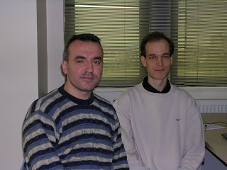

# A Picture From Oracle Coherence Workshop in Istanbul

We had a very nice 3-day `OracleCoherenceWorkshop` in Istanbul last month. `AndrasJokuthy` from Hungary was next to me 
during this event. We chatted about Istanbul, Hungary, traffic jams, life in two countries, and about weather and water, 
etc. I hope he liked Istanbul and wish to meet him someday in the future again. Maybe in Budapest… why not 🙂
