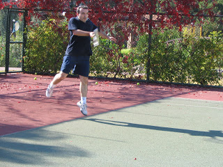
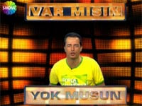

# Korkunun Ecele Faydası Yok Derler

Uzun zamandır tenis oynuyorum. Her fırsatta profesyonel oyuncuların katıldıkları turnuvaları izlemeye çalışırım. İlk yılı 
hariç İstanbul Cup’ı kaçırmadım ve orada pekçok profesyonel oyuncuyu yakından izleme fırsatı buldum. Zaman içerisinde 
tenis müsabakalarının, insan psikolojisi ve davranışları hakkında gözlem yapmak için çok enteresan bir ortam sağladığını 
gözlemledim.

Örneğin, normal olarak herkes başarıya ve mutluluğa erişmeyi, zafer kazanmayı ister, söylemleri, davranışları hep bu 
yöndedir. Yenilgi ve kayıplar istenmeyen şeylerdir. Yenilgi ve mağlubiyetin kaldırılması daha zor şeyler olduğu düşünülür. 
Ancak insanoğlu bu iki zıt olgu ile ilgili somut olarak yüz yüze kaldığı vakit aslında zafer ve başarının da mağlubiyet 
ve üzüntüler gibi taşınması zor ve insan ruhuna ağır gelen şeyler olduğunu fark eder. Hatta o an zaferin getireceği ilgi 
odağı olma, insanların merkezinde yer alma durumu ona manevi olarak daha zor gelebilir. Profesyonellerin maçlarını 
seyrederken dikkatimi çeken en ilginç şey, tekniklerinde çok büyük farklar olmamasına rağmen bir oyuncuyu yıldız yapan 
ve diğerini sıradan bir oyuncu olarak bırakan psikolojik nedenlerden biri olarak bunu gördüm diyebilirim.

Yukarıda bahsettiğim psikolojik olgu ile birebir olmasa bile yine de bir bağlantısı olduğunu düşündüğüm bir durumu da 
yakın zamanda tv’deki bir yarışma programında gözlemledim. Acun Ilıcalı’nın “Var mısın, Yok musun” yarışma programının 
son birkaç bölümünde iki yarışmacı son aşamaya ciddi paralar kazanacak biçimde gelmelerine rağmen, kritik anlarda 
kendileri için kötü olmasına rağmen kolay ve garanti olanı tercih ettiler. Kendilerini bu tercihlere zorlayan nedenler 
olarak da içlerinde bulundukları maddi güçlükleri, borçlarını, ailelerinin ihtiyaçlarını vs. gösterdiler. Eğer bu 
zorluklar içinde olmasalardı, kendi ifadeleri ile yarışmanın sonuna kadar devam edecekler ve o çok yaklaştıkları büyük 
ikramiyeye ulaşmayı kesinlikle deneyeceklerdi. Hatta bunlardan biri devam etseydi, son iki kutuya 500 bin YTL 
bırakabilecekken, çok daha düşük bir rakamı kabul etti. Sanırım insan, ne kadar kötü olursa olsun kolay ve garanti olanı, 
önünde biraz sis perdesi varsa, zor ama güzel olana hemen tercih ediveriyor.

Belki de bu tercihlerimizin temelinde korkular ve endişeler yatıyor. Ama içinde korku duygusunu hissetmeyen kim yok ki? 
Doğunun yeni dönem ünlü düşünürlerinden Osho’nun şu mealdeki bir sözünü çok beğenirim: “Cesaret, hiç korkmamak değildir, 
korkularına rağmen arzularına, isteklerine doğru hareket edebilmektir.”