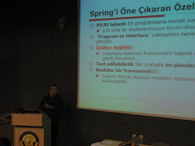
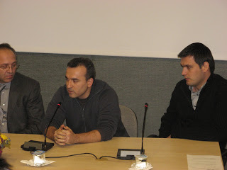
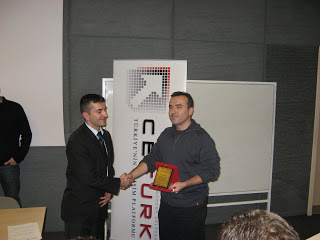
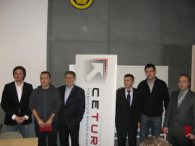

# Ankara’da CETURK Java Etkinliği
Cumartesi günü CETURK’ün Ankara’da düzenlediği Java etkinliğine konuşmacı olarak katıldım. Öncelikle CETURK ekibinden 
`Murat Aydın`, `Ahmet Pirimoğlu` ve `Mehmet Aca` arkadaşlarımıza, Çankaya Üniversitesi’nden `Abdülkadir Görür`’e ve bu 
organizasyona emeği geçen diğer herkese teşekkür etmek istiyorum.

|   |  |
|---|-----------------------------------|

Etkinlik bir günlük olmasına rağmen, bence çok verimli ve doyurucu oldu. Konuşmacıların sunumlarının her birisinden 
katılan herkesin yeni ve faydalı birşeyler öğrendiğini düşünüyorum. Umarım bundan sonra da Ankara’da benzer aktivitelerin 
gerçekleşmesi mümkün olur.

|  |  |
|-----------------------------------|-----------------------------------|

Konuşmamla ilgili dokümanları CETURK’e gönderdim. Ayrıca bu dokümanlara aşağıdaki linklerden de erişebilirsiniz.

[Spring Application Framework’e Giriş Sunumu](http://blog.harezmi.com.tr/ankarada-ceturk-java-etkinligi/spring-application-framework/)

Spring örneklerini içeren [uygulama](http://blog.harezmi.com.tr/ankarada-ceturk-java-etkinligi/spring-webapp/) ve her 
bir örnekle ilgili bilgilendirici dokümana [buradan](http://blog.harezmi.com.tr/ankarada-ceturk-java-etkinligi/orneklerle-adim-adim-springapplication-framework/) ulaşabilirsiniz.
