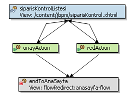
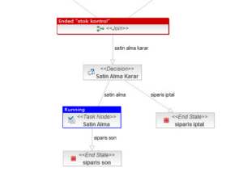
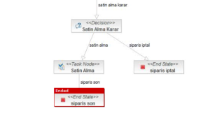

# Sipariş İş Akışı Örneği İle JBPM Spring WebFlow Entegrasyonu-II

Geçen [yazımda](20090402_siparis-is-akisi-ornegi-ile-jbpm-spring-webflow-entegrasyonu-i.md) sipariş iş akışı örneğinden 
bahsetmeye başlamıştık. Bu yazımda da örneğe devam ederek sipariş iş akışında kullanıcılara atanmış görevlerin işletilmesi 
ve satın alama iş adımının gerçekleştirilmesi ile süreci sonuna kadar incelemeye devam edeceğiz.

## Kullanıcının Kendisine Atanmış Bir Görevi(Task) Yürütmesi

Bu aşamada `JBPM task name (sorguSonuclari.selectedRow.name)` SWF tarafındaki `flow id`’sine karşılık gelmektedir. Ayrıca 
`_jbpmTaskId` request parametresi ile redirect edilen flow’un hangi JBPM task instance’ını yükleyeceği belirtilir. Bu 
sayede kullanıcıya atanmış herhangi bir task üzerinden ilgili SWF flow’u başlatılarak task’ın SWF tarafında işletimine 
devam edilmiş olunur.

Stok kontrol ve bütçe kontrol senaryoları birbirine benzemektedir. Bunların önemli kısımları üzerinden geçerek SWF JBPM 
entegrasyonunu incelemeye devam edelim.



```xml
<flow> 
    <on-start> 
        <set name="flowScope.siparis" value="processScope.siparis"/> 
    </on-start> 
    ... 
    <action-state id="onayAction"> 
        <evaluate expression="processScope.setVariable('stokOnayDurum', new Boolean(true))"/> 
        ... 
    </action-state> 
    <action-state id="redAction"> 
        <evaluate expression="processScope.setVariable('stokOnayDurum', new Boolean(false))"/> 
        ... 
    </action-state> 
    <end-state id="end" view="flowRedirect:anasayfa-flow" commit="true"> 
        <attribute name="jbpmEndTask" value="true" type="boolean"/> 
    </end-state> 
</flow>
```

Stok kontrol flow’u başladığında JBPM process’inden `siparis` nesnesi alınarak 
SWF flow scope’a aktarılır. SWF flow’ları içerisinden o anda üzerinde çalışılan process ve task instance’larının 
değişkenlerine daha rahat erişebilmek amacı ile SWF’nin `RequestControlContextImpl` sınıfına `processScope` ve `taskScope` 
özelliklerini ekledik. Bu sayede SWF’de request, flash ve flow scope’lardaki değişkenlere nasıl erişiliyorsa, process ve 
task instance’larındaki değişkenlere de aynı syntax ile erişmek mümkün olmuştur.

Stok kontrolünü yapan kullanıcı siparişe onay verirse `processScope`’daki `stokOnayDurum` boolean değişkeninin değeri 
`true`, red verirse `false` olarak set edilir. `stokOnayDurum` değişkeni JBPM tarafında “Satin Alma Karar” Decision 
state’inde stok ve bütçe kontrol işlemlerinin sonucunu tespit aşamasında kullanılacaktır. Stok kontrol flow’u sonlandığında 
ise o andaki aktif JBPM taskı da sonlandırılır.

## Satın Alma İş Adımı



Stok ve bütçe kontrol taskları, ilgili kullanıcılar tarafından yürütüldüğü vakit iş akışı satın alma aşamasına gelecektir. 
Satın almadan sorumlu kullanıcı sisteme girip kendisine atanmış satın alma işlemini onaylarsa iş akışı başarılı biçimde 
sonlanacak, siparişi veren kullanıcıya da siparişin onaylandığına dair bir e-posta mesajı gönderilecektir. Aksi takdirde 
iş akışı siparişin iptali ile sonlanmış olacak kullanıcıya da bu yönde bir e-posta JBPM tarafından gönderilecektir.




```xml
<flow> 
    ... 
    <view-state id="satinAlma" view="/content/jbpm/siparisKontrol.xhtml"> 
        <transition to="end" on="onay"/> 
        <transition to="end" on="red"/> 
    </view-state> 
    <end-state id="end" commit="true" view="flowRedirect:anasayfa-flow"> 
        <attribute name="jbpmEndTaskWithTransition" value="true" type="boolean"/> 
    </end-state> 
</flow>
```


Satın alma flow’unda kullanıcı onay veya red butonlarından hangisine tıklarsa SWF tarafında o butona karşılık gelen 
transition flow’u end state’ine geçirip sonlandırmaktadır. Bu aşamada JBPM satın alma task’ına da hangi transition ile 
bir sonraki node’a geçeceğinin söylenmesi gerekir. Bunun için `jbpmEndTaskWithTransition` attribute’u kullanılmıştır. 
SWF tarafında end state’e gelindiği vakit bu attribute mevcutsa end-state’e getiren son transition’ın `event-id`’si JBPM 
task’ına sinyal gönderirken `transition name` olarak kullanılmıştır.

Bundan sonraki yazımda JBoss JBPM Console’un uygulama içerisinde gömülü olarak çalıştırılmasından, console vasıtası ile 
process’lerin deploy edilmesinden ve yönetilmesinden bahsedeceğim.


