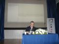
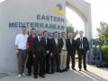

# CETÜRK Doğu Akdeniz Üniversitesi Java Etkinlikleri
11-12 Nisan 2009 tarihlerinde CETÜRK ve Doğu Akdeniz Üniversitesi Yazılım Kulübü işbirliği ile düzenlenen Java 
Etkinlikleri Günü'ne konuşmacı olarak katıldım. Öncelikle bu güzel ve başarılı etkinliği düzenleyen CETÜRK ekibinden 
Mehmet Aca'ya, Yazılım Kulübü'nden Hakkı, Selçuk, Sinan ve Olcay arkadaşlarımıza ve etkinliğe katılmamızı mümkün kılan 
üniversite yönetimine teşekkür ederim. Küçük aksaklıklar olsa da arkadaşlar Kıbrıs için çok güzel ve yararlı bir 
etkinliği gayet başarılı biçimde organize ettiler.

Etkinliğin ikinci günü yaptığım sunumda `Spring Security Framework`'ten bahsettim. `Spring Security Framework` daha 
öncesinde `Acegi Security Framework` adı ile biliniyordu, ancak Spring dünyasında gördüğü ilgi ve yaygın kullanımı 
sonucunda 2.0 sürümünden itibaren Spring ürün ailesine dahil edildi ve ismi de `Spring Security` olarak değiştirildi. 
Sunumda kurumsal uygulamaların genel olarak karşılaştığı temel kimliklendirme (authentication) ve yetkilendirme 
(authorization) ihtiyaçlarından, `Spring Security`'nin bu ihtiyaçlara getirdiği çözümlerden, diğer alternatif çözümlere 
göre `Spring Security Framework`'ün artılarından bahsettikten sonra, kimliklendirme ve yetkilendirme konularını detaylı 
biçimde inceledik. Ayrıca sunum içerisinde `Spring Security 2.0`'ın bir web uygulamasında nasıl devreye alınacağını, form 
tabanlı kimliklendirme yönteminin kullanımını, web kaynaklarının ve servis metotlarının yetkilendirmeye tabi tutulmasını 
ve `JSP security` taglerini örnek uygulama geliştirerek anlatmaya çalıştım. Umarım katılımcı arkadaşlar açısından faydalı 
bir sunum olmuştur.

Etkinlikte ayrıca ilk gün Furkan Horasan "Volantis", ikinci gün ise Özan Acar "Java ile yüksek performanslı web 
platformlarının oluşturulması", ardından da Mehmet Gürsul "Zihin Haritası (Mind Map) yöntemi ile çalışmak" konularında 
ilgi çekici sunumlar gerçekleştirdiler. Organizasyonun ilk gününe maalesef iştirak etme fırsatımız olmadığı için ilk gün 
ile ilgili ayrıntılı bir şey söyleyemeyeceğim, ancak organizasyonu yapan arkadaşların belirttiğine göre bütün Kıbrıs 
çapında yoğun bir katılım söz konusu oldu, ikinci gün ise belki biraz da Pazar gününün etkisi ile ilk güne oranla daha 
az bir katılım söz konusuydu ancak yine de katılımcı sayısı tatmin edici düzeydeydi diyebilirim. Katılımcılar gün sonuna 
kadar organizasyonu ilgi ile takip ettiler.

Sunumların ardından "Kariyer Gelişim Sürecinde Teknoloji Tercihinin Önemi" konulu bir panel gerçekleştirdik. Yaklaşık bir 
saat süren bu panelde öğrenci arkadaşların kariyer gelişim sürecinde üzerine eğilmeleri, önem vermeleri gereken konulardan, 
kendilerini geliştirmeleri gereken noktalardan bahsettik. Bunun yanında bilişimle ilgili diğer soruları da cevaplama ve 
bunlarla ilgili tartışma fırsatımız da oldu. Yaklaşık bir saat süren panel sanırım herkes için oldukça doyurucu bir 
aktivite oldu.

Doğu Akdeniz Üniversitesi'nde düzenlenen bu etkinliğe katılanların neredeyse hepsi Kıbrıs'taki değişik üniversitelerde 
okuyan öğrenci arkadaşlarımızdı. Daha önce CETÜRK'ün Ankara Çankaya Üniversitesi'nde düzenlediği etkinlikte de gözlediğim 
gibi buradaki öğrenci arkadaşlar da bu tür bilgilendirici çalışmalara büyük bir ilgi gösteriyorlar. Onlara gelecek için 
yol gösterecek, faydalı bilgiler ve değişik bakış açıları kazandıracak organizasyonlara gerçekten ihtiyaç duyuyorlar. 
Umarım Türkiye genelinde benzer organizasyonlar daha yaygın ve kapsamlı biçimde gerçekleştirilir. Emeği geçen herkese 
tekrar teşekkürler...

