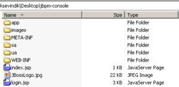

# JBoss JBPM Admin Console-I
Admin console JBPM dağıtımı ile birlikte gelen bir web uygulamasıdır. `jsf-console.war`’ı web container’ınıza deploy 
ettiğinizde çalışması için container’da `JbpmDataSource` isimli bir JNDI datasource nesnesinin olması gerekmektedir. 
Ayrıca console uygulamasının mesaj, yetkilendirme gibi kısımlarında kendinize özgü değişiklikler yapmanız pek muhtemeldir. 
Biz admin console’u kendi uygulamalarımızın içerisinde gömülü biçimde çalıştırmayı tercih ettik. Bu sayede process 
tanımlarının console vasıtası ile runtimeda istenilen vakitte deploy edilebilmesinin yanında, tanımların hem uygulama 
tarafından hem de console tarafından aynı anda yönetilebilmesi mümkündür. Admin console’u kendi web uygulamalarımızın 
içerisinde gömülü olarak çalıştırmak için yaptığımız işlemlerle başlayalım.

## Dosyaların ve Dizinlerin Kopyalanması



`jsf-console.war` bundle’ı açtığımızda aşağıdaki gibi bir dizin yapısı ile karşılaşırız.

Console’un JSF syafaları ve css dosyası, `app`, `sa` ve `ua` dizinlerinde bulunmaktadır. Biz bu üç dizindeki dosyaları 
ve `images` dizinini tek bir dizin (`jbpm-console`) altında topladık. JSF, css, imaj gibi dosyaların tek bir dizin altında 
toplanması ile birlikte bu dosyalardan diğer dosyalara olan referansların güncellenmesi gerekti. Ayrıca uygulamaların 
`jbpm-console` dizini yerine başka bir dizin adı kullanabilmelerine olanak sağlamak amacı ile bir property de uygulama 
içerisine eklendi.

Bu sayede JSF içindeki sayfalardan diğer sayfalara referans verilirken url ifadesinin başına `jbpm.console.base.path`’in 
değerini veren EL’i ekleyerek JSF sayfalarının dizin değişikliklerinden etkilenmemesini sağladık.

## Web.xml’deki Değişiklikler

Bir sonraki adımda `jbpm-console`’un çalışabilmesi için aşağıdaki tanımlamaların `web.xml` dosyasına eklenmesi gerekti.

```xml
<listener> 
    <listener-class>org.jbpm.web.JbpmConfigurationCloser</listener-class> 
</listener> 
<servlet> 
    <servlet-name>GPD Deployer Servlet</servlet-name>
    <servlet-class>org.jbpm.web.ProcessUploadServlet</servlet-class> 
    <load-on-startup>1</load-on-startup> 
</servlet> 
<servlet-mapping> 
    <servlet-name>GPD Deployer Servlet</servlet-name> 
    <url-pattern>/upload/*</url-pattern> </servlet-mapping> 
<servlet> 
    <servlet-name>Faces Servlet</servlet-name> 
    <servlet-class>javax.faces.webapp.FacesServlet</servlet-class> 
    <load-on-startup>1</load-on-startup> 
</servlet> 
<servlet-mapping> 
    <servlet-name>Faces Servlet</servlet-name> 
    <url-pattern>/jbpm-console/pi/*</url-pattern> 
</servlet-mapping> 
<servlet-mapping> 
    <servlet-name>Faces Servlet</servlet-name> 
    <url-pattern>*.jsf</url-pattern> 
</servlet-mapping>
```

## Faces-config.xml’deki Değişiklikler

`faces-config.xml` içerisinde aşağıdaki `view-handler` ve `navigation-handler` tanımlarının yapılması gerekiyor.

```xml
<view-handler>org.jboss.gravel.QueryPreservingViewHandler</view-handler> 
<navigation-handler>org.jboss.gravel.navigation.GravelNavigationHandler</navigation-handler>
```

`QueryPreservingViewHandler` içerisinde SWF ile uyumlu çalışabilmesi için küçük bir değişiklik yapmak gerekti. 
`QueryPreservingViewHandler` sadece orijinal action URL’de query string mevcut değilse request’deki query string’i URL’e 
append edecek biçimde değiştirildi.

## Jbpm4jsf-config.xml Dosyasının Oluşturulması

`WEB-INF` dizini altında `jbpm4jsf-config.xml` dosyasını oluşturmak gerekiyor. Dosyanın içeriği aşağıdaki gibi olmalıdır. 
Dosyayı jsf-console’un açılmış halindeki `WEB-INF` dizini altından da alabilirsiniz.

```xml
<?xml version="1.0" encoding="UTF-8"?>
 <jbpm4jsf-config xmlns="http://jbpm.org/jbpm4jsf/config">
 <!-- This entry controls whether to map JSF user authentication to
 actor IDs. Set to false if the authentication scheme used by
 the administration console is not related to the set of actors
 that is used by your processes.-->

 <authentication-service>
 <use-jsf-actor>true</use-jsf-actor>
 </authentication-service>
 <!-- This entry facilitates the usage of process image URLs -->
 <process-file-matcher><pattern>^/jbpm-console/pi/(\d+).jpg</pattern>
 <file-name>processimage.jpg</file-name>
 <content-type>image/jpg</content-type>
 </process-file-matcher>
</jbpm4jsf-config>
```

## JBPM Console’a Erişim Kontrol Dosyasının Oluşturulması

`jsf-console` açıldığında `WEB-INF` dizini altında `access.properties` dosyası yer alacaktır. JBPM Console bu dosyadaki 
tanımlara göre console'daki fonksiyonlara kullanıcıların rol bazında erişimlerini yönetmektedir.

```xml
<gd:loadProperties path="access.properties" var="access"/>
```

Dosyayı `t_loggedin.xhtml` dosyası içerisinde aşağıdaki JSF component’i vasıtası ile yüklemektedir. `access.properties` 
dosyasının içerisinde console’un fonksiyonlarının karşısına hangi rollerin erişebileceğini yazmak gerekiyor. Örneğin;

```properties
# Process definition operations
role.process.deploy=ROLE_ADMIN
role.process.delete=ROLE_ADMIN
role.process.start=
```

Burada process tanımlarını deploy etmek ve silmek için gerekli arayüze erişim yetkisi sadece `ROLE_ADMIN` rolüne sahip 
kullanıcılara verilmiştir. Process tanımından yeni bir process instance başlatmak ise bütün kullanıcılara açılmış bir 
özelliktir. Eğer bir özelliği bütün kullanıcılara kapatmak isterseniz, bu özelliğin karşısına geçersiz bir rol tanımı 
girmeniz yeterlidir.

Uygulamalarımızda güvenlik altyapısı olarak Acegi Security Framework’ü kullanıyoruz. Acegi’nin `SecurityContextHolderAwareRequestFilter` 
özelliği sayesinde o andaki web request’inin `isUserInRole()` metod çağrısının sisteme Acegi ile login olmuş kullanıcının 
rol bilgilerini kullanarak cevap dönmesi sayesinde JBPM console’un sistemimizdeki kimliklendirme ve yetkilendirme 
altyapısına entegrasyonu için ilave bir şey yapmaya gerek kalmadı.

## i18n Özelliğinin Ayarlanması

`jsf-console`’un `WEB-INF/classes` dizini altında `messages.properties` dosyası bulunmaktadır. Bu dosya içerisinden JBPM 
console’un UI ve kullanıcı mesajları kullanıcıya uygun bir dile çevrilebilir. Dosyayı uygulamanız içerisinde `WEB-INF/classes` 
dizini altına kopyalamalısınız.

```xml
<f:loadBundle var="msgs" basename="messages"/>
```

`messages.properties` dosyası `t_base.xhtml` içerisinden yüklenmektedir. Console’un farklı dilleri desteklemesi söz 
konusu ise `messages_lang_country.properties` formatında desteklenen locale’e uygun versiyonunun oluşturularak uygulamanıza 
eklenmesi yeterli olacaktır.

## Ortak SessionFactory Kullanımı

JBPM Console o anda uygulamanın execution context’i içerisinde default `JbpmConfiguration` instance’ını kullanarak yeni 
bir `JbpmContext` oluşturmaya çalışmaktadır. `LocalJbpmConfigurationFactoryBean` ile oluşturulan `JbpmConfiguration` 
kullanılmadığı için `DbPersistenceServiceFactory`’nin uygulamanın spring managed `SessionFactory` nesnesinin dışında yeni 
bir `SessionFactory` nesnesi oluşturması söz konusu olmaktadır. Bu problemi aşmak için custom bir `DbPersistenceServiceFactory` 
yazılarak spring managed `SessionFactory` nesnesinin dönülmesi sağlanmıştır. Custom `DbPersistenceServiceFactory` `jbpm.cfg.xml` 
içerisinde persistence service olarak belirtilmelidir.

Bir sonraki yazımda JBPM Console’u incelemeye devam edeceğiz. Örnek bir process’i JBPM GPD ile oluşturup console ile 
deploy ettikten sonra process’i baştan sona console ile yürüteceğiz.

