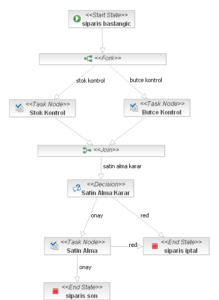
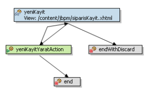
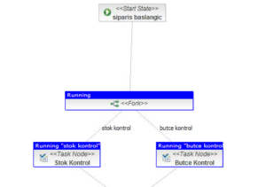

# Sipariş İş Akışı Örneği İle JBPM Spring WebFlow Entegrasyonu-I
## Sipariş Tedarik Süreci

Şimdi bir örnek üzerinden giderek JBPM SWF entegrasyonunu daha yakından inceleyelim. Örnek iş akışımız bir organizasyondaki 
sipariş tedarik süreci olsun. Mümkün olduğunca iş akışını basit tutarak her iki sistem arasındaki karşılıklı etkileşimi 
anlatmaya çalışacağım. Süreç, sistem kullanıcılarından birisinin yeni bir sipariş oluşturması ile başlar. 

Siparişin verilmesinden sonra süreç aynı anda işleyen iki ayağa ayrılır. Sürecin bir adımında verilen siparişin mevcut 
stoktan tedarik edilip edilemeyeceği kontrol edilir. Diğer adımında ise siparişin bütçesi kontrol edilir. Eğer her iki 
adımda siparişe onay verirse bu sefer satın alma adımına geçilir. Satın alma bölümü de bu siparişi onayladığı vakit 
sürecimiz siparişin onaylandığı ile ilgili olarak siparişi veren kullanıcıyı bilgilendirerek sonlanır.



Yukarıda ayrıntılandırdığımız bu iş akışında sipariş girişi, stok kontrol, bütçe kontrol, satın alma adımları değişik 
rollere sahip kullanıcılar tarafından gerçekleştirilen senaryolara karşılık gelmektedir. Bahsedilen bu senaryoların her 
birisi de SWF’de birer `flow`’a karşılık gelmektedir. Her bir senaryo/flow kendi başına bir bütünlük arz etmektedir. Web 
uygulaması tarafında tek oturumda bir veya daha fazla adımla gerçekleştirilmesi gerekebilir. Bütün bu özelliklere bakıldığında 
SWF `flow`ları ile kullanıcı senaryoları (use case) birebir eşleşmektedir ve bir iş akışının tasklarından her birine 
kaşılık gelmektedir.

## Sürecin Başlatılması

SWF’de `siparisKayit` `flow`’u yeni bir spariş girişini gerçekleştirir. Yeni siparişin kaydedilmesi ile beraber JBPM 
tarafında da sipariş iş akışı başlamış olur.



```xml
<flow>
    <attribute name="jbpmStartProcess" value="siparis"/> 
    ... 
    <action-state id="yeniKayitYaratAction"> 
        ... 
        <evaluate expression="processScope.setVariable('siparis', flowScope.siparis)"/>
        ... 
        <transition to="end" on="success"> 
            <attribute name="jbpmSignalProcess" value="true" type="boolean"/> 
            <attribute name="jbpmSaveProcess" value="true" type="boolean"/> 
        </transition> 
    </action-state> 
    <end-state id="end" commit="true"/> 
</flow>
```

`siparisKayit` `flow`’u başladığı vakit JBPM tarafında da `siparis` `process` 
tanımından yeni bir `processInstance` oluşturulur. Kullanıcı sipariş kayıt ekranında kaydet butonuna tıkladığı vakit 
çalışan `yeniKayitYaratAction`’ı içerisinde ise `flow`’daki `Siparis` nesnesini JBPM `processInstance`’ına aktardıktan 
sonra JBPM’e kaldığı state’den default transition ile devam etmesi için sinyal gönderip `processInstance`’ı save edilir.



Sipariş kaydının ardından JBoss JBPM Admin Console’u vasıtası ile sipariş `processInstance`’ı nı incelediğimizde iş 
akışının stok kontrol ve bütçe kontrol tasklarında beklediğini görürüz. Bu aşamada stok kontrol ve bütçe kontrol 
tasklarının atandığı kullanıcıların sisteme giriş yapıp üzerlerine atanmış bu işleri yürütmeleri gerekir.

## Kullanıcılara Atanmış Görevlerin (Task) Listelenmesi

Web uygulamamızda kullanıcılara atanmış JBPM `task`’larının listelenmesini sağlayan bir `flow` geliştirdik.


```xml
<flow> 
    <view-state id="isListesi" view="/content/jbpm/isListesi.xhtml"> 
        <on-entry> 
            <evaluate expression="workflowService.getTaskListByGrantedAuthorities()" result="flowScope.sorguSonuclari" result-type="dataModel"/> 
        </on-entry> 
        <transition to="end"/> 
    </view-state> 
    <end-state id="end" commit="true" view="flowRedirect:${sorguSonuclari.selectedRow.name}?_jbpmTaskId=${sorguSonuclari.selectedRow.id}"/> 
</flow>
```

`isListesi``flow`’u başladığında o andaki kullanıcıya atanmış taskları `workflowService` `bean`’ı aracılığı ile listelenir.
Kullanıcı listeden herhangi bir `task`’ı seçtiği vakit ise o `task`’a karşılık gelen SWF `flow`’una yönlendirilir.


Süreci örnek üzerinden anlatmaya bir sonraki yazımda devam edeceğim.

