# Ankara CETÜRK Java Teknolojileri Etkinliği Düzenlendi
### Java Teknolojileri Etkinliği Raporu

13 Haziran Cumartesi günü İnnova Bilişim Çözümleri A.Ş.’nin ve i-Con’un destekleri ile ODTÜ Kültür Kongre Merkezi’nde 
Java Teknolojileri Etkinliği’ni gerçekleştirdik. CETÜRK Anadolu turunun devamı olarak gerçekleştirilen etkinlik çok 
başarılı geçti, katılım oranı da oldukça yüksekti. Daha önce Çankaya, Fırat, 18 Mart ve Doğu Akdeniz üniversitelerinde 
düzenlenen serinin bu kez durağı ODTÜ idi.

| 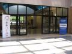 | 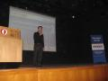 |
|--------------------------------|--------------------------------|

Açılış konuşmasını CETÜRK kurucusu Mehmet Aca gerçekleştirdi. Konuşmasında kısaca CETÜRK’ten ve faaliyetlerinden 
bahsettikten sonra programa geçildi.

| 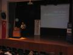 | 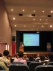 |
|--------------------------------|--------------------------------|

Program olarak oldukça dolu ve kapsamlı bir etkinlik oldu. İlk önce STM’den Hasan Türksoy, son dönemde “rich internet 
applications” geliştirmeye yönelik olarak kurumsal java teknolojileri dünyasında ciddi bir dönüşüme öncülük eden Google 
Web Toolkit hakkında güzel bir sunum yaptı. Sunumla birlikte iki örnek uygulama geliştirilerek `GWT`’nin mimarisi ve 
kabiliyetleri gösterildi.

| 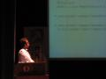 | 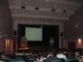 |
|--------------------------------|--------------------------------|

İkinci sunum en son Enterprise Java Beans spesifikasyonu hakkında oldu. Sunumu gerçekleştiren Vardar Yazılım’dan Ümit 
Vardar, `EJB 3.1` ile gelen yeniliklerden ve bileşen tabanlı yazılım geliştirme teknolojilerindeki gelişmelerden bahsetti.

| 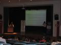 | 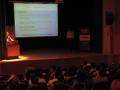 |
|--------------------------------|--------------------------------|

Bu sunumların ardından İnnova çalışanlarından Mustafa Demir ve Mustafa Daşgın arkadaşlarımız `Spring Web Servis Framework`’ünü 
tanıtan bir sunum yaptılar. İki arkadaşımız da uzun zamandır `Spring Web Servis Framework`’ünü İnnova’daki uygulamalarda 
kullanarak bu framework ve genel olarak web servis geliştirme konuları hakkında ciddi bir bilgi birikimi ve deneyim 
sahibi olmuşlardı. Sunumda da bu deneyimlerini gerçek bir örnek üzerinden katılımcılarla paylaştılar.

|  | 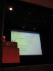 |
|--------------------------------|--------------------------------|

Etkinlikteki diğer bir sunum ise kurumsal java dünyasındaki modülerlik, koşut zamanda dinamik olarak yeniden yüklenebilirlik, 
sınıf yükleme gibi kronikleşmiş problemlere çözüm olabilecek `OSGI` hakkında oldu. Sunumu STM’den Mehmet Gürsul gerçekleştirdi. 
Mehmet Gürsul, sunumunu herkesten farklı olarak powerpoint yerine zihin haritalama yöntemi ile FreeMind aracını kullanarak 
yaptı. Bu açıdan da sunum izleyiciler için farklı bir tecrübe oldu.

| 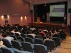 | 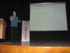 |
|--------------------------------|--------------------------------|

Son olarak ben, bu sene ekim ayında düzenlenecek olan Ulusal Yazılım Mühendisliği Sempozyumu’na göndermiş olduğum, 
“Aspect Oriented Programlama ve ORM teknolojileri vasıtası ile servis düzeyinde audit loglama” konulu makaleden yola çıkarak 
hazırladığım sunumu katılımcılara takdim ettim. Sunum sonunda `Spring AOP` ve `Hibernate` kullanarak ana hatları ile benzer 
sistemin nasıl geliştirilebileceğini örnek uygulama ile gösterme fırsatım da oldu.

| 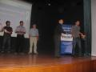 | 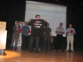 |
|--------------------------------|--------------------------------|

Etkinlik sonunda katılımcılar arasında yapılan çekilişle üç kişiye Özcan Acar arkadaşımızın yazdığı *Extreme Programming* 
isimli kitap, bir kişiye de Mehmet Gürsul arkadaşımızın hazırlattığı ilginç bir t-shirt hediye edildi. Etkinliğe destek 
veren sponsorlara, gayet kaliteli ve düzeyli sunumları ile konuşmacılara, bizleri yalnız bırakmayan bütün katılımcılara 
ve CETÜRK ekibine çok teşekkürler. Yeni bir etkinlikte görüşmek üzere...

