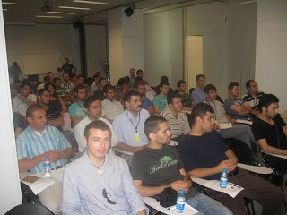
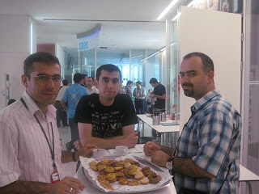
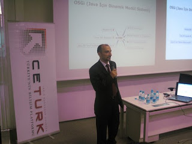
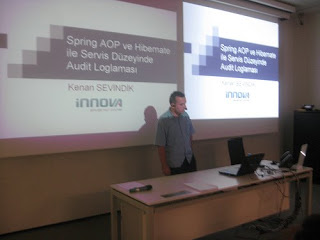

# 4 Temmuz’da İstanbul’daydık
CETÜRK bünyesinde düzenlediğimiz etkinliklerin devamında **4 Temmuz 2009 Cumartesi günü İstanbul’daydık**. Aslında bu 
etkinlik `13 Haziran’da` Ankara’da düzenlediğimiz `Java Teknolojileri Etkinliği`’nin bir tekrarı oldu.

|  |  |
|--------------------------------|--------------------------------|

Ankara’da düzenlediğimiz program içerik olarak oldukça tatmin edici bir düzeydeydi. Bir günde `5` değişik konu üzerinde 
örneklerle desteklenen dolu dolu sunumlar katılımcıların da oldukça beğenisini kazanmıştı. Bu nedenle CETÜRK yöneticisi 
`Mehmet Aca` ile etkinliğin bir tekrarını da İstanbul’da yapmaya karar verdik. Bu Cumartesi günü de katılımcılar programın 
içeriğinden oldukça memnun kaldılar, bunu hem gün boyunca katılımcı sayısının belli bir düzeyin üstünde kalmasından hem 
de değerlendirme formlarına yazılan yorumlardan rahatlıkla söyleyebiliriz. Bu İstanbul’da yaşayan ve daha önceki etkinliğe 
katılamayan arkadaşlar için güzel bir fırsattı.

Etkinliğin düzenlenmesine destek veren sponsor firmalardan `IBM Türk` ve `I-Con`’a çok teşekkür ederiz. Özellikle IBM’in 
salon ve gün boyunca yapılan ikramlar konusunda desteği, çalışanlarının gösterdiği özen bizi ve katılımcıları çok memnun 
etti. Umarım bu tür etkinliklere ileride daha geniş çapta sponsor desteği söz konusu olur. Ülke genelinde hatta uluslararası 
boyutta, nitelikli organizasyonlar düzenleyebilmek için sponsor desteğinin önemi büyük. Bilişim sektöründeki firmaların 
bu tür etkinliklere cüzi de olsa verdikleri destek kendilerine çok daha büyük oranlarda pozitif bir imaj ve reklam olarak 
geri dönüyor.

|  |  |
|--------------------------------|--------------------------------|

Bence firmalar kendi bünyelerinde, çalışma mekanlarında da dışarıdan katılıma açık benzer etkinlikler düzenlemeliler. Bu 
sayede firma çalışanları için bilişim dünyasındaki gelişmeler, yenilikler hakkında bilgilenme ve tazelenme fırsatı 
olabileceği gibi, şirket içinde de bu konulara yönelik daha olumlu bir atmosferin oluşması mümkün olur. Ayrıca sektörün 
değişik yerlerinden gelen katılımcılar ve firma için karşılıklı bir tanışma fırsatı da doğabilir.

Hafta sonundaki organizasyon sayesinde bir süredir görüşmeye fırsat bulamadığım arkadaşlarımla da bir araya gelme ve fikir 
alışverişinde bulunma fırsatım oldu. Aslında bu tür etkinlikler sadece sunumlardaki içerikle teknik boyutta değil, bilişim 
dünyasında yer alan çalışanları, öğrencileri bir araya getirerek sosyal boyutta da sektöre önemli katkıda bulunuyor.

Umarım gelecekte daha farklı ve daha kaliteli içeriklerle Türkiye’nin değişik bölgelerinde bu tür organizasyonları düzenleyebiliriz.
