# JBPM Admin Console II

JBPM’in JPA ile entegre edilmesi, Spring WebFlow ile birlikte kullanılması hakkında yayımladığım blog yazılarından sonra 
sık sık JBPM ile ilgili sorular alıyorum. Bu soruların bir kısmı genel olarak JBPM’in tercih edilmesi, diğer bir kısmı 
ise JBPM’in JSF gibi UI teknolojileri ile nasıl kullanılabileceği hakkında oluyor. Aslında Spring WebFlow entegrasyonunu 
anlattığım blog yazısı UI entegrasyonu ile ilgili sorulara cevap verir niteliktedir. JBPM ve Spring WebFlow’u beraber 
kullanırken UI teknolojisi olarak JSF’i kullanıyoruz ve burada JSF sayfaları ile JBPM arasındaki etkileşim WebFlow ara 
katmanı vasıtası ile oluyor. Aradaki WebFlow katmanını çıkaracak olursak, JBPM ile JSF sayfaları arasındaki karşılıklı 
etkileşim ve geçişler için yine benzer bir çözüm ortaya çıkarmak gerekecektir. Tabi bu noktada bir de JBPM 3.2.x’in Admin 
Console uygulamasından, taskların kullanıcılar tarafından yürütülmesinin console üzerinden sağlandığı, tasklardaki 
değişkenler üzerinde işlem yapabilmek için otomatik olarak admin console tarafından üretilen ve processin yürütülmesi 
sırasında gösterilen JSF formlarından da bahsetmek gerekiyor.

Bu yazıda öncelikle Eclipse plugin’i Graphical Process Designer (GPD) vasıtası ile örnek bir iş akışının (process) nasıl 
oluşturulabileceğini, arından iş akışının admin console ile deploy edilmesini ve en sonunda da akışın tamamen admin 
console üzerinden yürütülmesini anlatacağım. Böylelikle JBPM 3.2.x hakkındaki yazılarımı sonlandırmış olacağım. Artık 
JBPM 4.x var ve 4.x de 3.2.x’e göre ciddi kavramsal ve mimarisel değişiklikler içeriyor. Bundan böyle çalışmalarımı JBPM 
4 üzerinde yoğunlaştırmayı planlıyorum.

## Örnek Bir İş Akışının GPD İle Oluşturulması

JBoss JBPM GPD’in Eclipse içerisinde kurulumu ve GPD’nin nasıl kullanılacağı hakkında detaylı bilgiyi buradan edinebilirsiniz. 
Ayrıca JBPM araçları JBoss Developer Studio içerisinde de yer aldığından JBDS’yi kullandığınız vakit veya JBoss Tools’u 
kurduğunuzda JBPM araçlarına da sahip olabilirsiniz.

Örnek iş akışı olarak daha önceki yazılarımda kullandığım sipariş iş akışının bir benzerini kullanacağım. Süreç, 
kullanıcılardan birisinin yeni bir sipariş oluşturması ile başlar. Siparişin verilmesinden sonra süreç aynı anda işleyen 
iki ayağa ayrılır. Sürecin bir adımında, verilen siparişin mevcut stoktan tedarik edilip edilemeyeceği kontrol edilir, 
diğer adımında ise siparişin bütçesi kontrol edilir. Eğer her iki adımda siparişe onay verirse sipariş kabul edilir ve 
işleme konur. Kontrollerden birisi olumsuz görüş bildirirse sipariş iptal edilir. Her iki durumda da siparişi yapan kişi 
e-posta ile bilgilendirilerek iş akışı sonlandırılır.

JBPM GPD kurulduktan sonra Eclipse içerisinde “Open Perspective” ile JBPM JPDL perspektifine geçilir. Daha sonra yeni 
bir “process definition” oluşturulur.

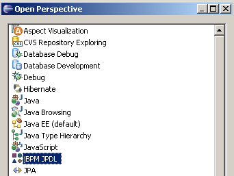

Artık yeni tanımladığımız sipariş iş akışının adımlarını oluşturabiliriz. Her iş akışı tanımı mutlaka bir “start state” 
ile başlamalıdır. Biz de “order start” isimli start state’imizi ekledik. “Order start” state’inde siparişi verecek olan 
kullanıcının gerçekleştireceği bir görev(task) eklemeliyiz. Bu görevin atandığı kullanıcı sipariş bilgilerini girerek 
görevi icra edecektir. Bunun için “order start” state’inin properties view’ı üzerinde “Configure Task”’ı seçelim. Aktif 
olan “Task pane”inden görevle ilgili detayları girelim. Sipariş giriş görevinde kullanıcı “name” ve “price” bilgilerini 
girdikten sonra “Sipariş Ver” butonuna tıklayarak siparişi gerçekleştirecektir.

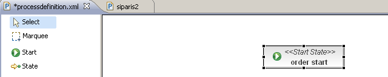
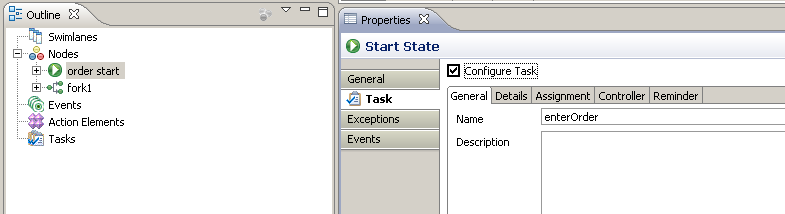

Siparişin “name” ve “price” bilgilerini kullanıcının “order start” taskında girmesi için Controller tabından giderek iki 
tane okunabilir ve yazılabilir “task scoped” değişken tanımlayabiliriz. Bir görev içerisinde tanımlanan controller’ın 
amacı “process scope”da tutulan değişkenlerin tasklar içerisinde “process scope”ta bulunan kopyasına herhangi bir etkide 
bulunmadan lokal biçimde değiştirilmesini sağlamaktır. “Task scoped” değişkenlerdeki güncellemeler “process scope” 
karşılıklarına görevin sonlanması sırasında yansıtılır. Aslında doğrudan process değişkenlerini de güncelleyebiliriz. 
Ancak bu biraz programımız içerisinde global değişkenleri kullanmak gibi olur.

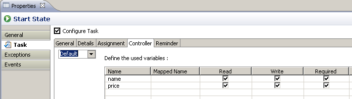
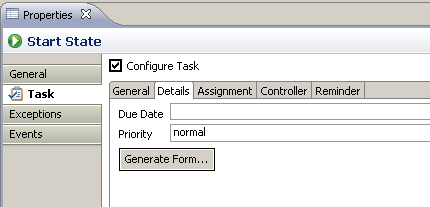

Görev içerisinde kullanılacak değişkenleri tanımladıktan sonra kullanıcının bu görevi yerine getirmek için kullanacağı UI 
formu oluşturulabilir. “Details” tabında “Generate Form…” butonuna tıkladığımız vakit form içerisinde yer alacak girdi ve 
çıktı alanlarını, tasklar arası geçişi sağlayan “transition”lara bağlanan butonların bilgisini girmemizi sağlayacak bir 
dialog penceresi açılır. Bu pencerede gerekli bilgileri girdikten sonra iş akışının tanımının tutulduğu dizinde task ile 
aynı isimde bir xhtml oluşturulur. Ayrıca yine iş akışı ile aynı dizinde forms.xml dosyası içerisinde task-form 
eşleştirmesi eklenir.

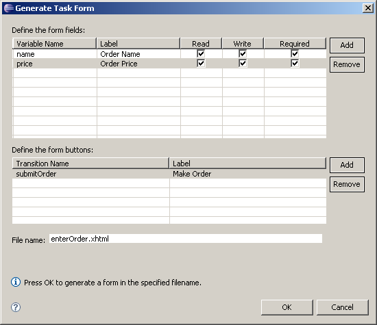

Siparişin girişinden sonra iş akışının bir sonraki adımı verilen siparişin stok ve muhasebe bölümleri tarafından ayrı ayrı 
değerlendirilmesidir. Bu değerlendirme iki departman tarafından eş zamanlı olarak yürütülebilir. Bu nedenle iş akışının 
bu aşamasında bir “çatallanma” (fork) söz konusudur. Bunun için GPD ile bir “fork” tanımı iş akışına eklenir. Bu 
çatallanmada izlenecek iki yol vardır. Birisi “stok kontrol” diğeri “bütçe kontrol”. Her birisi için iki ayrı “task node” 
yine GPD ile iş akışı tanımına eklenir.

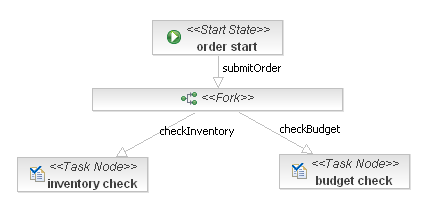

Stok ve bütçe kontrol görevlerinde ilgili kullanıcıların yapması gereken sipariş bilgilerini kontrol ederek siparişi 
onaylamaları veya reddetmeleridir. Bunun için her iki task node içerisinde de properties view’ı kullanılarak birer task 
oluşturulur. Sipariş bilgilerini (name, price) ve bölümün kontrolünün sonucunu tutacak değişkenler bir controller vasıtası 
ile tanımlanır. Burada name ve price değişkenleri salt okunur, inventoryCheckResult ve budgetCheckResult değişkenleri ise 
yazılabilir ve okunabilir olarak tanımlanır. Ardından kullanıcının bu bilgileri görebileceği ve değiştirebileceği UI formu, 
Details tabına geçerek oluşturulur.

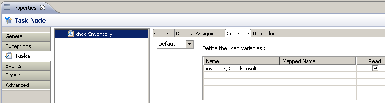
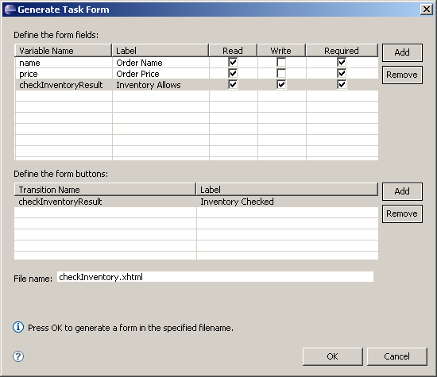

Stok ve bütçe kontrol görevleri yerine getirildikten sonra iş akışında bu adımlarda girilen değerlere göre siparişin 
gerçekleşip gerçekleşmeyeceğine karar verilmelidir. Bunun için öncelikle stok ve bütçe kontrol görevleri ile ortaya çıkan 
çatallaşmayı birleştiren bir “join” elemanı eklenmelidir. Birleştirilen akışın bir sonraki adımı olarak da “order check 
decision” adında “decision state” akışa eklenir. Bu adımda değerlendirmeyi yapacak olan “Handler”in değişik tiplerde olması 
mümkündür. Biz projelerimizde drools rule base tabanlı ve groovy script tabanlı handler nesneleri oluşturmayı mümkün kıldık. 
Çağrılan handler nesnesi içerisinde kabaca yapılan şey, iş değişkenlerinin değerlendirilmesi sonucu decision state’in hangi 
“transition”dan devam edeceğini bildirmektir. Tercih edilen handler’ın invoke edilmesini, aynı zamanda process değişkenlerini 
bu handler nesnesine geçirmeyi sağlayan bir handler proxy sınıfı oluşturduk. Bu sınıfın kullanımı ve iş akış tanımı 
içerisindeki ayarları aşağıdaki resimlerde görülebilir.

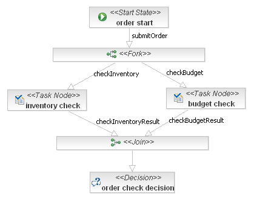
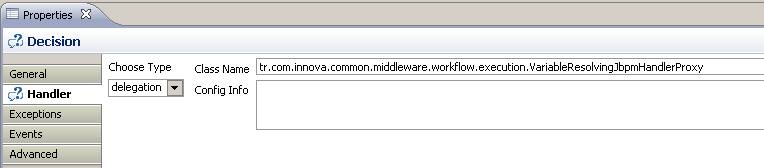
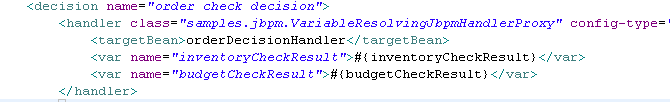

Sipariş iş akışındaki karar adımında varılacak sonuca göre akışın iki şekilde sonlanması söz konusudur. Eğer stok ve bütçe 
kontrolleri olumlu ise sipariş onaylanacaktır. Aksi takdirde sipariş reddedilecektir. Bu durumları ifade etmek için iki 
tane ayrı “end state” tanımlanmalıdır. Her iki end state’e varıldığında da siparişi veren kullanıcıya bir e-posta 
gönderilerek sipariş değerlendirme sonucu hakkında bilgi verilir.

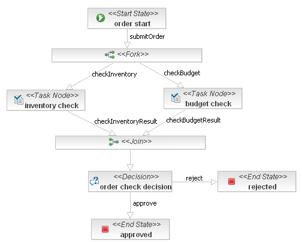

Siparişi yapan kişiye e-posta gönderilmesinin ayarları, approved ve rejected end state’lerine geçişi sağlayan transition 
tanımları üzerinde yapılır. İlgili geçişler sırayla seçilip properties view’daki Actions tabında “New Mail” ile e-posta 
ayarları yapılabilir. E-postaların hem spesifik kullanıcılara hem de belirli görevleri icra etme sorumluluğu verilmiş 
aktör’lere gönderilmesi mümkündür.

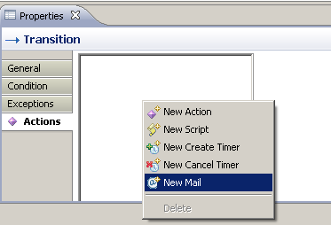
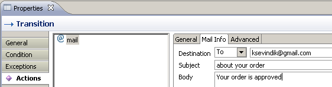

Bu aşamada artık sipariş iş akışı tanımlanmış olup değişik yöntemlerle JBPM ortamına deploy edilebilir durumdadır. Bir 
sonraki bölümde iş akışının deploy edilmesi ve admin-console vasıtası ile yürütülmesi üzerinde duracağım.

