# JBPM Admin Console III

Oluşturulan iş akışı programatik olarak, GPD vasıtasıyla veya admin-console üzerinden deploy edilebilir. Programatik 
olarak deploy etmek için `ProcessDefinition` sınıfının sağladığı `parseParZipInputStream` ve `parseXmlInputStream` 
metodlarından yararlanılabilir. `parseParZipInputStream` metodunu kullanmak için iş akışının ilgili tüm dosyaları bir 
arşiv dosyasına eklenmelidir. PAR, “process archive” anlamına gelmektedir ve jar dosyalarına benzemektedir. Aşağıda 
GPD’nin sağladığı deployment view’ı görülmektedir. “Deployment Server Settings” bölümünde jbpm-console’un (admin console) 
çalıştığı host bilgileri girilerek iş akışı GPD üzerinden deploy edilebilir.

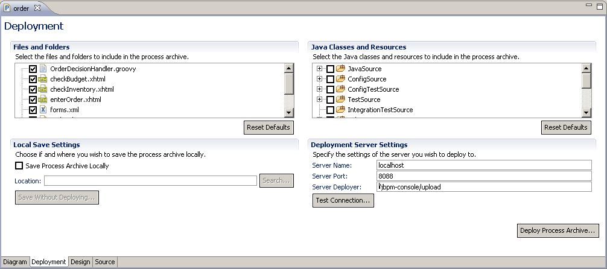

## İş Akışının Admin Console Vasıtası İle Deploy Edilmesi

İş akışının admin console ile deploy edilmesi için ilgili dosyaların önce arşive eklenmesi gerekir. Ardından admin 
console’un ana sayfasında `Actions` bölümünde “Deploy a new process” tıklanarak oluşturulan arşiv dosyası dosya isteminden 
seçilerek deploy gerçekleştirilir.

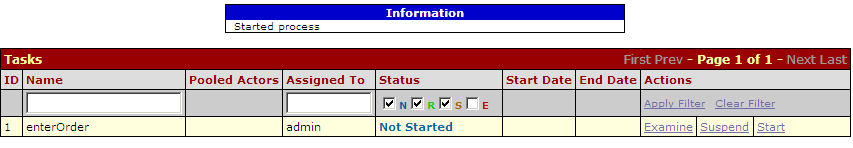
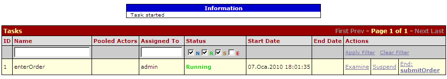

Deploy işlemi sonucunda iş akışı ile ilgili bilgiler ve bu akış tanımı üzerinde yapılabilecek işlemler listelenir. İş 
akışı tanımından oluşturulmuş instance’lar, bu akışa ait görevler ve akış tanımının görüntüsü izlenebilir. İş akışı 
tanımından yeni bir instance oluşturularak yeni bir süreç işletilmeye başlanabilir.

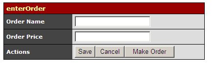

## İş Akışının Baştan Sona Admin Console İle Yürütülmesi

“Start a new process of this process” tıklanarak tanımdan yeni bir instance oluşturulduğunda ekranda aşağıdaki gibi bir 
bilgi verilir ve akışta sırasını bekleyen görevler listelenir. İş akışları ve görevlerin listelendiği ekranlarda “Status” 
sütunundaki N, R, S, E alanları seçilerek değişik durumdaki akışlar ve görevler listelenebilir.

- **N:** Not started
- **R:** Running
- **S:** Suspended
- **E:** Ended
- 
  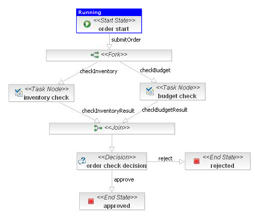

Listedeki çalıştırılabilir görevlerden herhangi birisi start edilerek ilgili kullanıcı tarafından icra edilebilir. 
`Examine` linki ile görevin bir formu mevcut ise bu forma ulaşıp task değişkenleri üzerinde değişiklikler yapılabilir. 
“Sipariş iş akışı” tanımından yeni bir instance oluşturulduğu vakit ilk task `enterOrder` olarak karşımıza gelir. 
`enterOrder` görevi başlatıldıktan sonra `Examine` ile UI forma erişilerek sipariş bilgilerini girmek mümkündür. Bilgiler 
girildikten sonra “Make Order” butonuna tıklandığı vakit akış bir sonraki göreve geçiş yapacaktır.

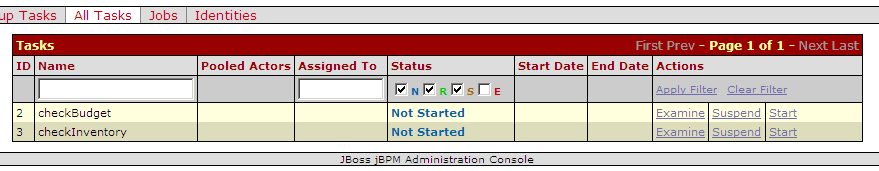
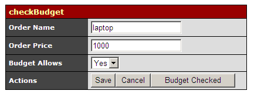
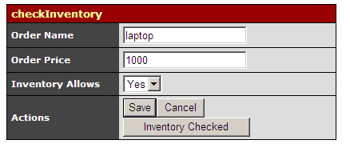

Bir sonraki aşama stok ve bütçe kontrol görevleridir. Bu görevler de ilgili kullanıcılar tarafından yerine getirilmelidir. 
Örnek iş akışında görevlerin değişik aktörlere atanması ve swimlane oluşturulmasına girmedik, ancak gerçek projelerde 
bunlar yardımıyla görevlerin sadece belirli rollerdeki kullanıcılar tarafından icra edilmesi yaygın bir durumdur.

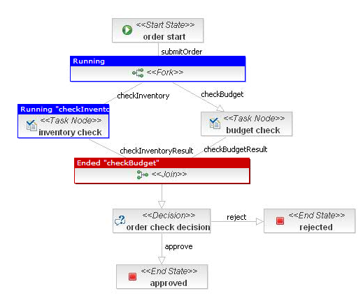
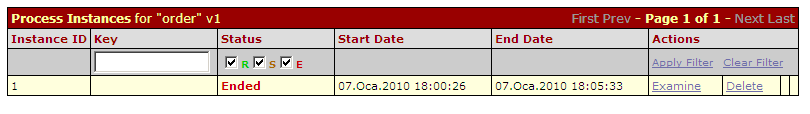
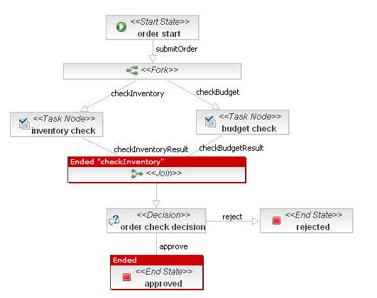
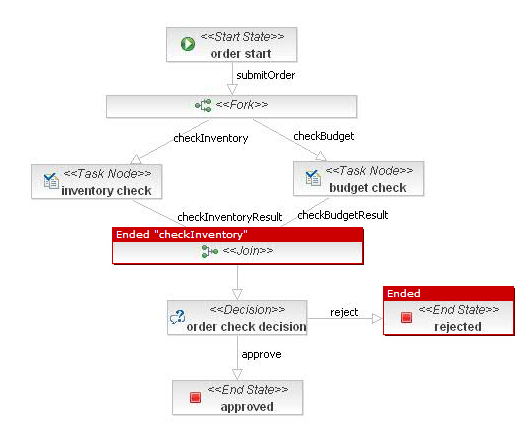

Stok ve bütçe kontrol görevleri sonlandığı vakit iş akışındaki bir sonraki adım bu kontrollerin değerlendirildiği 
`order check decision` aşamasıdır. Burada iş akışı, ilgili `DecisionHandler`’in döneceği transition değerine göre approved 
veya rejected aşamasına geçerek sonlanacaktır. Her iki aşamaya geçişte de kullanıcıya bir e-posta gönderilecektir.

İş akış nesnelerini sorguladığımız vakit bitmiş akışları görebilmek için E statüsünü seçmek gerekir. Örneğin sipariş iş 
akışı sonlandırıldıktan sonra approved ve rejected durumların iş akışının state-transition diagram görüntüsü aşağıdaki 
gibi olmaktadır.

Sonuç olarak kurumsal uygulamaların pek çoğunda sık sık karşımıza çıkan iş akışlarını JBPM ile modelleyerek icra etmek 
doğrudan uygulama içerisinden mümkün olabildiği gibi, doğrudan jbpm-console vasıtasıyla da mümkündür. Bu sayede iş 
akışlarının zaman içerisinde farklı versiyonları ile ortaya çıkabilecek uygulamaların UI ile JBPM iş tanımları arasındaki 
versiyon farklılıklarının önüne de geçilebilmiş olunur.

