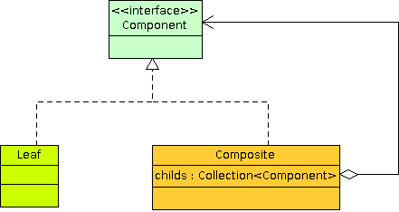

# Fraktal ve Composite

Geçenlerde okuduğum bir [kitapta](http://www.amazon.com/Business-Engineering-Object-Technology-Taylor/dp/0471045217), 
fraktal örüntülerin aslında sağlam bir programlama modeli oluşturabileceğinden 
bahsediliyordu. Verilen örnekte ise composite bir component model üzerinden composite ürünlerin modellenmesi söz 
konusuydu. Gerçekten de composite tasarım örüntüsü fraktal kavramına birebir uymaktadır. Fraktal “parçanın içerisinde 
bütünün tanımlı olması” şeklinde ifade edilebilir. Sonsuza değin süregelen özyinelemeli bir tekrar vardır. Aslında 
composite örüntü de bu özyinelemeli tekrar üzerine kuruludur. Composite örüntü parça-bütün hiyerarşilerinin ele 
alınmasında ve istemcinin en alt düzeydeki bileşen ile composite bileşenlere aynı şekilde davranması gerektiği 
durumlarda çok kullanışlıdır.

Bu örüntüdeki kritik nokta, en alt düzeydeki bileşen ile composite bileşenlerin aynı soyutlamaya tabi tutulmasıdır. 
Aşağıda composite örüntünün sınıf diagramını görüyorsunuz. Composite örüntü GOF’da yapısal bir örüntü olarak 
tanımlanmıştır. Belirli bir bileşen yapısı sunar ve bu yapı üzerinde istemci, parça-bütün ayrımına gitmeden tek bir 
arayüz üstünden kolayca işlem gerçekleştirebilir. Nesne hiyerarşileri veya nesne grupları üzerinde işlem yapmayı 
sağlayan Visitor ve Iterator örüntüleri sıklıkla bu örüntü ile birlikte kullanılırlar. Iterator, composite nesne 
hiyerarşisini dolaşmak için kullanılır. Visitor ise bu hiyerarşi üzerinde uygulanacak işlemlerin tek bir yerde 
toplanmasını sağlar.
