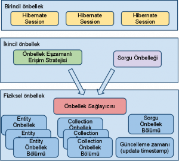

# Hibernate ve Second Level Cache

Hibernate iki seviyeli cache mimarisine sahiptir. Birinci düzeyde cache rolünü persistence context üstlenmektedir ve 
zorunludur. Başka bir deyişle mutlaka devrededir. Bir entity aynı persistence context içerisinde iki veya daha fazla kez 
erişildiğinde, Hibernate sadece tek sefer veritabanına gidecek, diğerlerinde ise entity referansı doğrudan persistence 
context’den dönülecektir. Persistence context Hibernate Session içerisinde yer alan bir yapıdır. Bu nedenle çoğu zaman 
Hibernate Session = Persistence Context olarak da bilinir. Persistence context’in ömrü Session’ın ömrü kadardır. Session 
kapatılıp yeni bir Session açıldığında birincil önbellek yeniden başlar. Her bir Session’da kendine özel bir persistence 
context’e sahip olduğundan birincil önbellekleri de ayrı ayrıdır.

Hibernate opsiyonel olarak second level cache olarak adlandırılan ikincil bir ön bellek yapısını da desteklemektedir. 
Ancak ikincil ön bellek persistence context gibi Hibernate’in fonksiyonlarını yerine getirmesi için zorunlu değildir. 
Olsa da, olmasa da olur. Tamamen performans amaçlıdır. Verinin veritabanından, uygulama tarafına daha yakın bir yere 
taşınmasıdır. Bu yer memory veya disk olabilir.

İkincil ön bellek SesisonFactory düzeyinde konfigüre edildiği için birden fazla Session tarafından ortaklaşa kullanılmaktadır. 
Çoğu zaman her bir Session’ın ayrı bir transaction demek olduğu düşünülürse aynı ikincil belleğe eşzamanlı olarak birden 
fazla transactional erişimin olması ihtimal dahilindedir. Bu nedenle uygulamaların ikincil ön bellek ile çalışırken 
“stale veri” ile karşılaşmaları söz konusudur. Bu durumda da veritabanı erişimlerinde olduğu gibi önbellek erişimlerinde 
de eşzamanlı erişim (concurrent access) stratejileri karşımıza çıkmaktadır.

Hibernate ikincil önbellek, entity, collection ve sorgu düzeyinde konfigüre edilebilmektedir. Entity, collection değerleri 
ve sorgu sonuçları ikincil önbellekte ayrı ayrı bölümlerde tutulurlar. Her bir entity ve collection için ayrı bir önbellek 
alanı ayrılır. Sorgu sonuçları ise sorgu önbellek alanında saklanır. Entity java serialization’a benzetilebilecek bir 
şekilde serialized biçimde önbellekte tutulur. Entity’ler üzerinde gerçekleştirilen işlemlerle ilgili timestamp bilgisi 
update timestamp region olarak bilinen ayrı bir alanda tutulur. Alan tanımları önbellek konfigürasyonu sırasında 
özelleştirilebilir. Önbellek sağlayıcısının konfigürasyonunda da her bir alan için tuning yapılabilir.

Collection’larda ise sadece ilişkili entity’lerin id’leri saklanır. Sorgularda ise sorgu sonucu dönen entity’lerin id’leri 
ve primitif değerler saklanır. Bu nedenle collection ve sorgularda ön bellek, ilgili entity ile beraber devreye alınmalıdır. 
Örneğin User entity’sinin yer aldığı bir sorgu veya ilişki için önbellek devreye alınacak ise User sınıfı üzerinde de ön 
bellek tanımı yapılmalıdır.

Yarın ikincil önbellek eşzamanlı erişim stratejileri ile devam edeceğiz.