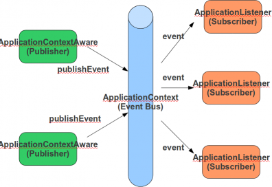

# Spring ve Event Tabanlı Mimariler

Dört günlük [**Spring Application Framework Core Eğitimi**](http://www.java-egitimleri.com/spring.html)‘mizde Spring hakkında pek çok konu üzerinde duruyoruz. Bu 
konulardan birisi de Spring container’ın event publish mekanizmasıdır. Spring Application Framework ile sistemimizi event 
tabanlı bir mimari üzerine bina etmek oldukça kolaydır. Spring container kurumsal uygulamalarda bir event bus olarak görev 
yapabilir. Uygulama içerisindeki farklı modüller, birbirleri ile event tabanlı olarak loose-coupled biçimde entegre 
olabilirler. **ApplicationContext**, modüller arasında iletişim ortamı, bir başka deyişle **Mediator** rolünü üstlenmektedir.

Spring tarafından yönetilen **bean**’lar iş akış sürecinde meydana gelen bir takım event’leri **ApplicationContext** 
vasıtası ile publish ederler. Bu event’ler **ApplicationEvent** sınıfından extend etmelidir. Yine Spring tarafından 
yönetilen **ApplicationListener** arayüzüne sahip bean’lar, Spring container tarafından özel olarak tespit edilerek, 
meydana gelen bu event’lerden haberdar edilirler. Bu sayede **ApplicationListener** nesneleri, ilgilendikleri event’ler 
üzerinden iş mantığı ile ilgili görevlerini yerine getirme fırsatı bulurlar.

**Mediator** örüntüsü görüldüğü gibi **Observer** örüntüsü ile yakından ilişkilidir. Publish-subscribe olarak da bilinen 
**Observer** örüntüsü **Mediator** içerisinde event notification mekanizmasını hayata geçirir. **Mediator** örüntüsü 
sayesinde uygulamanın modülleri arasında olması gereken kompleks ilişkiler ortadan kalkmakta, modüllerin sadece Spring 
container’ın event modeline bağımlı olmaları yetmektedir.

**ApplicationContext** publish edilen event’leri default olarak senkron biçimde **ApplicationListener** nesnelerine 
iletmektedir. Bir **ApplicationListener** event’i handle ettikten sonra diğer listener’a geçilir. Event publish metodundan, 
ancak bütün listener nesneleri haberdar edildikten sonra dönülecektir. İstendiği takdirde bu senkron davranış asenkron 
hale kolaylıkla dönüştürülebilir. Bunun için **ApplicationEventMulticaster** arayüzünü implement eden **SimpleApplicationEventMulticaster**
nesnesini **TaskExecutor** olarak **SimpleAsyncTaskExecutor** ile konfigüre etmek yeterli olacaktır. İstendiği takdirde 
**ApplicationEventMulticaster**’ın davranışı da tamamen değiştirilebilir. **ApplicationContext** içinde tanımlı **ApplicationListener** 
nesnelerinin notifikasyon sırası belirsizdir. Eğer listener’lar arasında belirli bir sıranın gözetilmesi istenirse bu 
durumda **Ordered** arayüzünü implement etmeleri yeterli olacaktır.

Yazın bu sıcak günlerine girdiğimiz şu sıralar herkese bol Spring’li günler…
