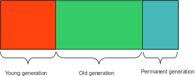

# Java Garbage Collector'da Beynimiz Gibi Çalışıyor

Eğer birisi size bu sabah kahvaltıda yediklerini say dese, ya da dün karşılaştığınız telefon numaralarından birisini 
hatırlamanızı istese büyük ihtimalle her ikisine de cevap vermekte oldukça zorlanacaksınız, muhtemelen de cevap 
veremeyeceksiniz. Oysa yıllar önce, daha çocukluk yıllarınızdayken yaşadığınız bazı anlar ise, çok sıradan olsalar dahi 
en ince ayrıntıları ile gözünüzün önüne gelebilir. Bu anları detayları ile birlikte hatırlamakta hiç zorlanmayabilirsiniz. 
İnsan beyni, en son öğrendiklerini ve karşılaştıklarını hızlı biçimde unutarak hafızadan silmeye, bu şekilde yeni 
öğrenilecek şeylere yer açmaya programlanmış biçimde çalışır. Eğer öğrendiklerimiz, yaşadıklarımız vs. ne kadar uzun süre 
hafızada kalır ise onların unutulmaları da o kadar güçleşir. Başka bir ifade ile insan beyni hafızada yeni bilgilere yer 
açmak için sondan başa doğru giderek temizleme işlemi gerçekleştirir.

Bildiğimiz gibi Java programlama dili de otomatik hafıza yönetimi yapmaktadır. Otomatik hafıza yönetiminde, oluşturduğumuz 
nesnelerle işimiz bittiği vakit, bu nesnelerin hafızada kapladığı alanla ilgili herhangi bir işlem yapmamıza gerek yoktur. 
Java garbage collector, nesne havuzu içerisinde periyodik olarak dolaşmakta, uygulama içerisinde herhangi bir yerden işaret 
edilmeyen nesneleri tespit edip, bu nesnelerin kapladıkları hafıza alanını temizlemektedir. Peki garbage collector nasıl 
bir algoritma kullanmaktadır? Java GC de aynı insan beynine benzer bir şekilde çalışmaktadır. Java uygulamalarında 
oluşturulan nesnelerin %80-90’ının çok kısa ömürlü oldukları istatistiksel olarak tespit edilmiştir. Demek ki uygulama 
içerisindeki çoğu nesneye sadece çok kısa süreliğine ihtiyaç duyuyoruz, işimizi halleder etmez de bu nesneleri bir daha 
görmek dahi istemiyoruz.

Java hafıza havuzu (JVM heap) belirli bölgelere ayrılmıştır. Nesneler öncelikle `young generation` olarak adlandırılan 
bölgede yaratılırlar. Garbage collector belirli periyotlarda devreye girerek `young generation`da bulunan nesnelere 
yapılan referansları inceler, eğer bir nesneye uygulama içerisinden doğrudan veya dolaylı olarak herhangi bir referans 
yoksa bu nesneye ait hafıza alanı temizlenebilir olarak kabul edilir. Uygulamaların performansına menfi etkide bulunmaması 
için GC düşük seviyeli bir thread ile çalıştırılır ve çalışma süresi de oldukça kısadır. Eğer bir GC işlemi sırasında 
nesneye hiç referans olmadığı tespit edilirse bu nesnenin hafıza alanı temizlenir. Herhangi bir nesne, birkaç GC işlemi 
sırasında uygulama tarafından refer edilir vaziyette tespit edilirse bu durumda, nesne `young generation`dan `old generation`a 
taşınır.

JVM iki tür GC işlemi yürütmektedir: **Partial GC** ve **Full GC**. Partial GC sık sık devreye girmektedir, ancak kısa 
kısa çalışmaktadır. Partial GC sadece `young generation` alanını kendine ayrılan süre zarfında tarar. Full GC ise daha 
çok JVM’in nesne havuzunda yer azaldığı zamanlarda devreye girer ve bütün nesne havuzunda tarama gerçekleştirir. Bu nedenle 
eğer bir nesne birkaç partial GC işlemi boyunca sağ kalmayı başarırsa, `old generation`a taşındıktan sonra uygulama 
içerisinden kendine referans olmasa bile uzun süre GC tarafından hafıza alanına dokunulmayabilir. Yukarıdaki resimde 
bulunan fakat GC için erişilmez olan bir alan daha vardır. Bu alana `PermGen space` adı verilir. Bu alanda sınıf bilgileri, 
sabit değerler, String literal değerler vs. tutulur ve asla GC işlemine tabi tutulmaz.
