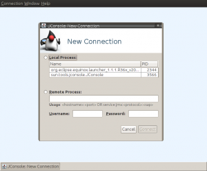

# EhCache'i Monitor Etmek

EhCache özellikle Hibernate’deki ikincil önbellek kabiliyetini sağlamak için yaygın biçimde kullanılmaktadır. EhCache ile 
çalışırken “cache region” olarak adlandırılan bölgelerdeki aktiviteleri izlemek için değişik yollara başvurabiliriz.

1. Yol: EhCache Monitor Uygulamasını Kullanabiliriz


Öncelikle Terracotta firması tarafından geliştirilen ve geliştirme amaçlı olarak ücretsiz kullanılabilen ehcache-monitor 
uygulaması Terracotta sitesinden indirilmelidir. Monitor uygulaması web uygulaması olarak çalıştırılarak değişik 
lokasyonlardan gelecek “cache probe” olarak adlandırılan bilgilendirmeleri dinler. Belirli periyotlarla bu bilgiler 
güncellenerek uygulamamızdaki cache aktiviteleri monitor uygulaması üzerinden takibe sunulmuş olur.  
Monitor uygulamasını çalıştırmak için işletim sistemine göre bin dizini altındaki startup scriptlerinden birisini 
çalıştırmalıyız. Bu script jetty server çalıştırarak monitor uygulamasını devreye alacaktır. Uygulama ile ilgili herhangi 
bir konfigürasyon değişikliği yapmak istersek bunu etc dizini altındaki konfigürasyon dosyalarından gerçekleştirebiliriz.

Monitor uygulamasını çalıştırdıktan sonra kendi uygulamamızın bağımlılıkları arasına ehcache-probe.jar‘ı, uygulamamızdaki 
ehcache.xml dosyası içerisine de aşağıdaki gibi bir tanımı eklemeliyiz.

```xml
<cacheManagerPeerListenerFactory
 class="org.terracotta.ehcachedx.monitor.probe.ProbePeerListenerFactory"
 properties="monitorAddress=localhost,monitorPort=9889, memoryMeasurement=true" />
```

Bu tanımdaki monitorAddress ve monitorPort attribute’ları monitor uygulamasının çalıştığı sistemi göstermelidir. Ehcache.xml 
dosyasındaki cache region tanımlarında statistics attribute değerini true yaparak ve uygulamamızı çalıştıralım. Artık 
Ehcache cache bölümleri üzerindeki aktiviteleri monitor uygulaması üzerinden takip edebiliriz.

2. Yol: CacheManager ve İlgili Nesneleri Mbean ile Erişilebilir Kılabiliriz  

Diğer bir yol CacheManager ve ilgili nesnelerini MBean olarak dışarıdan erişilebilir kılmaktır. Bu sayede cache ile ilgili 
verilere herhangi bir JMX console vasıtası ile erişilebilir. Bunun için uygulamamızda değişik yollar izlenebilir. Aşağıda 
en basit şekli ile bunu nasıl yapabileceğimiz gösterilmektedir.

```java
MBeanServer mBeanServer = ManagementFactory.getPlatformMBeanServer();
ManagementService.registerMBeans(cacheManager,mBeanServer,true,true,true,true);
```


Öncelikle JRE’deki MBean sunucusuna erişilmelidir. Ardından EhCache’in ManagementService sınıfı aracılığı ile cacheManager 
nesnesi mBeanServer’a register edilir. Boolean input argümanları CacheManager, Cache, CacheConfiguration, CacheStatistics 
yapılarından hangilerinin MBean vasıtası ile dışarıya açılacağını belirler.

Bu kayıt işlemini uygulamamızın başlangıç kısmında yapmamız gerekir. Uygulamamız açık kaldığı müddetçe herhangi bir JMX 
uyumlu console vasıtası ile cache yapılarının MBean aracılığı ile sundukları attribute ve fonksiyonlara erişebiliriz. JMX 
console olarak JDK ile beraber gelen jconsole kullanılabilir.

```shell
$jconsole
```

Yukarıdaki komut ile JConsole açıldıktan sonra uygulamanın MBean sunucusuna bağlanarak kayıtlı Mbean nesnelerine erişebiliriz.

3. Yol: Kendi EhCache Debugger’ımızı Yazabiliriz

Eğer yukarıdaki yöntemler ile elde ettiğimiz veri bizi tatmin etmez ise CacheManager nesnesi üzerinden doğrudan istediğimiz 
bilgiye erişmemiz de mümkündür. Bunun için uygulama içerisinde bir miktar kod yazmamız yeterli olacaktır.

```java
String[] cacheNames = cacheManager.getCacheNames();
Cache cache = cacheManager.getCache(cacheName);
```

Öncelikle getCacheNames() metodu ile tanımlı cache bölgelerinin isimlerini elde etmeliyiz. Ardından her bir cache nesnesine 
bu isimler vasıtası ile ulaşabiliriz.

```java
for(Object key:cache.getKeys()) {
 Element element = cache.getQuiet(key);
}
```

Cache nesnesinin `getKeys()` metodu ile o anda cache’e eklenmiş kayıtların anahtar kelimelerine erişerek `Cache.getQuiet()` 
metodu ile her bir key’e karşılık gelen değeri Element nesnesi olarak alırız. Burada dikkat edilmesi gereken nokta eğer 
`Cache.get()` metodu ile bu değerlere erişecek olursak CacheManager bizim erişimlerimizi de cache istatistiklerine dahil 
edecektir. Bu nedenle debug işlemi sırasında `getQuiet()` metodunun kullanılması önemlidir.

```java
element.getHitCount();
element.getCreationTime();

Object entry = element.getObjectValue();
```

Element nesnesi üzerinden değerin eklenme, erişim, güncellenme zamanlarını, kaç defa erişildiğini vs. öğrenmek mümkündür. 
Cache’de tutulan değerimiz Element nesnesi içerisindedir. Cache’i kullanan uygulamaya göre değerin tipi ve içeriği farklı 
farklı olacaktır.

```java
((CacheEntry)entry).getDisassembledState();
```

Hibernate için bu genellikle `CacheEntry` nesnesidir. Örneğin, `CacheEntry.getValue()` metodu ile, eğer değer entity ise 
entity nesnenin disassembled haline erişmek mümkündür.

Yukarıda sözünü ettiğimiz bu üç yöntemden uygun olan herhangi birisini kullanarak EhCache’in devrede olduğu uygulamalarımızdaki 
veri erişim işlemlerinin davranışını daha kolay biçimde takip etmemiz mümkündür. Özellikle Hibernate’in ikincil önbellek 
kabiliyetinin devrede olduğu senaryolarda bu tür bir monitör işleminin geliştirme ve test süreçlerimize önemli katkısı 
olacaktır.
