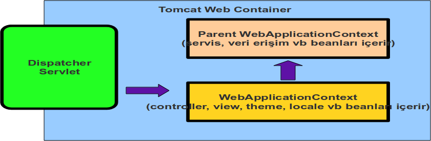

# Spring ve ApplicationContext Hiyerarşisi

## Parent-Child ApplicationContext’ler

Spring tarafından yönetilen nesnelerin yer aldığı, Spring Container olarak da bilinen ApplicationContext bir uygulama 
içerisinde birden fazla sayıda oluşturulabilir. Bu ApplicationContext nesneleri arasında parent-child ilişki kurulabilir. 
Aslında Spring Web MVC ile çalışan, DispatcherServlet konfigüre edilen web uygulamalarında çoğu zaman bu bilinçli veya 
bilinçsiz biçimde uygulanıyor. DispatcherServlet kendisine ait bir WebApplicationContext oluşturur. Eğer web.xml içerisinde 
ContextLoaderListener tanımı mevcut ise web uygulamasının context’i initialize edilirken ayrı bir WebApplicationContext 
daha oluşmaktadır. İşte bu ikinci container, DispatcherServlet tarafından oluşturulan container’ın parent’ıdır. Aynı web 
uygulaması içerisinde çoğu zaman bir tane tanımlansa bile, gerektiği durumlarda birden fazla DispatcherSevlet tanımı 
yapılabilir. Bu durumda her bir DispatcherServlet instance’ının kendine ait bir Spring Container’ı olduğu gibi, bütün bu 
container nesneleri ContextLoaderListener tarafından oluşturulan WebApplicationContext’in child container’ı durumundadır.



Yukarıdaki diagramda da görüldüğü gibi birden fazla ApplicationContext instance’ı uygulamanın farklı katmanlarındaki 
Spring bileşenlerini yönetmek için ideal bir yapı sunmaktadır. Web katmanına ait olan controller, view gibi bileşenler 
DispatcherServlet’in ApplicationContext’i tarafından yönetilirken iş ve veri erişim katmanında yer alan servis ve DAO 
gibi bileşenlerin ise parent ApplicationContext tarafından yönetilmesi söz konusudur. Hemen aklımıza aynı uygulama 
içerisinde birden fazla DispatcherServlet’in nerede karşımıza çıkacağı sorusu gelebilir. Normal web request’lerini ele 
alan DispatcherServlet konfigürasyonumuza ilave olarak örneğin Spring Web Services Framework’ünü kullanarak contract-first 
yaklaşımı ile web uygulamamızdan belirli web servis çağrılarına da cevap vermesini isteyebiliriz. Spring Web Services 
Framework web servis çağrılarını MessageDispatcherServlet ile ele almaktadır ve kendine ait bir ApplicationContext 
oluşturmaktadır. Yine benzer biçimde Spring Remoting kabiliyeti ile servis katmanımızı ayrı bir DispatcherServlet 
konfigürasyonu ile standalone Java istemcilerin erişimine de sunabiliriz.

## Ortak Bir ApplicationContext’in Paylaşılması

Yukarıda bahsettiğimiz model aynı JVM içerisinde çalıştırılan birden fazla web uygulamasına da uyarlanabilir. İki veya 
daha fazla web uygulaması servis, dao vb. bileşenleri ortak bir parent ApplicationContext nesnesi üzerinden paylaşabilirler. 
Örneğin birkaç web uygulaması ortak bir domain modeli paylaşabilirler ve persistence işlemleri de Hibernate gibi bir ORM 
aracı vasıtası ile gerçekleştirilebilir. Hibernate SessionFactory nesnesinin ve diğer ilgili bileşenlerin, servis ve dao 
bileşenlerinin konfigürasyonu bu web uygulamaları tarafından paylaşılabilir. Bu durumda belirtilen bileşenlerin ortak bir 
ApplicationContext içerisinde yönetilmesi gerekir. Spring kullanan web uygulamalarında ortak ApplicationContext’in 
oluşturulması ve bu container içerisindeki bileşenlere erişilebilmesi için öncelikle ApplicationContext’in de bir Spring 
bileşeni olarak tanımlanması gerekir. Bu tanım `beanRefContext.xml` isimli Spring bileşen konfigürasyon dosyası içerisinde 
yapılır.

```xml
<bean id="shared.context">
    <constructor-arg value="classpath*:/appcontext/appContext.xml"/>
</bean>
```

Yukarıdaki `“shared.context”` isimli bileşen tanımı bir ApplicationContext nesnesidir. Bu ApplicationContext de kendi 
içinde `“classpath*:/appcontext/appContext.xml”` argümanı ile classpath’deki ilgili konfigürasyon dosyalarını işleyerek 
kendi Spring bileşenlerini oluşturmaktadır. `“shared.context”` isimli ApplicationContext nesnesi diğer web uygulamalarında 
oluşturulan WebApplicationContext nesnelerine parent container olacaktır. Bunun için her bir web uygulamasının web.xml 
dosyası içerisinde

```xml
<context-param>
    <param-name>parentContextKey</param-name>
    <param-value>shared.context</param-value>
</context-param>
```

şeklinde bir context parametre tanımı yapılmalıdır. Bu sayede `parentContextKey` ile belirtilen 
bileşen ContextLoaderListener ile yaratılan WebApplicationContext’e parent ApplicationContext olarak belirtilmiş olunur.
Peki `“shared.context”` ismi ile belirtilen bileşenin oluşturulması ve web uygulamaları arasında paylaştırılması işini kim 
gerçekleştirmektedir? Bu iş için `BeanFactoryLocator` arayüzünü implement eden bir nesneye ihtiyaç vardır. `BeanFactoryLocator` 
nesnesi `parentContextKey` ile belirtilen container instance’ı oluşturmak ile görevlidir. Birden fazla web uygulamasının 
aynı parent container instance’ı paylaşması için de Spring’in `ContextSingletonBeanFactoryLocator` sınıfından yararlanılır. 
Adından da anlaşılacağı gibi bu `BeanFactoryLocator` singleton olup, classpath’deki bütün `beanRefContext.xml` dosyalarını 
tespit eder. Bu konfigürasyon dosyalarındaki tanımlardan bileşenleri oluşturur. Daha önceden de belirttiğimiz gibi 
`“shared.context”` isimli ApplicationContext nesnesi de bir bileşen olarak `beanRefContext.xml` dosyasında tanımlanmıştı. 
Dolayısı ile context’i initialize olan ilk web uygulaması ortak ApplicationContext’in oluşmasını tetikleyecek ve bunu 
parent container olarak kullanacak, diğer web uygulamaları da singleton `BeanFactoryLocator` vasıtası ile aynı 
ApplicationContext nesnesine erişeceklerdir. Bu yöntemle ApplicationContext paylaşımının yapılabilmesi için `beanRefContext.xml` 
dosyalarının, Spring ile ilgili kütüphanelerin ve paylaşılan bütün bileşenlerle ilgili sınıf ve kütüphanelerinin web 
uygulamaları tarafından erişilebilen ortak bir lokasyonda olması şarttır. Bu çoğunlukla ear içerisine, web uygulamalarının 
ayrı war dosyaları olarak konurken, ortak dosya, sınıf ve kütüphanelerin de konması ile gerçekleştirilir. Tomcat gibi bir 
web container ile çalışırken ise ortak kısımlar Tomcat’in shared dizini altına yerleştirilir. Burada dikkat edilmesi 
gereken en önemli hususlardan birisi `ContextSingletonBeanFactoryLocator` sınıfını içeren `spring-context.jar`’ın da ortak 
lokasyonda olmasıdır. Aksi takdirde her bir web uygulamasının ayrı ClassLoader’ı olacağından farklı `BeanFactoryLocator` 
nesneleri oluşacak, dolayısı ile `“shared.context”` isimli ApplicationContext’de birden fazla olacaktır. Parent 
ApplicationContext yöntemi daha çok ortak bileşenlerin birden fazla web uygulaması arasında paylaşılması için kullanılsa 
bile, standalone uygulamaların modüler bir yapıya sahip olması için de kullanılabilir. `BeanFactoryLocator` kullanarak 
modüler bir mimarinin nasıl oluşturulabileceğine ise bir sonraki yazımızda değineceğiz.
