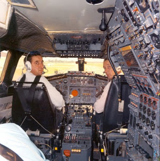

# Peki Bizim Kullanıcı Arayüzlerimiz Nasıl?

Resim şimdilerde Fransa’daki kazadan sonra uçuşları durdurulmuş Concorde’ların cockpit’inden bir görüntü. Sizin de bazen 
geliştirdiğiniz uygulamaların kullanıcı arayüzlerinin de bu cockpit kadar karmaşık olduğunu düşündüğünüz oluyor mu? 
Uygulama geliştirme süreci boyunca sürekli olarak aynı arayüzü kullanmaktan ötürü ortaya çıkan aşinalık, kullanıcı 
arayüzünün basit olduğu izlenimini verebiliyor. Ancak daha önce bu uygulama arayüzü ile hiç karşılaşmamış bir kullanıcı 
acaba el yordamı ile istediği fonksiyonaliyeti çalıştırmayı başarabiliyor mu? Ya da sisteminiz “aptal kullanıcı testinden” 
kazasız belasız geçebiliyor mu?
