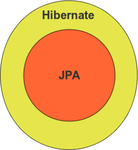
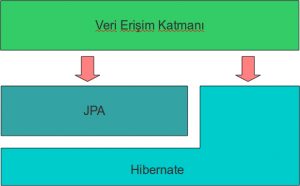

# Hibernate mi, JPA mı?

Hibernate ile ilgili eğitimlerimizde ve danışmanlık faaliyetlerimizde sıklıkla karşılaştığım sorulardan bazıları JPA mı 
kullanalım, Hibernate mi? Siz hangisini tercih ediyorsunuz? veya Niçin Hibernate/JPA? şeklinde oluyor.

JPA hepimizin bildiği gibi bir spesifikasyon, enterprise Java ve ORM dünyasındaki gelişmeler sonucunda ortaya çıkmış bir 
“persistence API”. Doğal olarak, en nihayetinde bu spesifikasyon kağıt üzerinde birtakım tanımlamalardan ibaret. 
Kullanabilmek için bunun ete kemiğe bürünmüş hali lazım. İşte bu da “implementasyon” oluyor. Hibernate, EclipseLink, 
DataNucleus birer JPA implementasyonudur.

Hemen her spesifikasyonda ve API’de olduğu gibi, implementasyonlar spesifikasyon ile uyumlu olmanın ötesinde çoğunlukla 
kendilerine özel kabiliyetlerde barındırırlar. Dolayısı ile yukarıda bahsettiğim sorulara bir de hangi JPA implementasyonu? 
sorusunu ekleyebiliriz.

Kurumsal bir uygulamada veri erişim katmanında doğrudan ORM implementasyonlarından birisini kullanmak yerine, ORM işlemlerini 
JPA üzerinden gerçekleştirmenin şu artıları olabilir.

JPA ile ORM araçlarının uygulamalar içerisinde kullanımı için gerekli konfigürasyonlar büyük ölçüde standarttır.

Domain model ile veri modelinin eşleştirilmesinde kullanılan mapping metadata tamamen olmasa da büyük oranda JPA ile ifade 
edilebilmektedir.

Geliştiriciler arasında persistence ve ORM kavramlarının yaygınlaşmasına, ORM konusunda deneyimli geliştiricilerin sayısının 
çoğalmasına yardımcı olmaktadır.

Ancak uygulama geliştirme safhasında bu artılar sizin için çok da önemli olmayabilir. JPA ile çalışmak, arka tarafta 
kullandığınız ORM implementasyonundan tamamen izole olmak demek değildir. ORM implementasyonuna özgü konfigürasyon 
property’leri, framework’e özel eşleme metadataları, JPA’da bulunmayıp implementasyonda yer alan, ilave ve gelişmiş 
kabiliyetler, spesifikasyonun açık bıraktığı noktalarda implementasyonun nasıl davrandığı gibi pek çok konu geliştirme 
sürecinde sürekli olarak karşınıza çıkacaktır. Açıkçası, kullandığınız JPA implementasyonuna tam olarak hakim olmadan JPA 
ile çalışmanız çok da kolay olmayacaktır.

JPA’yı savunanların öne sürdüğü en büyük argümanlardan birisi ise JPA’nın uygulamayı ORM üreticisinden bağımsız kıldığıdır. 
Bu sayede istendiği vakit farklı bir ORM implementasyonuna geçiş yapılabileceği iddia edilir. Oysa nasıl ki kurumsal 
uygulamalarda veritabanı tercihi kolay kolay değiştirilmez, bir ORM çözümünden başka bir çözüme aynı uygulama için geçiş 
de o kadar sık rastlanan bir durum değildir. Hatta bu durum, kurum içindeki uygulamalar arasında bile bu şekildedir.

Günümüzde pek çok kurumsal uygulama geliştirme projesinde ORM dendiğinde geliştiricilerin aklına çözüm olarak Hibernate 
gelmektedir. Peki Hibernate’i diğer ORM implementasyonlarından bir (kaç) adım öne çıkaran faktörler nelerdir? Bahsettiğimiz 
diğer ORM çözümleri arasında neredeyse ilklerden olması, Spring ve diğer hafif sıklet frameworklerin çok popüler olduğu bir 
dönemde hayata geçirilmesi, çok geniş bir kullanıcı kitlesi, zengin forum ve dokümantasyonu, aradığınız hemen her soruya 
bir cevap bulabilmek sanırım Hibernate’i tercih sıralamasında üstlere taşımaya yetiyor.