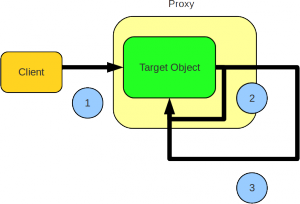

# Proxylenmiş Nesnenin İçerisinden Transactional Bir Metoda Erişmek
Spring Application Framework ile çalışırken TX, security vb. kabiliyetlerin arkasındaki yapı AOP proxy nesnelerdir. Spring 
iki türlü proxy nesne üretebilir.

* Interface proxy (JDK proxy olarak da bilinir)
* Class proxy (cglib veya javassist kullanılabilir)

Birisinde ilgili sınıfın sahip olduğu herhangi bir arayüz implement edilir, diğerinde ise ilgili sınıftan dinamik olarak 
extend edilerek proxy sınıf türetilir. Her iki yöntemde de proxy nesneler söz konusudur. İstemciler açısından en temel 
problem target nesnenin, sadece public ve final olmayan metotların proxy nesne üzerinden çağrılabilmesidir.

Yukarıdaki diagramda da gördüğünüz gibi istemci target nesneye erişirken, transparan biçimde proxy nesne devreye girmektedir 
ve proxy nesne vasıtası ile dekleratif TX yönetimi gibi çaprazkesen fonksiyonlar çalıştırılabilmektedir. Ancak, proxy 
nesneye gelen dış bir metot çağrısı içerisinden yine aynı nesne içerisindeki başka bir metoda erişilirse, bu metot öncesinde 
veya sonrasında çalışması istenen çaprazkesen fonksiyonlar devrede olmayacaktır.

Bunun nedeni ikinci metot erişimi ilk metot erişiminin içerisinden, yani doğrudan target nesne üzerinden olmaktadır. Bu 
durumda da metot çağrısı proxy nesne üzerinden geçmemektedir. Diğer metot için de bu fonksiyonların çalışması isteniyorsa 
yapılması gereken target nesne içerisinde proxy nesneye erişmek ve proxy nesne üzerinden bu metot çağrısını gerçekleştirmektir.

Spring Application Framework AopContext.currentProxy() metodu ile target nesne içerisinden o anda aktif olan proxy nesneye 
erişmek mümkündür. Bunun için öncelikle AOP proxy oluşturulurken, proxy nesnenin kendisini AOP invocation context üzerinden 
erişime açması belirtilmelidir. Ardından target nesnenin içerisinden proxy nesneye erişilerek çapraz kesen davranışa sahip 
metotlar çalıştırılabilir.