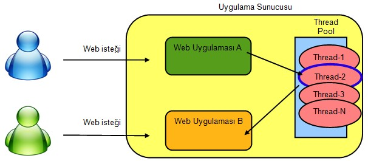

# ThreadLocal Kullanımının Yol Açabileceği Güvenlik Problemleri ve Alınabilecek Önlemler

ThreadLocal değişkenler hem Java hem de .NET ile geliştirilen kurumsal uygulamalarda zaman zaman karşımıza çıkabilir. 
ThreadLocal bir değişkenin değeri her Thread için farklı farklı olabilmektedir. Bu değişkenler, en çok uygulamanın 
katmanları arasında bağlamsal bir verinin (contextual data) metotlara parametre geçmeden taşınması için kullanılmaktadır.

Örneğin, transaction verisi veya güvenlikle ilgili kullanıcı bilgisi gibi. Bu açıdan “global” değişkenlere de 
benzetilmektedirler. Aşağıda Spring Security Framework projesinden alınmış bir kod parçacığında SecurityContext bilgisinin
tutulmasında kullanılan ThreadLocal değişken mevcuttur.

```java
final class ThreadLocalSecurityContextHolderStrategy implements SecurityContextHolderStrategy {
    
    private static final ThreadLocal<SecurityContext> contextHolder = new ThreadLocal<SecurityContext>();
    
    public void clearContext() {
        contextHolder.remove();
    }


    public SecurityContext getContext() {
        SecurityContext ctx = contextHolder.get();
        if (ctx == null) {
            ctx = createEmptyContext();
            contextHolder.set(ctx);
        }
        return ctx;
    }


    public void setContext(SecurityContext context) {
        Assert.notNull(context, "Only non-null SecurityContext instances are permitted");
        contextHolder.set(context);
    }
    
    public SecurityContext createEmptyContext() {
        return new SecurityContextImpl();
    }
}
```

## Olası Problemler ve Dikkat Edilmesi Gereken Noktalar

Web uygulaması geliştirenlerin ThreadLocal değişkenler ile çalışırken biraz daha dikkatli olmaları şarttır. Aksi takdirde 
hafıza sızıntılarına (memory leaks) yol açmaları veya güvenlik açıklarına neden olmaları çok kolaydır.

Eğer ThreadLocal değişkenimiz statik olarak tanımlanmış ise, ki yukarıdaki kod örneğinde de olduğu gibi bu genellikle 
böyledir; değişkenin içeriği, bağlamsal veri üzerinde çalışma tamamlanmasına rağmen temizlenmez ise, sınıf hafızada yüklü 
kaldığı müddetçe yer kaplayacaktır. Java'da yüklenen sınıfların hafızadan çıkarılması (unload) da söz konusu olmadığı için 
bu hafıza alanları JVM açık kaldığı müddetçe hafıza temizlemeye (garbage collection) tabi tutulmayacaktır.



Diğer bir problem ise güvenlik noktasında karşımıza çıkar. Web uygulamaları çoğunlukla bir uygulama sunucusuna deploy 
edilirler ve sunucu, uygulamaya gelen web isteklerinin ayrı ayrı thread'ler tarafından ele alınmasını sağlar. Uygulama 
sunucusu istekleri hızlı biçimde ele alabilmek için çoğunlukla bir thread havuzu kullanır. Bir isteği karşılayan thread, 
sonrasında tamamen farklı bir kullanıcının web isteğini karşılamak için görevlendirilebilir. Bu görevlendirme aynı 
uygulama için olabileceği gibi tamamen farklı bir web uygulamasına gelen isteği cevaplamak için de olabilir. Eğer web 
isteği cevaplanırken ThreadLocal değişkenin içeriği, istek sonunda uygulama tarafından temizlenmez ise, aynı thread farklı
bir web isteğini ele almak için görevlendirildiğinde, içerik diğer kullanıcı veya uygulama tarafından erişilebilir 
vaziyette olacaktır.

## ThreadLocal Değişkenlere Çalışma Zamanında Erişim

Java programlama dilinde herhangi bir Thread nesnesine ait ThreadLocal değişkenlerine reflection yardımı ile kolaylıkla 
erişilebilir. Thread nesnesine özel ThreadLocal değişkenlerinin değerleri Thread sınıfı içerisindeki “threadLocals” isimli
private bir değişkende tutulmaktadır. Bu değişken ThreadLocal sınıfı içerisinde tanımlanmış ThreadLocalMap isimli bir 
statik inner class tipindedir. ThreadLocalMap değişkeni ThreadLocal değerlerini tutumak için özelleşmiş bir map 
implementasyonudur.

Öncelikle reflection yardımı ile elimizdeki Thread nesnesinin “threadLocals” değişkeninin değerine erişimemiz gerekir.
Java'daki erişim kurallarını hatırlayacak olan okurlarımız hemen “private” bir değişkene erişilemez diye düşünebilirler.
Ancak bu engel Field nesnesinin “setAccessible” metodunu çağırarak kolaylıkla aşılabilir.

Map içinde key olarak ThreadLocal instance, değer olarak da bu instance'a setValue() metodu ile geçilen değer tutulmaktadır.
Daha sonra ThreadLocalMap içinde yine private olan “table” isimli bir değişkene aynı yöntemle erişmemiz gerekiyor.

“table” değişkeni ThreadLocal$ThreadLocalMap$Entry[] tipindedir. Her bir Entry nesnesi içerisinde key-value eşleniklerini 
barındırmaktadır. Artık Entry array'de, bir döngü ile dolaşarak her bir hücresindeki değere Entry sınıfı içindeki “value” 
field'ına üzerinden yine reflection vasıtası ile kolayca erişebiliriz. Eriştiğimiz bu değer bize her bir ThreadLocal 
değişkeninde saklanan değeri verecektir.

## ThreadLocal Değişkenlere Çalışma Zamanında Erişimin Engellenmesi

Peki ThreadLocal değişkenlerin değerlerine reflection ile erişimin önüne geçmek için ne yapabiliriz? Kullandığımız platforma
göre yöntemlerde değişiklik söz konusu olabilir. Bu kısımda anlatacaklarımız Java sanal makinası (JRE) için geçerlidir.

Java güvenlik modeli, herhangi bir ağdan indirilerek JRE'de çalıştırılacak kodların denetimi mantığı üzerine kurulmuştur. 
Bu sayede yetkisiz kişilerin yazdığı zararlı kodların kullanıcıların makinalarına indirilerek çalıştırılmasının önüne 
geçilir. Bunun için java, “sandbox” yani kum havuzu modeli sunar. Java güvenliğindeki temel yaklaşım çalıştıracağımız
kodun güvenilir bir kaynaktan indirilmesidir. Sandbox modeli ile güven derecesine göre erişim yetkileri düzenlenebilir. 
Kodlar JRE'deki sandbox içerisinde kendilerine tanınan yetkiler dahilinde sistem kaynalarına erişebilir. Java sandbox 
modelinin hayata geçirilmesini ve özelleştirilmesini sağlayan yapıya SecurityManager adı verilir.

`java -Djava.security.manager` parametresi ile uygulama çalıştırıldığı vakit, JRE default SecutityManager kurulu biçimde
çalışır. Bu durumda da java policy dosyasındaki güvenlik ayarlarına göre  Field.setAccessible() metodunun çalıştırılmasına
izin verilmeyecektir.

Eğer istenirse `JAVA_HOME/jre/lib/java.policy` dosyası içerisinde gerekli ayarları yaparak SecurityManager devrede olsa 
bile setAccessible metodunun çalıştırılması sağlanabilir. Örneğin 

```code
grant {
    permission java.security.AllPermission
};
```

ifadesi ile kaynağı ne olursa olsun bütün kodlar için JRE'de her türlü işlemin yapılmasına izin vermiş olabilir. 
Bu durumda setAccessible metodu problemsiz biçimde çalışacaktır. `AllPermission` ifadesi hepimizin kolaylıkla tahmin 
edeceği gibi sistemimizi tamemen korumasız bir hale getirmektedir. Bu nedenle kullanırken bir değil, birkaç defa düşünmemiz
gerekir. Biraz daha temkinli yaklaşarak sadece reflection ile field erişimine izin vermeyi de deneyebiliriz.

```code
grant {
    permission java.lang.RuntimePermission "accessDeclaredMembers";
    permission java.lang.reflect.ReflectPermission "suppressAccessChecks";
};
```

grant permission entry'lerinin yapısı basitçe şu şekildedir:

```code
permission permission_class “target_name” “action”
```

Buradaki `permission_class` java kodu içerisinde security manager tarafından güvenliğe tabi tutulan metot içerisinde o
andaki kod kaynağının sahip olması istenen permission nesnesinin sınıfıdır. Permission sınıflarına göre “target_name” ve 
“action” farklılık gösterebilir. “action” çoğu permission sınıfı tarafından istenen bir değerdir. Bu değer “read”,”write”
gibi erişimin türünü belirler. Diğer durumlarda ise target_name değerine sahip olunup olunmaması security manager'ın 
denetimi için yeterlidir. Örneğin yukarıdaki gibi `RuntimePermission`'ın “accessDeclaredMembers” değerine sahip olması 
ilgili kod bloğunun çalışması için yeterlidir.

## Sonuç

Uzun lafın kısası siz siz olun, ThreadLocal değişkenlerden yararlanırken işiniz bittiğinde bu değişkenlerin mutlaka 
temizlendiğinden, kullandığınız framework ve kütüphanelerin de varsa ThreadLocal değişkenleri uygun biçimde ele 
aldıklarından da kesinlikle emin olun. Programlarınızın çalıştığı ortamdaki güvenlik mekanizmalarının uygun ayarlara 
sahip biçimde çalışmalarını mutlaka sağlayın.


**Not**: Bu yazı ilk olarak 31 Aralık 2011 tarihinde TÜBİTAK'ın şimdi mevcut olmayan www.bilgiguvenligi.gov.tr sitesinde
[yayımlanmıştır](https://web.archive.org/web/20120126004653/http://www.bilgiguvenligi.gov.tr/yazilim-guvenligi/threadlocal-kullaniminin-yol-acabilecegi-guvenlik-problemleri-ve-alinabilecek-onlemler.html).