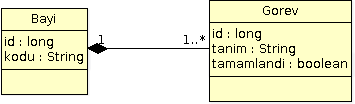

# Hibernate ve Multi-Tenant Uygulamalar
Internet’in yaygınlaşması ve uygulamaların web platformuna taşınması ile birlikte farklı organizasyonlara ait verilerin 
tek bir sunucu uygulamasında yönetimi üzerine kurulu olan multi-tenant uygulamaların sayısı da gün gittikçe artıyor.

Java teknolojileri ile geliştirilen kurumsal uygulamaların pek çoğunda artık ORM teknolojileri tercih edilir hale geldi. 
ORM çözümlerinden Hibernate, en önde gelen “Persistence Framework” olarak karşımıza çıkıyor. İki bölümden oluşacak bu 
yazı dizisinde Hibernate ile multi-tenant uygulamaların nasıl geliştirileceği üzerinde detaylı biçimde duracağız.

Öncelikle multi-tenant uygulama nedir? Özellikleri nelerdir? sorularına cevap vererek başlayalım. Basit bir ifade ile 
multi-tenancy, bir uygulamanın aynı anda birden fazla istemci organizasyonu destekleyecek biçimde çalışmasıdır. Bu tür 
uygulamalarda veri ve diğer konfigürasyon bilgileri istemci organizasyon bazında gruplanmakta, her bir organizasyon 
belirli bir veri ve konfigürasyon kümesi üzerinde çalışmaktadır.

Tek bir uygulama üzerinde birden fazla kurumun yönetilmesine alternatif ise, uygulamanın fiziksel veya yazılımsal 
katmanlarının her bir istemci organizasyon için ayrı ayrı “instance”lar şeklinde kurularak çalıştırılmasıdır. Internet’in 
ve web uygulamalarının yaygın olmadığı dönemlerde çoğu uygulama bu şekilde istemci tarafında ayrı ayrı kurularak 
çalıştırılır, organizasyonlar arası etkileşim için ise genellikle merkezdeki veri tabanından yararlanılırdı. Internet’in 
yaygınlaşması ve uygulamaların çoğunlukla web platformunda çalışacak biçimde geliştirilmesi ile multi-tenant uygulama 
geliştirme ihtiyacı da bu tür kurumsal uygulamalar için gün geçtikçe artmaktadır. Konumuza bir örnek üzerinden devam edelim: 



Örneğin `Bayi` ve `Gorev` şeklinde iki sınıfımız olsun. Her bir bayi üzerine atanan bir veya daha fazla da görev olsun. 
Görevler tamamlandığında bayi tarafından görevin tamamlandığı belirtilsin. Yukarıdaki gibi bir model üzerinde, her bir 
bayi için tamamlanmış, bekleyen ve bütün görevlerin sayılarını öğrenmek isteyebiliriz. Bu ihtiyaçları karşılamak için HQL 
ile şu şekilde sorgular tanımlanabilir:

```hql
select count(g) from Gorev g where g.bayi = ?
select count(g) from Gorev g where g.bayi = ? and g.tamamlandi = false
select count(g) from Gorev g where g.bayi = ? and g.tamamlandi = true
```

Bazen de bayiler genelinde bütün tamamlanmış, bekleyen ve tüm görevlerin sayılarını da öğrenmek isteyebiliriz.  

```hql
select count(g) from Gorev g
select count(g) from Gorev g where g.tamamlandi = false
select count(g) from Gorev g where g.tamamlandi = true
```

Yukarıdaki ihtiyaçlar için yazılan bu sorgular birbirlerine çok benzemekle birlikte, bayi düzeyindeki sorgularda sürekli 
olarak bayi’nin de `where` kriteri olarak kullanılması gerekmektedir. Bayi kriteri tanımlanmamış olsa her iki senaryo 
için ortak sorguların kullanılması mümkün olacaktır. Diğer bir açıdan bayi özelinde yapılacak sorgularda sürekli olarak 
bayi bilgisinin kriter olarak belirtilmesi gereksiz bir tekrardır. Bir nevi DRY prensibinin de ihlali olarak nitelendirilebilir.

Hibernate 3 bu tür tekrarlayan kriterlerin sorgularda tekrar tekrar tanımlanmasının önüne geçmek için `Filter` kabiliyetini 
sağlamaktadır. `Filter` tanımları yardımı ile sorguların `where` kısmında sürekli olarak yer alacak ifade `Filter` tanımında 
belirtilir. Çalışma zamanında bu `Filter` tanımları, ifadede yer alması gereken parametreler de verilerek etkinleştirilir.  

```java
@FilterDef(
name="bayi",
parameters={@ParamDef(type="long",name="bayiId")},
defaultCondition=":bayiId = bayi_id")

...

@Entity
@Filter(name="bayi")
public class Gorev {
...
}
```

Tanımlı filtrenin etkinleştirilmesi `session` düzeyinde gerçekleşir. Ardından aşağıdaki gibi bir sorgu çalıştırıldığında 
Hibernate sorgunun `where` kısmına `bayi_id = ?` ifadesini de otomatik olarak ekleyecektir.  

```java
s.enableFilter("bayi").setParameter("bayiId", b.getId());
```

```hql
select count(g) from Gorev g
```

Eğer bütün bayilerin görevleri sorgulanmak istenirse bu durumda da filtrenin devre dışı bırakılması yeterli olacaktır. 
Sorgularda herhangi bir değişiklik yapılmasına gerek yoktur.

Bir sonraki yazımızda Hibernate 4 ile gelen multi-tenancy kabiliyetlerine detaylı biçimde bakacağız.
