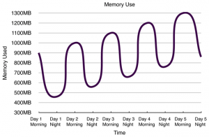

# JSF ViewScope ve JVM Memory Problemleri

Şu sıralar büyük bir müşterimizin kurumsal web uygulamasının performans optimizasyonu üzerinde çalışıyoruz. Süreç sonunda 
uygulamanın kaldırabileceği kullanıcı sayısında ve istekleri ele alma hızında önemli ölçüde iyileşme oldu. Bu iyileştirme 
sürecinin bir bölümünü de memory optimizasyonuna ayırdık. Uygulamanın ön yüzü JSF ile geliştirilmişti. Bu bloğu takip 
edenler JSF hakkında ne güzel(!) hisler beslediğimi bilirler. JSF deki view scope çözümü bu görüşlerimde beni bir kere 
daha yanıltmadı.

Öncelikle çok temel bir kabiliyetle ilgili “memory leak”e sebebiyet veren bir referans implementasyona sahip olmak, ve 
bu bug’ın çözülmesi için uzun süre beklemek JSF kullanıcıları açısından çok da hoş bir deneyim olmasa gerek. Ancak belki 
de JSF ile geliştirilmiş uygulamaların neredeyse gün aşırı restart veya redeploy edilmesi normal bir pratik haline gelmiş 
olabilir ki, bu da bu temel problemin yakın zamana kadar çözümsüz kalmasında bir sorun yaratmamış olabilir. View scope 
ile ilgili bazı issue’ların çözüm için 2.2 sürümünü beklediğini de ilave edelim.

Peki biz bu “hafıza sızıntısı”sını nasıl tespit ettik? Projedeki arkadaşlar ile JVM heap’in kullanım grafiğini 
incelediğimizde aşağıdakine benzer bir yükseliş trendindeki bir eğriyi gördüğünüzde aklınıza gelecek ilk şey bir hafıza 
sızıntısı olmalıdır.

Bizde buna benzer bir grafik gördükten sonra “visual vm” yardımı ile bir takım senaryoları incelerken “full GC”yi 
tetikledikten sonra senaryonun o adımına gelindiğinde ortada görünmemesi gerekirken hala heap’de yer kaplayan nesneleri 
incelemeye koyulduk. Şanslıydık ki ilk birkaç dakika içinde “view scope” JSF controller nesnelerinin, senaryolarının 
dışına çıkılmasına rağmen hala heap’de bulunmaları dikkatimizi çekti. Bug’ların tespiti, sürüm yükseltmeleri vs’de bunları 
takip etti.

İlgili bug fix’in dışında JSF’in tarayıcıların “geri” buttonu kullanıldığında önceki sayfaları o andaki state’lerini 
korumuş biçimde göstermeye çalışmasını sağlayan tasarımından dolayı ve bu tasarımın göz ardı edilip, view scope backing 
bean’lerin refer ettiği nesnelerle hafızayı şişirdiğiniz vakit yine aşırı hafıza tüketimi ile karşı karşıya kalabilirsiniz. 
Kısaca özetlemek gerekirse JSF, back button’unu ve multi tab view’ları ele alabilmek için web.xml’de yönetilen iki context 
parametresine sahip. “numberOfViewsInSession” ve “numberOfLogicalViews” context parametreleri JSF implementasyonlarına 
göre farklı ön eklerle web.xml’den yönetilebiliyorlar ve default değerleri 15 ila 20 arasında değişiyor. Basite indirgersek 
her GET request’i logical view sayısını, her POST request’i de o logical view ile bağlantılı session’daki view sayısını 
bir artırıyor. Dolayısı ile bu değerler sonucunda 15×15 veya 20×20 adet view ve ilgili state’i Http Session içerisinde 
saklanabildiği zamanlar olabilir. Uygulamanızda bu view state’lerdeki veri miktarını da göz önüne alarak hafıza tüketiminin 
nerelere varacağını siz hesaplayın artık. Tabi aşırı hafıza tüketimi ve bunun yaratacağı “full GC” yavaşlamaları da işin 
tuzu biberi olacaktır.

Çözüm olarak bu paramterelerin değerlerini çok daha aşağılara çekmenizi, view scope bean’lerde tutulan verinin veya 
ilişkili nesne networkünün hacmini küçültmenizi önerebiliriz. Tabi bu değerleri azalttığınız durumda geri tuşunun kullanımı 
sırasında veya farklı tab’larda açılan view’larda işlem yaparken ViewExpiredException alabilirsiniz. Bu hata restore 
edilmek istenen view’ın artık JSF’in LogicalViewMap’inde yer almadığını anlatıyor. Bu hatayı bir exception handler ile 
yakalayıp kullanıcıya uygun bir hata mesajı göstermek hiç yoktan iyi bir çözüm olacaktır.