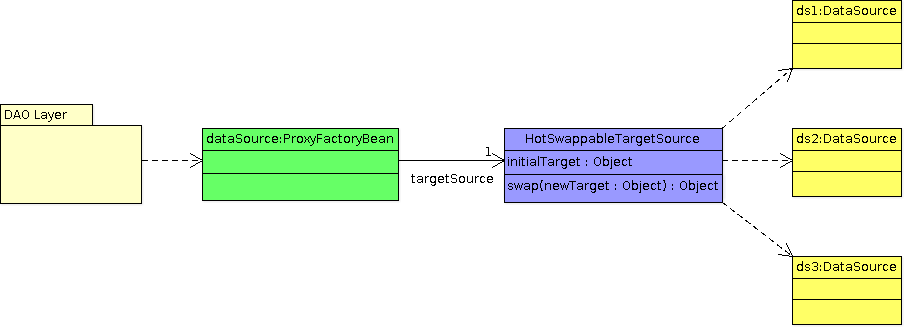

# How to Switch from One DB Instance to Another at Runtime

Sometimes we may need to switch from one DB instance to another during runtime. Actually, this is very easy if you are 
using Spring and the DataSource API in order to obtain DB connections. Let's look at our solution for such a requirement.

Our solution is based on the “proxy pattern”. Spring provides us with `ProxyFactoryBean` so that we can easily create a 
proxy bean, which is depended on by others instead of the real bean and delegates requests to its “target” bean.

The target bean can be directly given to the proxy bean, or instead, it can be accessed over a `TargetSource` instance. 
Here, we employ a special implementation of `TargetSource` called `HotSwappableTargetSource`. The `HotSwappableTargetSource` 
bean allows us to swap the real target at runtime via its “swap” method. Initially, it is configured with an 
“initialTarget”; however, later it can be replaced with any other suitable bean by just calling the `swap` method, giving 
the “newTarget” as the input parameter.

Such a requirement may come up in your project as well. You may want your application to use a temporarily different DB 
instance during maintenance, for example. In such cases, you will also need to handle other cases such as invalidating 
currently logged-in users’ sessions, object caches, etc.
