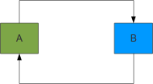

# Spring JavaConfig ve Döngüsel Bağımlılıklar




Sonda söyleyeceğimiz daha baştan söyleyerek başlayalım. Aslında en doğrusu döngüsel bağımlılıklardan tamamen kaçınmak. 
Ancak zaman zaman karşımıza doğrudan veya dolaylı olarak Java nesneleri arasında döngüsel bağımlılık ihtiyacı çıkabiliyor.

Spring XML tabanlı konfigürasyon ile çalışırken döngüsel bağımlılık problemi “setter injection” yöntemi tercih edildiği 
takdirde bir yere kadar problemsiz biçimde ele alınabiliyor. Eğer “constructor injection” kullanılırsa XML tabanlı 
konfigürasyonun bize yardımcı olması söz konusu değil.

```java
public class A {
	private B b;

	public A() {}

	public A(B b) {
		this.b = b;
	}

	public B getB() {
		return b;
	}

	public void setB(B b) {
		this.b = b;
	}
}

public class B {
	private A a;

	public B() {
	}

	public B(A a) {
		this.a = a;
	}

	public A getA() {
		return a;
	}

	public void setA(A a) {
		this.a = a;
	}
}
```

```xml
<bean id="a" class="com.javaegitimleri.spring.A">
        <property name="b" ref="b"/>
</bean>

<bean id="b" class="com.javaegitimleri.spring.B">
        <property name="a" ref="a"/>
</bean>
```

Yukarıdaki bean konfigürasyonu problem çıkarmaz iken aşağıdaki bean konfigürasyonunda `BeanCurrentlyInCreationException` 
hatası ortaya çıkacaktır.

```xml
<bean id="a" class="com.javaegitimleri.spring.A">
        <constructor-arg ref="b"/>
</bean>

<bean id="b" class="com.javaegitimleri.spring.B">
        <constructor-arg ref="a"/>
</bean>
```

Döngüsel bağımlılık durumu, bağımlılıkların enjekte edildiği durumların dışında da karşımıza çıkabilir. Örneğin bir bean 
bağımlılıkları enjekte edildikten sonra Spring `ApplicationContext`’e erişebilir ve belirli bir tipte veya isimde bir 
bean’a lookup yapabilir. Bu lookup yapılan bean’da doğrudan veya dolaylı olarak ilk bean’a refer edebilir. Bu durumda da 
döngüsel bağımlılık problemi ile karşı karşıyayızdır.

```java
public class B implements ApplicationContextAware, InitializingBean {
	private A a;
	private ApplicationContext applicationContext;

	public B() {
	}

	public B(A a) {
		this.a = a;
	}

	public A getA() {
		return a;
	}

	public void setA(A a) {
		this.a = a;
	}

	@Override
	public void afterPropertiesSet() throws Exception {
		this.a = applicationContext.getBean(A.class);
	}

	@Override
	public void setApplicationContext(ApplicationContext applicationContext)
			throws BeansException {
				this.applicationContext = applicationContext;
	}
}
```

Yukarıdaki örnekte `B` bean’ının içerisinde `ApplicationContext`’e erilip `A` tipindeki bean’a lookup yapılmaktadır. Bu 
durumda ortaya çıkan döngüsel bağımlılığı Spring aslında bize DEBUG level’daki bir uyarı mesajı ile haber de vermektedir.

```console
26 Feb 2013 16:24:53,653 - DEBUG -  -  - AbstractAutowireCapableBeanFactory.invokeInitMethods(1529) | Invoking afterPropertiesSet() on bean with name 'b'
26 Feb 2013 16:24:53,653 - DEBUG -  -  - AbstractBeanFactory.doGetBean(242) | Returning eagerly cached instance of singleton bean 'a' that is not fully initialized yet - a consequence of a circular reference
26 Feb 2013 16:24:53,654 - DEBUG -  -  - AbstractAutowireCapableBeanFactory.createBean(463) | Finished creating instance of bean 'b'
```

Yukarıdaki örneklerde her ne kadar bean’lar tam olarak initialize edilmeden birbirlerine enjekte edilseler bile, döngüsel 
bağımlılık XML tabanlı konfigürasyon için engelleyici bir sorun teşkil etmemektedir. Çünkü setter injection ile nesnenin 
oluşturulması ve bağımlılıkların enjekte edilmesi iki farklı fazda ele alınmaktadır. Dolayısıyla doğrudan veya dolaylı 
olarak birbirlerine bağımlı nesneler yaratıldıktan sonraki bir adımda bağımlılıkları kendilerine rahatlıkla enjekte 
edilebilmektedir.

Spring’in XML ve annotasyon tabanlı konfigürasyonun yanında Spring 3 ile Java tabanlı konfigürasyon kabiliyetine de sahip 
olduğunu söylemiştik. Java tabanlı konfigürasyonda bean oluşturma ve bağımlılıklarının enjekte edilmesi Java kodu içerisinden 
gerçekleştirilmektedir. Başka bir ifade ile nesnenin oluşturulması ile bağımlılıklarının enjekte edilmesi bir tek faz 
içerisinde ele alınmaktadır. Dolayısıyla döngüsel bağımlılık söz konusu olduğunda bunun çözülebilmesi mümkün olmayacaktır. 
Sorun “constructor injection”daki durumla oldukça paraleldir.

Döngüsel bağımlılıkların ele alınamaması JavaConfig tabanlı Spring konfigürasyonunun temel kısıtlarından birisidir. Ancak 
birkaç “workaround” ile problem bir düzeye kadar yönetilebilir bir hale sokulabilir. Bunlar:

- Bean düzeyinde autowire’ın aktive edilmesi (`@Bean(autowire = Autowire.BY_TYPE)`)
- `@AutoBean` özelliğinin kullanılması
- `@Configuration` düzeyinde `AutowiredAnnotationBeanPostProcessor` ile autowire kabiliyetinin aktive edilmesi

Bir sonraki devam yazımızda bu özellikleri örnekler üzerinden incelemeye çalışacağız.
