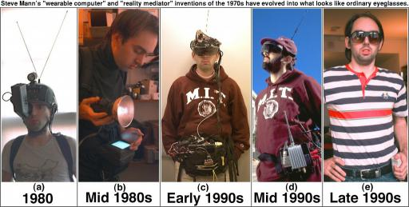

# İlerleme Süreklilik İster

Steve Mann’ı ve çalışmalarını İnternet üzerinden 94’den bu yana aralıklarla takip ediyorum. Kendisi 70’lerin sonlarından 
bu yana “giyilebilir bilgisayar” sistemleri üzerinde çalışıyor. Çalışmaları en son Google’ın “gözlük” projesini duyunca 
tekrar aklıma geldi. Acaba Steve Mann’da bu projede yer alıyor mu veya bu proje hakkında ne düşünüyor diye merak ediyordum. 
Kısa bir zaman sonra takip ettiğim twitlerden birisinde aşağıdaki [yazı](http://spectrum.ieee.org/geek-life/profiles/steve-mann-my-augmediated-life) 
belirdi. Steve, yazıda 35 yılı bulan, kendi tabiri ile “mediated reality” yani “aracılı gerçeklik” tecrübelerinden ve 
Google’ın “gözlük” projesi hakkındaki fikirlerinden bahsediyor.

Steve Mann’ın 70’lerin sonlarındaki ilk çalışmalarına baktığımızda kafasında büyükçe, antenli ve garip bir kask görüyoruz. 
Steve bu çalışmalarını ilk dönemlerden itibaren günlük hayatta da tecrübe ediyormuş. Muhtemelen kendisi ile dalga geçen, 
alaya alan, çabalarının beyhude ve zaman kaybı olduğunu düşünen, bu külfete katlanmayı anlamlı bulmayan pek çok kişi 
olmuştur. Ancak bu çalışmaların kesintiye uğramadan 35 yılın sonunda geldiği noktaya ve sunduğu kabiliyetlere baktığımızda 
net bir ilerleme görüyoruz. Eğer Steve Mann bu süreci ısrarla sürdürmeseydi, kesinlikle günümüzde erişilen noktada 
olunamayacaktı.

Bütün bunları düşünürken aklıma bizim yazılım sektöründeki durumumuz geldi. Acaba özel veya kamu kuruluşlarımızın 
çalışmaları ne kadar süreklilik arz ediyor? İlk aşamada başarısız, verimsiz gibi duran çalışmaların içerisindeki işe 
yarar kısımlar ne ölçüde tespit edilip, revize edilerek, ne işe yarıyor, neresi problem yaratıyor bakılarak ortaya çıkan 
yapılar şirketin deneyim havuzuna aktarılıyor? Önceki projelerden elde edilen bilgi birikimi ve deneyim hangi oranda 
kesintisiz biçimde daha sonraki projelerde kullanılıyor, iyileştirilip bir ileri adıma taşınabiliyor? Teknolojide, 
araçlarda ve yazılım süreçlerinde ne gibi bir süreklilik var? Yoksa günü kurtaran çözümlerle ağustos böceği gibi yaşamaya 
devam mı ediliyor? Gazetelerden birisinin sloganıydı “her sabah dünya yeniden kurulur, her sabah taze bir başlangıçtır”, 
yoksa bizde bu sloganla mı hareket ediyoruz?

Sözün özü, herhangi bir konuda ilerleme ve tatmin edici bir sonuç istiyorsak kısa vadeli çözümlerin kurumsal vizyonu 
sekteye uğratmasının önüne geçmeliyiz. Esen rüzgarda bir oraya bir buraya savrulan yaprak olmaktan kurtulmalıyız.