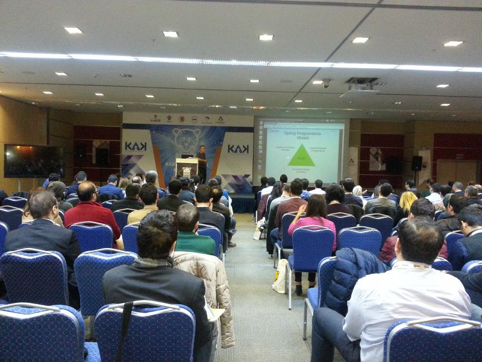
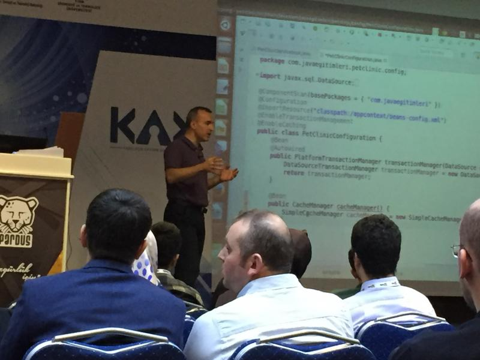

# Spring Ekosisteminde Kurumsal Yazılım Geliştirme

ULAKBİM tarafından düzenlenen Kamuda Açık Kaynak Konferansı‘ında Spring Framework’ü etraflıca tanıttığımız Spring 
Ekosisteminde Kurumsal Yazılım Geliştirme isimli bir sunum yaptık. Katılım oldukça yoğundu. Sunumu Spring, kurumsal 
uygulamaların özellikleri ve orta katman ihtiyaçları ile ilgili kısa bir bilgilendirmenin ardından demo ağırlıklı 
gerçekleştirdik.

Harezmi Bilişim Çözümleri olarak düzenlediğimiz “Kurumsal Java Eğitimleri”nde sürekli olarak kullandığımız petclinic 
örneği üzerinde sıfırdan bir Spring konfigürasyonu nasıl yapılır, en basit biçimde standalone ortamda Spring 
ApplicationContext nasıl yaratılır ve kullanılır ile başlayarak Spring’in sağladığı pek çok kabiliyeti adım adım 
örnekledik.

Bu örnekler arasında Spring ile entegrasyon birim testleri, JDBC ile veri erişim kabiliyetleri nelerdir, transaction 
yönetimi, servis metotları düzeyinde cache’leme ve validasyon kabiliyetleri, aspect oriented programlamada Spring’in 
sağladığı kolaylıklar, custom bir aspect’in yazılması ve çalıştırılması, standalone ortamda yapılan bütün bu 
konfigürasyonun web ortamına taşınarak uygulamanın çalıştırılması, MVC ve REST kabiliyetleri, Spring Security’nin form ve 
HTTP basic authentication kabiliyetleri mevcuttu. Katılımcılar 3 saate yakın süren oturum boyunca bütün bu özelliklere 
sahip kurumsal bir web uygulamasının Spring kullanılarak nasıl geliştirilebileceğini gözleme şansına sahip oldular.

[ULAKBIM KAK Spring Framework Sunumu](files/20151112_ULAKBIM_KAK_Spring_Framework_Sunumu.pdf)
