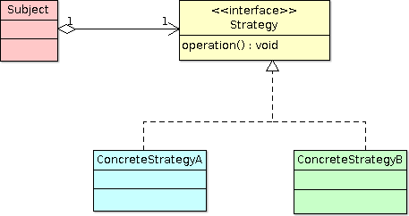
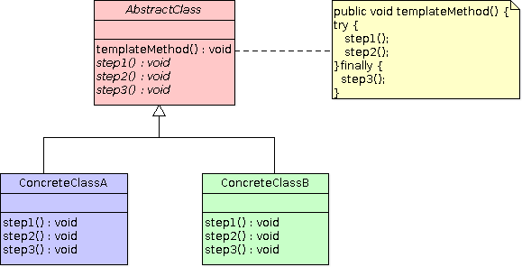

# What is the difference between Strategy and Template Method patterns…, if there is any?

In our [Spring book](http://www.amazon.com/Beginning-Spring-Mert-Caliskan-ebook/dp/B00T1JV8TI/ref=asap_bc?ie=UTF8), we 
discuss transaction management mechanisms available in the Spring Framework, namely declarative and programmatic 
transactions. It is further explained inside the programmatic transaction demarcation section, how programmatic 
transaction can be achieved using different methods. One of the ways a programmatic transaction can be achieved is by 
using the `TransactionTemplate` utility class provided by Spring itself. It is based on the Template Method pattern, 
which constantly emerges over several different parts of the Spring Framework to encapsulate steps of a recurring 
operation, such as data access, transaction management, REST or JMS communication logic, etc. In that case, the main 
transaction demarcation logic is fixed within the specific template method, but varying steps can be given into it later 
on, so that specifics of the algorithm can be customized by the calling body. In our case, the transactional code block 
that needs to be run within an active transaction is given as a method parameter.

```java
TransactionTemplate tt = new TransactionTemplate(transactionManager);
tt.execute(new TransactionCallbackWithoutResult() {
        public void doInTransaction(TransactionStatus status) {
                entityManager.persist(pet);
        }
});
```

Recently, one of our book readers asked whether mentioning the `TransactionTemplate` as an example of the Template Method 
is really correct. He asked that; shouldn’t we call it a Strategy instead? Well, actually both the Strategy and 
Template Method patterns are very similar in their behavioural aspects. Indeed, we can call them cousins with some slightly 
different characteristics. They both try to encapsulate an algorithm. However, they vary in how that encapsulation is achieved.



The Strategy pattern encapsulates the algorithm using object composition or delegation. The subject depends on the `Strategy` 
interface, and a concrete implementation of the Strategy is chosen and invoked based on decisions made at runtime. That way, 
the specific algorithm, which will be executed, can be determined and changed dynamically. Context information of the 
client environment, which might be consulted during the execution of the algorithm, is usually passed in as a method 
argument in the Strategy pattern.

```java
public class AuthenticationProvider {
	private UserService userService;
	
	public AuthenticationProvider(UserService userService) {
		this.userService = userService;
	}

	public boolean authenticate(String username, String password) {
		User user = userService.loadUserByUsername(username);
		return user != null && user.getPassword().equals(password);
	}
}

public interface UserService {
	public User loadUserByUsername(String username);
}
```

In the above code sample, `AuthenticationProvider` depends on `UserService` in order to obtain a `User` object through it. 
`UserService`, an interface, is in the role of Strategy here, and it may have several concrete implementations, each of 
which queries `User` by username from different user realms. Any of those concrete implementations can be injected into 
`AuthenticationProvider` at runtime.



On the other hand, the Template Method pattern handles encapsulation of the algorithm and selection of it at compile time, 
usually based on inheritance. It fixes the main steps of the algorithm in a base class, called the Template Method class, 
and expects varying steps to be provided by the specific subclass which extends from the Template Method base class. 
Therefore, algorithm selection is finished long before the application state becomes running.

```java
public abstract class QueryTemplate {

	private DataSource dataSource;

	public void setDataSource(DataSource dataSource) {
		this.dataSource = dataSource;
	}
 
	public final List execute() {
		Connection connection = null;
		PreparedStatement statement = null;
		try {
			connection = dataSource.getConnection();
			String sql = getSql();
			statement = connection.prepareStatement(sql);
			Object[] args = getArgs();
			for(int i = 0; i < args.length; i++) {
				statement.setObject(i+1, args[i]);
			}
			ResultSet resultSet = statement.executeQuery();
			List resultList = new ArrayList();
			while (resultSet.next()) {
				T record = process(resultSet);
				resultList.add(record);
			}
			return resultList;
		} catch (SQLException e) {
			throw new RuntimeException(e);
		} finally {
			if (statement != null)
				try {
					statement.close();
				} catch (SQLException e) {}
			if (connection != null)
				try {
					connection.close();
				} catch (SQLException e) {}
		}
	}

	protected abstract String getSql();
	protected abstract Object[] getArgs();
	protected abstract T process(ResultSet resultSet) throws SQLException ;
}
```

In the above code sample, `QueryTemplate` is a base class in which the `execute()` method is implemented along with three 
other abstract methods which are called by the `execute()` method at specific steps during the query execution process. 
Subclasses extending `QueryTemplate` override those abstract methods in order to implement expected behaviours within them. 
Clients don’t need to know the exact subtype during query execution; they simply depend on `QueryTemplate` to perform 
their task.

Inheriting a Template Method class is not the most effective way from a framework perspective to provide varying parts. 
In the Java environment, it cannot be feasible every time, especially if the class which needs to extend from the 
Template Method class is already extending from another class. We hit against the multiple inheritance limitation in that 
case. Instead, frameworks follow another way to feed the Template Method with those varying steps; as method input arguments.

```java
public class QueryTemplate {

	private DataSource dataSource;

	public void setDataSource(DataSource dataSource) {
		this.dataSource = dataSource;
	}

	public final List execute(String sql, RowExtractor rowExtractor, Object...args) {
		Connection connection = null;
		PreparedStatement statement = null;
		try {
			connection = dataSource.getConnection();
			statement = connection.prepareStatement(sql);
			for(int i = 0; i < args.length; i++) {
				statement.setObject(i+1, args[i]);
			}
			ResultSet resultSet = statement.executeQuery();
			List resultList = new ArrayList();
			while (resultSet.next()) {
				T record = rowExtractor.process(resultSet);
				resultList.add(record);
			}
			return resultList;
		} catch (SQLException e) {
			throw new RuntimeException(e);
		} finally {
			if (statement != null)
				try {
					statement.close();
				} catch (SQLException e) {}
			if (connection != null)
				try {
					connection.close();
				} catch (SQLException e) {}
		}
	}

	public static interface RowExtractor {
		public T process(ResultSet rs);
	}
}
```

That code sample shows variation in the Template Method mentioned previously. `QueryTemplate` is concrete in this case, 
and `RowExtractor` is an interface which declares a method to process each row in the `ResultSet` returned from the query 
executed. Both the query to be executed, query parameters if there exist any, and the `rowExtractor` object are given as 
method parameters to the `execute` method of `QueryTemplate`. That way, application code doesn’t need to extend from the 
Template Method class over and over again. It just calls the method in order to execute the algorithm, and passes varying 
steps as method arguments into it.

If the varying parts are code blocks that need to be executed at a specific point in the algorithm, the only possible way 
prior to Java 8 was anonymous classes. Some contextual information, like `TransactionStatus` in our `TransactionTemplate` 
example, can be passed in as method parameters of the anonymous class, similar to the Strategy pattern as well. Probably, 
this variation in the implementation of the Template Method pattern causes some people to think that it more resembles 
the Strategy pattern.
