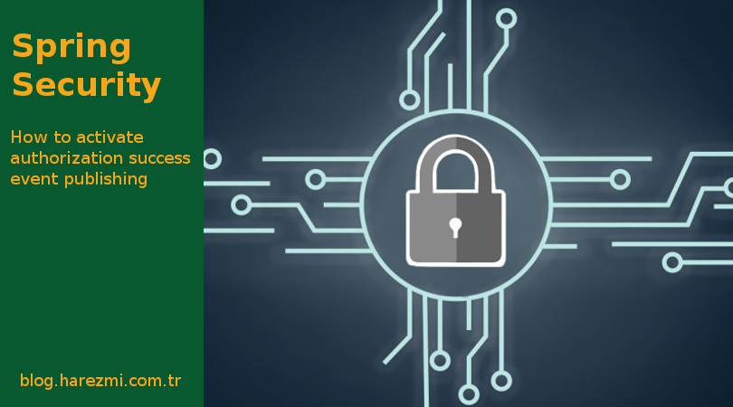

# Activating Authorization Success Event Publish Feature



Spring Security publishes various authentication and authorization events during its security checks. Spring-managed 
beans which implement the `ApplicationListener` interface or beans with methods annotated with `@EventListener` can 
consume those events within the application. One of those security-related events is `AuthorizedEvent`, which indicates 
that a user request is allowed to access a secure web resource. It is, however, disabled by default.

In this post, I will try to explain how to activate publishing `AuthorizedEvent`s whenever successful authorization occurs 
within your system. Authorization events are published by the `FilterSecurityInterceptor` bean, which is configured by 
Spring Security `<http>` element by default. It has a property setter, namely `setPublishSuccessAuthorization(..)`, 
through which publishing authorization success events are activated. Unfortunately, Spring Security provides no way to 
pass a value to this property within the `<http>` element. There are, however, several ways to change this property value 
to `true` and let Spring Security publish events after successful authorization operations as well.

One way is not to employ the `<http>` element at all and configure the Spring Security filter chain and the 
`FilterSecurityInterceptor` bean via explicit bean definitions. However, we will lose the advantages of configuring the
Spring Security filter chain via security namespace elements that way.

The other way is a lot easier. It also exploits Spring’s event mechanism itself. Here we keep the regular Spring Security 
namespace configuration, and only need to create a bean that handles Spring’s built-in `ContextRefreshedEvent`. When the 
Spring `ApplicationContext` is ready to use, the built-in `ContextRefreshedEvent` is fired, and we can perform a bean 
lookup for the `FilterSecurityInterceptor` bean, which is already defined via the `<http>` element. When we obtain that 
bean, it is only required to invoke `setPublishSuccessAuthorization(..)` to enable authorization success events. 
That’s all!

```java
@Component
public class SecurityConfigurer {

	@Autowired
	private ApplicationContext applicationContext;

	@EventListener
	public void handle(ContextRefreshedEvent event) {
		FilterSecurityInterceptor fsi = applicationContext
				.getBean(FilterSecurityInterceptor.class);
		fsi.setPublishAuthorizationSuccess(true);
	}

	@EventListener
	public void handle(AuthorizedEvent event) {
		System.out.println(event.getSource());
		System.out.println(event.getAuthentication());
		System.out.println(event.getConfigAttributes());
	}
}
```
I hope you will like this approach and employ it in your projects whenever you need to activate publishing authorization 
success events within your system.
