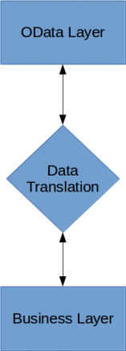
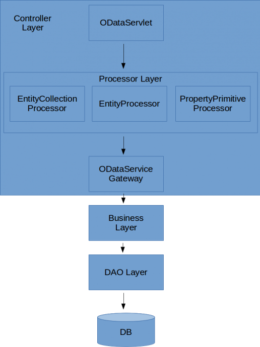

# Observations about OData and Spring Data REST

Recently I had a chance to spend some time reading about OData and experiment with Apache OLingo Project in order to 
understand what OData provides us with in terms of making our REST services more standardized and self-discoverable. 
I also compared it with Spring Data REST Project, what are their similarities and differences, whether it would be 
meaningful to integrate OLingo with Spring MVC REST, or what should be the scope of integration if possible.

OData is simply a data exchange protocol by definition, and it tries to operate over REST. As it is a data exchange 
protocol, it first starts with defining a metamodel called as entity data model (EDM). Within EDM, we first specify what 
are our entities, what attributes they contain, what associations exist between them, functions which can be performed 
over those entities and so on.

```java
public class PetClinicEdmProvider extends CsdlAbstractEdmProvider {
        @Override
	public CsdlEntityType getEntityType(FullQualifiedName entityTypeName) throws ODataException {
                 CsdlEntityType entityType = new CsdlEntityType();
                 entityType.setName(ENTITY_TYPE_NAME_VET);

                 CsdlPropertyRef idRef = new CsdlPropertyRef();
                 idRef.setName("id");

                 CsdlProperty id =  new CsdlProperty().setName("id").setType(EdmPrimitiveTypeKind.Int64.getFullQualifiedName());
                 CsdlProperty firstName = new CsdlProperty().setName("firstName").setType(EdmPrimitiveTypeKind.String.getFullQualifiedName());
                 CsdlProperty lastName = new CsdlProperty().setName("lastName").setType(EdmPrimitiveTypeKind.String.getFullQualifiedName());
                 CsdlProperty graduationYear = new CsdlProperty().setName("graduationYear").setType(EdmPrimitiveTypeKind.Int32.getFullQualifiedName());

                 entityType.setProperties(Arrays.asList(id,firstName, lastName, graduationYear));
                 entityType.setKey(Arrays.asList(idRef));

                 CsdlNavigationProperty navigationProperty = new CsdlNavigationProperty();
                 navigationProperty.setName("Specialties"); //name of the navigation property
                 navigationProperty.setType(FQN_ENTITY_TYPE_SPECIALTY);
                 navigationProperty.setNullable(false);
                 navigationProperty.setCollection(true);
                 navigationProperty.setPartner("Vets");

                 entityType.setNavigationProperties(Arrays.asList(navigationProperty));

                 return entityType;
       }
}
```

After creating EDM, it comes to write Processor objects to expose data and handle navigations between entities, perform 
CRUD operations or other functions/actions and data filtering through REST. We can easily say that Processor objects 
closely correspond with `RestController` beans in Spring MVC REST. They handle incoming web requests, extract information 
out of it, and translate that OData specific information into a format so that the current task can be delegated to the 
business layer. After the business layer returns, this time domain specific result data is translated back into the OData 
format and the web response is generated by writing it as the HTTP response body. That translator part, as depicted in 
the following diagram, is called as OData service gateway or gateway in short. It acts as a bridge between processor and 
service layers.

```java
public class PetClinicEntityProcessor implements EntityProcessor {
@Override
public void readEntity(ODataRequest request, ODataResponse response, UriInfo uriInfo, ContentType responseFormat)
		throws ODataApplicationException, ODataLibraryException {
	// extract metadata from request uri
	List resourceParts = uriInfo.getUriResourceParts();
	UriResource uriResource = resourceParts.get(0);
	UriResourceEntitySet resourceEntitySet = (UriResourceEntitySet) uriResource;
	EdmEntitySet edmEntitySet = resourceEntitySet.getEntitySet();

	// extract query data from request uri to perform search
	List keyPredicates = resourceEntitySet.getKeyPredicates();

	// execute backend business logic, search for specific entity in this
	// case
	Entity entity = oDataServiceGateway.readEntity(edmEntitySet, keyPredicates);

	// create a serializer to serialize found entity
	ContextURL contextUrl = ContextURL.with().entitySet(edmEntitySet).build();
	EntitySerializerOptions options = EntitySerializerOptions.with().contextURL(contextUrl).build();
	ODataSerializer serializer = odata.createSerializer(responseFormat);
	SerializerResult result = serializer.entity(serviceMetadata, resourceEntitySet.getEntityType(), entity,
			options);

	// write serialized data into the response
	response.setContent(result.getContent());
	response.setStatusCode(HttpStatusCode.OK.getStatusCode());
	response.setHeader(HttpHeader.CONTENT_TYPE, responseFormat.toContentTypeString());
}
}
```



Finally, you need to write an `ODataServlet` in which you bring those pieces together and handle the current web request. 
`ODataServlet`, Processors and OData service gateway can be seen as composing a Controller layer altogether.

```java
public class ODataServlet extends HttpServlet {
    
    private PetClinicService petClinicService = new PetClinicServiceImpl(new PetClinicDaoInMemoryImpl());
    
    @Override
    protected void service(HttpServletRequest request, HttpServletResponse response) throws ServletException, IOException {
		OData oData = OData.newInstance();
		ServiceMetadata serviceMetadata = oData.createServiceMetadata(new PetClinicEdmProvider(), new ArrayList<>());
		ODataHttpHandler handler = oData.createHandler(serviceMetadata);
		
		ODataServiceGateway oDataServiceGateway = new ODataServiceGateway(petClinicService);
		PetClinicEntityCollectionProcessor entityCollectionProcessor = new PetClinicEntityCollectionProcessor(oDataServiceGateway);
		PetClinicEntityProcessor entityProcessor = new PetClinicEntityProcessor(oDataServiceGateway);
		PetClinicPropertyPrimitiveProcessor propertyPrimitiveProcessor = new PetClinicPropertyPrimitiveProcessor(oDataServiceGateway);
		
		//handler.register(new DefaultDebugSupport());
		handler.register(entityCollectionProcessor);
		handler.register(entityProcessor);
		handler.register(propertyPrimitiveProcessor);
		
		handler.process(request, response);
    }
}
```




The end result is just exposing domain/data model over REST in a standard format/structure. OData specification tries to 
act similar to WSDL/SOAP of the REST world. We can actually say that OData is WSDL/SOAP of REST. In my experience, it 
seems that as WSDL/SOAP makes things too complex in XML-based web services, the same is true for OData in the REST side, 
too. Although, it will help you expose your domain/data model in a standard format, and make it exchangeable among various 
clients and servers, if your expectation from OData is just to create a standard REST API for accessing data, and performing 
operations over that REST API, OData will simply be an overkill.

Spring Data REST and OData/OLingo are competitors in short. They both are trying to achieve similar results but from 
completely different perspectives. As OData is totally data centric or data oriented, Spring Data REST, on the other hand, 
is function oriented. It would be meaningless trying to integrate OData/OLingo with Spring Data REST or Spring MVC REST, 
so that Spring should totally be responsible in handling web requests, and operating on the controller layer. OData as a 
protocol, and Apache OLingo as the implementation of it should be in complete control in handling web requests. However, 
OLingo can be integrated with Spring and leverage Spring Container’s capabilities in a limited fashion. `ODataServlet` 
can be replaced with a Spring Controller which just handles any HTTP request and delivers it to OData Handler for further 
processing. In that scenario, HTTP response is not written by Spring at all. OData service gateway can be made a 
Spring-managed bean as well. That way, Spring managed service beans can easily be injected into it.

```java
@Controller
public class PetClinicODataController {
	
	@Autowired
	private PetClinicService petClinicService;
	
	@RequestMapping
	public void handle(HttpServletRequest request, HttpServletResponse response) {
		//OData instance must be unique for each request/thread
		OData oData = OData.newInstance();
		
		ServiceMetadata serviceMetadata = oData.createServiceMetadata(new PetClinicEdmProvider(), new ArrayList<>());
		ODataHttpHandler handler = oData.createHandler(serviceMetadata);
		
		ODataServiceGateway oDataServiceGateway = new ODataServiceGateway(petClinicService);
		PetClinicEntityCollectionProcessor entityCollectionProcessor = new PetClinicEntityCollectionProcessor(oDataServiceGateway);
		PetClinicEntityProcessor entityProcessor = new PetClinicEntityProcessor(oDataServiceGateway);
		PetClinicPropertyPrimitiveProcessor propertyPrimitiveProcessor = new PetClinicPropertyPrimitiveProcessor(oDataServiceGateway);
		
		handler.register(new DefaultDebugSupport());
		handler.register(entityCollectionProcessor);
		handler.register(entityProcessor);
		handler.register(propertyPrimitiveProcessor);
		
		handler.process(request, response);
	}
}
```

Spring Data REST’s choice to make REST API standardized and self discoverable is HATEOAS. Hypertext as the engine of 
application state is an approach so that clients should be able to discover REST API by themselves via following HTML 
link tags returned from REST service calls. However, even with HATEOAS, everything is not explicitly defined and self 
discoverable by client applications without any external help. It is still needed for someone who will interpret returned 
links and prepare upcoming REST calls out of those link information. On the other hand, it is necessary to have a 
standardized approach or style applied throughout a REST API. That way, client-side developers will easily understand and 
learn how to fetch, insert, update, or delete data.
