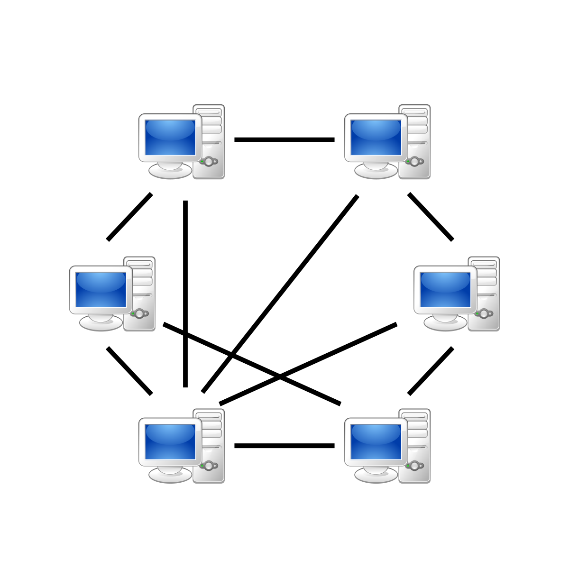

# EhCache Configuration in Replicated Mode



In cluster environments, you can configure EhCache in two different topologies, one is distributed, and the other is 
replicated. In replicated mode, each EhCache instance in the network acts as a peer. There is no master cache. Instances 
communicated with each other via multicast network messages through RMI. Configuration of EhCache in replicated mode is 
easy but involves several steps. Let’s look at them closer.

First, you need to add <cacheManagerPeerProviderFactory> element within <ehcache> element in ehcache.xml file.

```xml
<cacheManagerPeerProviderFactory
    class="net.sf.ehcache.distribution.RMICacheManagerPeerProviderFactory"
        properties="peerDiscovery=automatic, multicastGroupAddress=230.0.0.1,multicastGroupPort=4446, timeToLive=32"/>
```

EhCache instances discover other peers in the network either automatic, or manual. You can manage this option with 
peerDiscovery attribute.

Second, you need to add <cacheManagerPeerListenerFactory> element, again within <ehcache> element so that EhCache instance 
will listen to peer messages in the network.

```xml
<cacheManagerPeerListenerFactory
    class="net.sf.ehcache.distribution.RMICacheManagerPeerListenerFactory"
        properties="hostName=localhost,port=40001,socketTimeoutMillis=2000"/>
```

hostName property allows entering hostname or IP in order to direct EhCache listen multicast messages through a specific 
interface if there are several interfaces on the cluster node.

The third addition, <cacheEventListenerFactory> element goes into either <cache> or <defaultCache> elements the 
configuration file.

```xml
<defaultCache
  maxElementsInMemory="10000"
  eternal="false"
  timeToIdleSeconds="0"
  timeToLiveSeconds="120"
  maxElementsOnDisk="10000000"
  diskExpiryThreadIntervalSeconds="120"
  memoryStoreEvictionPolicy="LRU">
    <persistence strategy="localTempSwap"/>
    <cacheEventListenerFactory class="net.sf.ehcache.distribution.RMICacheReplicatorFactory"
        properties="replicateAsynchronously=true, replicatePuts=true, replicateUpdates=true, 
        replicatePutsViaCopy=true,replicateUpdatesViaCopy=true, replicateRemovals=true "/>
</defaultCache>
```

This element enables a cache event listener in order to replicate operations performed on this cache region.

You can choose whether replication should go async or sync via replicateAsynchronously attribute. Async mode will be 
faster, but sync is safer as it will wait to ensure every other peer in the network got updated.

replicatePuts, replicateUpdates and replicateRemovals attributes allow us to manage what operations will be replicated 
on other peers.

replicatePutsViaCopy, and replicateUpdatesViaCopy attributes changes replication strategy of cache puts and updates 
either by copying or invalidating data in other peers.

The last important thing about in replicated cache configuration is use of time to idle. As time to idle is incosistent 
with replicated caching, you should not use it in your cache region configuration. You can set it to 0 in your cache 
configuration.