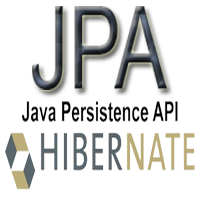

# JPA/Hibernate Pratikleri ve Püf Noktaları

Yaklaşık 2004 yılından bu yana önce Hibernate sonra da JPA üzerinde çalışıyorum. O dönemden bu yana pek çok projenin 
geliştirilmesinde görev aldım, danışmanlık ve mentörlük yaptım. Yıllar önce Ted Neward, ORM teknolojilerini bilgisayar 
bilimlerinin Vietnam’ına benzetmişti ve bunda da çok haklıydı. Eğer genel olarak ORM çözümleri, özelde de JPA/Hibernate 
ile ilgili sağlam bir teorik bilgiye sahip değilseniz projenizin tam manası ile bir bataklığa dönüşmesi işten bile değildir. 
Bütün bu yıllar boyunca JPA/Hibernate ile çalışmalarım sonucu bir takım temel kullanım pratikleri ve püf noktalar belirledim. 
Dahil olduğum projelerde de bu pratiklerin uygulanmasına, püf noktalara dikkat edilmesine azami gayret gösteriyorum ve 
sonuç olarak JPA/Hibernate ile çalışmak çok daha verimli bir hal alıyor. Aşağıda bu temel pratik ve püf noktalardan aklıma 
gelenlerin bir kısmını sizlerle paylaşmak istedim. Umarım işinize yarar!

- **1:1 ve M:1 ilişkiler** de dahil olmak üzere bütün ilişkileri `LAZY` tanımlayın.
- **1:M ilişkileri** her zaman için çift yönlü tanımlayın ve ilişkiyi sadece `M:1` tarafından yönetin.
- **M:N ilişkileri**, association table için ayrı bir entity tanımlayarak iki tane çift yönlü `1:M` ilişki ile ele alın.
- `Cascade` tanımlarını sadece `1:M` ve `1:1` ilişkilerde ve gerçekten hangi işlemlerin cascade etmesini istiyorsanız sadece onlar için kullanın.
- `Embeddable` yerine her zaman için `Entity` kullanın.
- Derin inheritance hiyerarşilerinden kaçının, mümkün olduğunca bütün hiyerarşi için “tek tablo” yönetimini tercih edin.
- Bileşke PK yönetiminden uzak durun.
- Nümerik PK değeri ile çalışılması gerekiyorsa sentetik PK üretme yöntemlerinden `SEQUENCE`’i tercih edin.
- **Entity** sınıfların `equals` ve `hashCode` metotlarını implement ederken proxy ile çalışma ihtimaline karşın attribute değerlerine her zaman getter metotlar vasıtası ile erişin.
- **HQL**, **Criteria** ve **Native SQL** sorgularından sadece senaryonun ihtiyaç duyduğu kadar veriyi içeren `DTO` nesneleri dönün, hiçbir zaman `Entity` dönmeyin.
- `LazyInitializationException` probleminin en iyi çözüm yolu **fetch join**’dir, `Hibernate.initialize()`, proxy nesnenin veya collection’ın içerisine erişim, `OpenSessionInViewFilter`, `OpenEntityManagerInViewFilter` gibi yöntemleri kesinlikle kullanmayın.
- Üretim ortamında detached uninitialized lazy ilişkilere veya proxy’lere erişim sırasında lazy hatası ile karşılaşmamak için `hibernate.enable_lazy_load_no_trans` property tanımının değerini `TRUE` yapın.
- **Entity** düzeyinde ikincil önbellek kullanıyorsanız, bu entity’nin `1:1` ve `M:1` ilişkili hedef entity’lerini de entity düzeyinde önbellek kontrolüne dahil etmeyi unutmayın.
- **İlişki** düzeyinde ikincil önbellek kullanıyorsanız, ilişkinin hedef entity’sini de entity düzeyinde önbellek kontrolüne dahil etmeyi unutmayın.
- Sorgu sonuçlarının önbellekte tutulması faydadan çok zarar getirebilir, bunu unutmayın. Gerçekten sorgu sonuçlarını önbelleğe dahil edecekseniz ve sorgu sonucunda entity dönülüyorsa hedef entity’yi de önbellek kontrolüne dahil etmeyi unutmayın.

