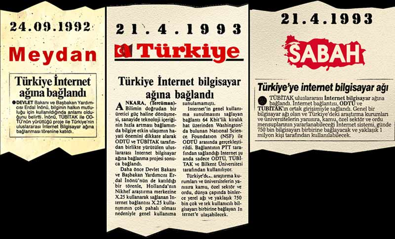
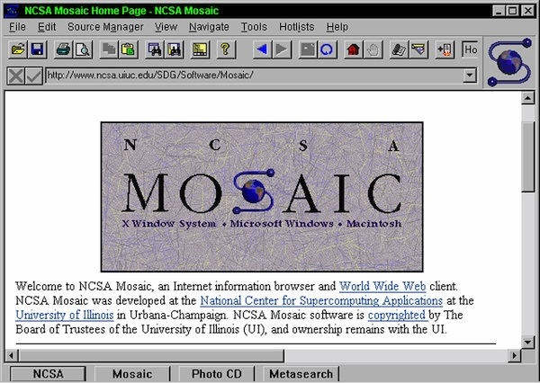
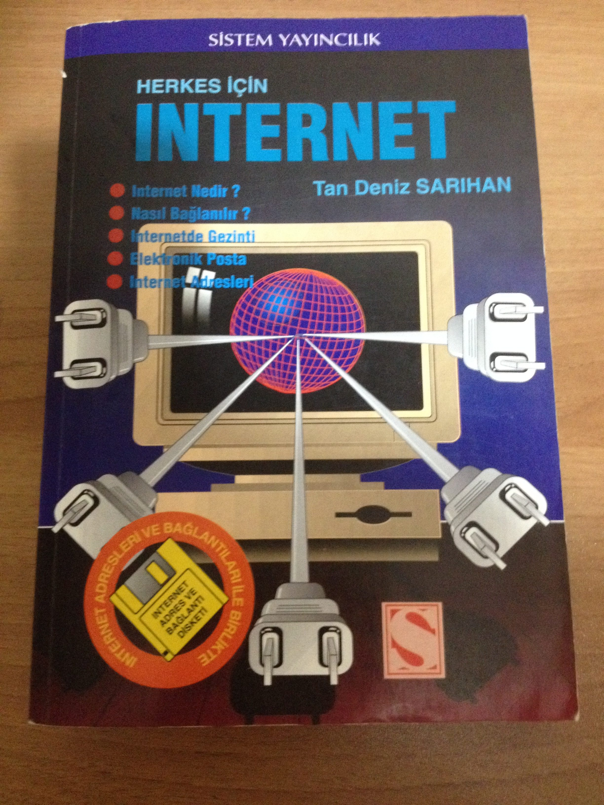
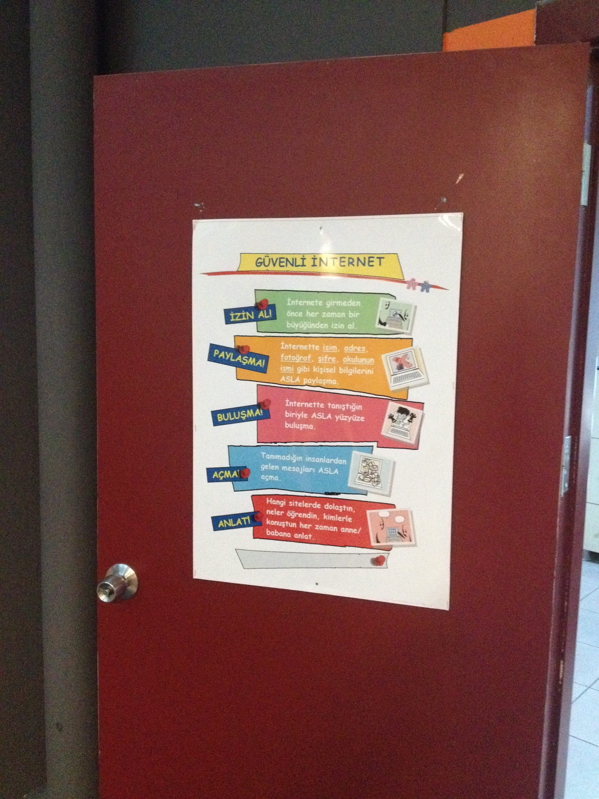
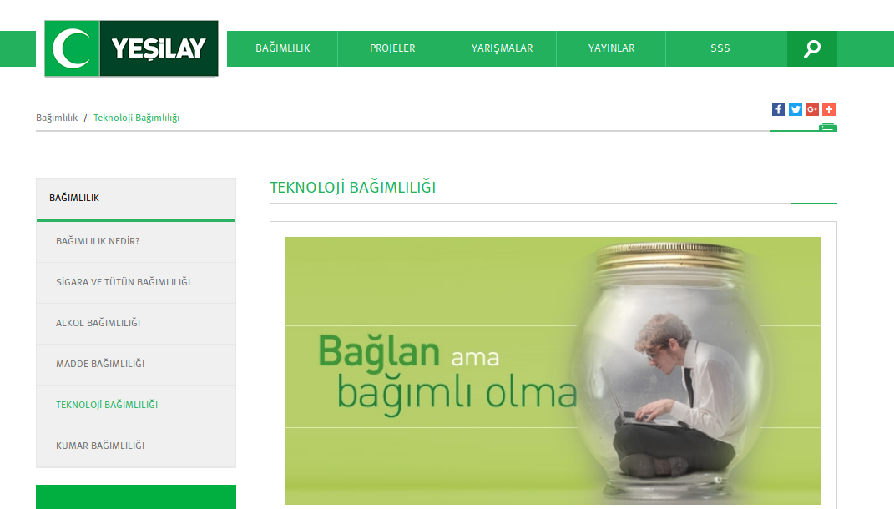
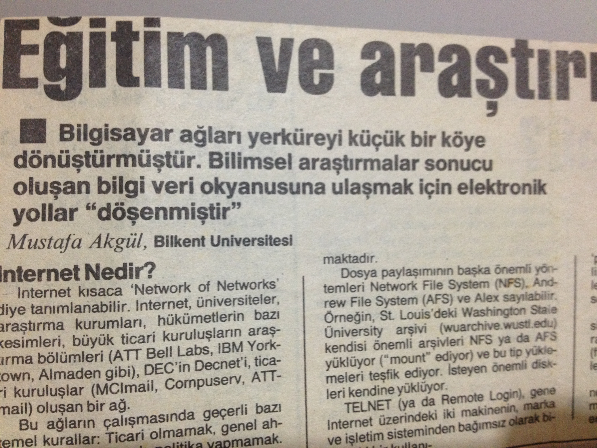
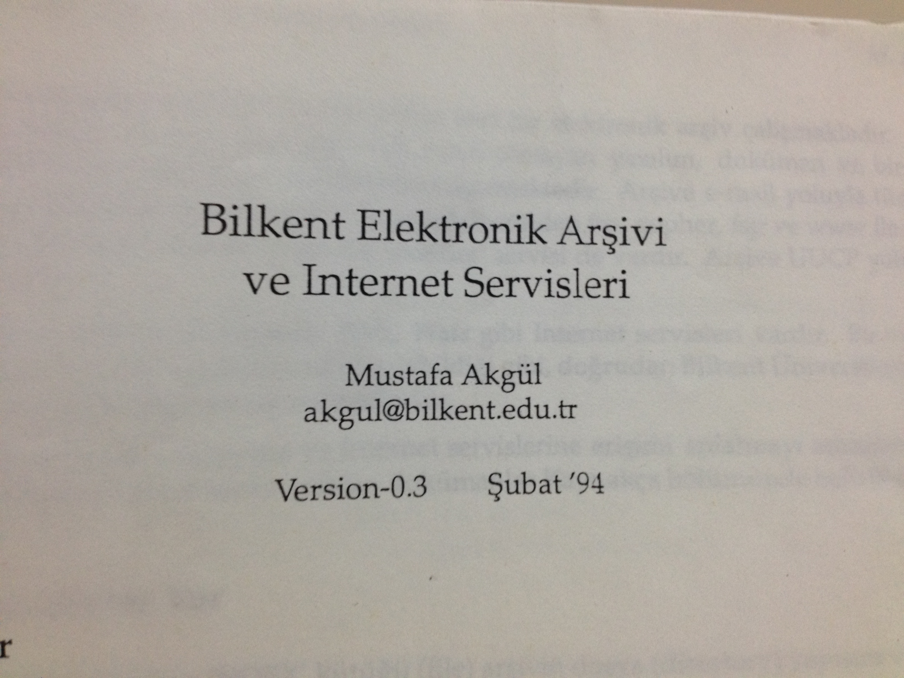

# İnternet ve 25 Yıl

Türkiye’de İnternet bağlantısı ilk olarak 12 Nisan 1993 yılında ODTÜ ve Tübitak’ın birlikte yürüttüğü bir proje ile 
sağlanıyor. Yani İnternet ile tam 25 yıl geçmiş. Ben de bu 25 yılın neredeyse 24 yılına bir Internet kullanıcısı olarak 
şahitlik ettim. İnternet ile ilk tanışmam Eylül-Ekim 1994’e dayanır. ODTÜ’ye geldiğim ilk yıl 1. ve 2. yurtlardaki 
bilgisayar lablarında İnternet’te surf yapmaya başlamıştım. Dolayısı ile Türkiye’deki İnternet kullanıcılarından ilk 
birkaç bini arasındayım diyebilirim.

O yıllar aslında dünyada da İnternet’in hemen hemen emekleme yıllarıydı diyebiliriz. Lablardaki PC’lerde Mosaic ve Netscape 
browser’lar (Mosaic Browser daha sonra ortadan kalktı, Netscape’in ise 1.0 sürümü ile çalıştım :-)) ile İnternet’e bağlanır 
ve elimizde daha önceden bir yerlerden elde ettiğimiz web adreslerine girmeye çalışırdık. Tabi birde UNIX hesaplardan text 
tabanlı çalışan lynx browser’ı da unutmamak lazım. İnternet siteleri sayıca o kadar azdı ki,bazı sitelerde çeşitli konularla 
ilgili web adreslerinin listesi olurdu, yada bu listeleri kağıt kalemle biz kendimiz yapardık. O ilk birkaç yıl içinde web 
sayfaları yapmaya başladığımızda çoğumuzun “my favourite links” şeklinde bu siteleri listelediğimiz bölümleri mutlaka 
olmuştur. Web sitelerini kataloglama fikri şimdi ne kadar saçma gelse de Yahoo’nun bile 1994’deki ilk çıkışında bunun 
olduğunu düşünürsek o zamanlar için bilgiyi indeksleme yaklaşımı hiç de saçma bir fikir sayılmazdı.

Tarayıcıların o zamanki kabiliyetleri de çok sınırlı idi, sitelerinde çoğu metin ve biraz da resim içerikli idi, ses veya 
video hiç yoktu. Hatta tarayıcılar belirli bir büyüklüğün üstündeki resimleri HTML sayfanın içerisinde gömülü biçimde 
açamaz, ayrı bir pencerede açarlardı. O zamanlar Bilkent Üniversitesi’nin sunucusu üzerindeki Cindy Crawford ve Claudia 
Schiffer resimlerini açmak için ne uğraşlar vermişizdir 🙂 Şu anda sadece Youtube üzerinden anlık olarak yayımlanan video 
miktarını düşününce o zamanlar İnternet üzerindeki verinin miktarı bizler için kavranabilir, bir şekilde en azından 
sınırları çizilebilir veya hakim olunabilir geliyordu. Bugün için ne absürd bir düşünce.

Internet’de World Wide Web’in dominantlık kazanmasından evvel Gopher isimli bir protokol vardı. Gopher sunucular İnternet 
üzerindeki dosya ve sayfaları hiyerarşik biçimde listelerlerdi. WWW tarafındaki arama motorlarından önce bu gopher 
sunucuları üzerinde Veronica ile arama da yaptığımızı hatırlıyorum. Gopher’a çoğunlukla UNIX hesaplarımızdan bağlanırdık. 
O zamanlar içeriğin büyük kısmı metin olduğu için bu çok da sorun olmazdı.

O zamanlar ODTÜ’ye başlayan bütün öğrencilere hazırlıktan sonra birinci sınıfa başladıklarında ODTÜ Bilgi İşlem’den bir 
UNIX hesap verilirdi. Narwhal isimli bir sunucuya bağlanırdık. Bu hesapların ismi de o zamanlar narwhal account’u olarak 
bilinirdi. Narwhal daha sonra öğrencilerin erişimine kapanıp, yerine Orca gelmişti. Yurt odamdaki 4. sınıflardan birisinin 
narwhal account’u ile hazırlıktan itibaren UNIX sistemlere bağlanmaya ve İnternet’e erişmeye başlamıştım. Bu arkadaş biraz 
hacker diye tabir edilebilecek birisiydi ve yanılmıyorsam CERN veya buna benzer bilimsel bir organizasyona yetkisiz erişimde
bulunmaya çalıştığı için oralardan da kendisine küçük bir uyarı yazısı gelmişti. O arkadaşın hesabı ile yurt lablarında 
İnternet’e bağlanırken, arada sırada kapıdan içeri Jandarma girecek ve ensemizde bitecek diye tedirgin de olmuyor değildim 🙂

İstanbul Küçükçekmece Lisesi’nden bir arkadaşım da o yıl Karadeniz Teknik Üniversitesi’nde sanırım Bilgisayar Bilimleri 
gibi bir bölümü kazanmıştı. Yaz tatilinde onunla bir araya geldiğimizde bana Tan Deniz Sarıhan’ın Herkes İçin İnternet 
kitabını gösterdi. Sanırım bu Türkiye’deki İnternet ile ilgili ilk kitaplardandır. Hemen Bayezit Meydanı’na gidip bir tane 
de ben edinmiş ve tatil’de baştan sona okuyup, ilginç bulduğum adreslerden notlar almıştım. Ancak kitabın yazarına daha 
sonra e-posta ile bir konu hakkında soru sorduğumda, kendisinden elektronik ortamda soru sorma adabı ile ilgili gayet 
sert ve kırıcı içerikli bir cevap alınca kendisine karşı pek de iyi duygular beslediğimi söyleyemem.

Geçen hafta kızımın okulunda bilişim teknolojileri dersinin öğretmeninin kapısında böyle bir afiş dikkatimi çekti. 
Malesef çocukların gözünde İnternet’i emniyetsiz, tehlikeli ve karanlık bir yer şeklinde gösteren, İnternet’e bağlanırken 
iki kere düşündürten bu tür yaklaşımlar gelecek nesillerin bu dünyanın nimetlerinden, kendilerine sunduğu ve sunacağı 
fırsatlardan yararlanmalarını zorlaştırır, onların zihinlerinde gerçek potansiyellerini açığa çıkarmaları noktasında 
engeller yaratır diye düşünüyorum.

İnternet ve bilgisayarlar benim için ilk andan itibaren bir alışkanlık, tutku halini almıştı. Hazırlık sona erip proficiency 
sınavına girince mecburen İstanbul’a, eve dönmüş ve lablardan uzak kalmıştım. Ancak proficiency sınav sonucunu öğrenme 
bahanesi ile Doğu Expresi’ne atlayıp Ankara’ya gelmeyi planladım. Aslında proficiency’yi rahat rahat geçtiğimden emindim, 
ama asıl niyetim yaz okulu boyunca da açık olan 1. veya 2. yurt labında biraz olsun İnternet’e girip surf yapabilmekti. 
Yanıma bilgisayar, unix ve www siteleri ile ilgili birkaç notumu ve 1.44 inçlik disketimi de alıp trene atladım. Ancak 
Eskişehir yakınlarında bulunduğumuz kompartmanda bir adam arıza(!) çıkardı, bende bundan biraz nasibimi aldım, kaşım açıldı, 
Eskişehir’de tedavimi olduktan sonra otobüs ile Ankara’ya ulaştım, ODTÜye geçtim, yine de birkaç saatliğine yurt labına 
uğradım.Tabi hemen bak İnternet/sosyal medya bağımlılığı ne kötü birşey, adamın başına böyle işler açıyor, o yüzden de 
Yeşilay bünyesinde içki, sigara, uyuşturucu ile mücadelenin yanında birde sosyal medya bağımlılığına karşıda bizi uyarıyorlar, 
ne de güzel yapıyorlar demeyelim lütfen. Malesef İnternet’i veya teknolojiyi özü itibari ile kötü olan şeylerle aynı cümle 
içinde anmak malesef vahim bir durum. Umarım bu sakat yaklaşımdan bir an evvel uzaklaşılır.

İnternet ile geçen bu 25 yılda paylaşılacak daha ne çok anı ve hikaye vardır. İlk arama motorları, dial up bağlantılar, 
web siteleri oluşturmalar vs. Benim için 94-95’de İnternet’li ilk yıllar işte böyleydi. Artık yapay zeka, artırılmış 
gerçeklik vs konuları, her yerden, her türlü cihaz ile bağlanabilme ve ucu bucağı olmayan bir depolama ve veri işleme 
kapasitesi ile çok farklı dünyalara yelken açıyoruz.

|   |  |
|---|---|

Bütün bu 25 yıl içerisinde Türkiye genelinde İnternet ile özdeşleşen pek çok isim olmuştur. Ancak ben bunlardan kısa zaman 
önce vefat eden Mustafa Akgül hoca’yı anmadan geçemeyeceğim. Akgül hoca, Türkiye’de İnternet’in kullanıma geçmesine öncülük 
etmiş kişlerden birisiydi, İnternet’in yaygınlaşması ve özgürce kullanılabilmesi için de kendi çapında elinden geldiği 
kadar üretmeye çalıştı. Gazetelerde, dergilerde yazdı, dokümanlar, kılavuzlar hazırladı, konferanslar, etkinlikler düzenledi. 
Arı gibi çalışkan bir insandı. Gördüğüm kadarı ile oldukça da mütevazi biriydi. Kendisini rahmetle ve saygı ile anıyorum, 
umarım bizlerde en az onun kadar Türkiye’deki bilişim ve İnternet dünyasına katkıda bulunabiliriz.

Bir sonraki 25. yılda da görüşmek dileğiyle...
