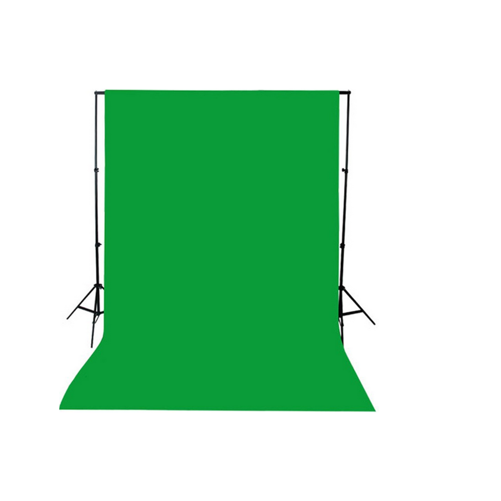
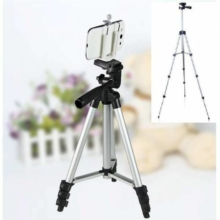
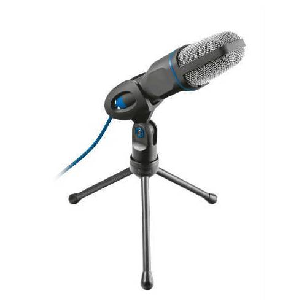
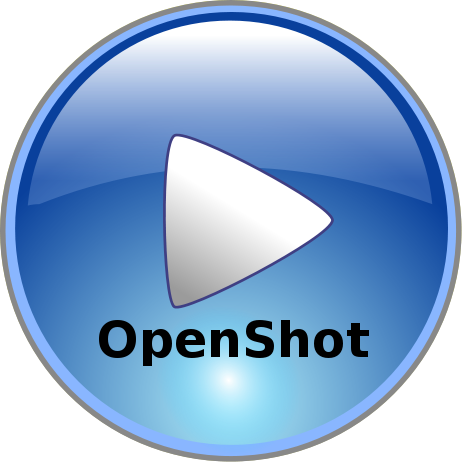

# Online Eğitim Hazırlama Tecrübeleri

Bu blog yazımda size online eğitim hazırlama tecrübelerimden bahsedeceğim. Yaklaşık 3.5 ay önce Udemy’de yayınlanmak 
üzere bir online eğitim hazırlama işine giriştim. Bu hafta itibari ile [Spring Boot 2.0 ile Dinamik Web Uygulamaları](http://www.udemy.com/spring-boot-egitimi) 
isimli eğitimimiz Udemy platformundan yayına girmiş bulunuyor.

Nasıl bir ortam kurdum, eğitim içeriklerini nasıl hazırladım, kayıtları nasıl gerçekleştirdim, Udemy tarafındaki süreç 
nasıl yürüdü hepsini bu yazımda anlatmayı planlıyorum.

Uzun yıllardır [Harezmi Bilişim Çözümleri](http://www.harezmi.com.tr/) bünyesinde Kurumsal Java Teknolojileri ile ilgili 
[sınıf eğitimleri](http://www.java-egitimleri.com/) düzenliyoruz. Bu konuda önemli bir tecrübemiz olduğunu rahatlıkla 
söyleyebilirim. Bütün bu yıllar boyunca elimizde belirli bir olgunluğa ulaşmış eğitim materyalleri de mevcut. Bizde bütün 
bu klasik eğitim deneyiminden elde ettiğimiz çıktıyı, birde Udemy üzerinden online eğitimler şeklinde sunalım diyerek işe 
koyulduk. Burada eğitimlere online eğitim tabirini kullanıyorum, ama bu eğitimler sınıf eğitimleri gibi eğitmen ve
katılımcıların senkron biçimde bir araya geldikleri şekilde olmuyor. Katılımcılar tamamen kendi zaman planlarına göre 
sistemden eğitim içeriğine erişip, bunların üzerinde çalışabiliyorlar. Aslında bu eğitimlere web platformundan sunulan 
asenkron eğitimler diyebiliriz, ama online eğitim demek de sanırım ana fikri anlatmak açısından yeterli, kısa ve öz gibi 
duruyor.

Doğal olarak online eğitimler, fiziksel ortamda, katılımcılarla yüz yüze gerçekleştirilen eğitimlerden daha farklı 
özelliklere sahip olmak durumundalar. Sınıf eğitimlerinde ortamda bir yazı tahtası kullanma imkanı sayesinde herhangi bir 
kompleks konuyu çok daha esnek ve farklı açılardan açıklama, izah etme imkanımız var. Online eğitimlerde ise bu araçlar 
daha çok slide’lar ve development ortamı ile sınırlı kalmış oluyor. Diğer bir farklı nokta ise katılımcılarla kurulan o 
andaki anlık etkileşime  ve ortam atmosferine göre anlatılan konularda değinilen noktaların derinliğinin dinamik olarak 
ayarlanabilmesi de mümkün. Online eğitimde ise eğitim kullanıcılara asenkron biçimde sunulduğu için eğitimdeki konu 
anlatımlarını ve derinliği sürekli olarak sabit bir düzeyde tutma durumu ortaya çıkıyor. Sınıf eğitiminde eğitmenin 
fiziksel aktivasyonu ve etkileşimini online ortamda mümkün olduğunca araçlar üzerinden sağlamaya çalışmak gerekiyor. 
Örneğin, bir kod parçacığındaki bölümleri detaylandırmak sınıf eğitiminde eğitmenin fiziksel anlatışı ile oldukça kolay 
gerçekleşmesine rağmen, online ortamda bu kod parçacığı ile ilgili bölümlemeleri, sözel anlatımları, görsel destekleri 
hazırlamak için etraflıca bir ön çalışma gerekiyor. Tabi bütün bu farklılıklarda sınıf eğitimlerinde kullanılan materyali 
olduğu gibi birebir online ortama taşıyarak sunmayı imkansız kılıyor.

Paylaşımıma online eğitimleri kaydetmek için nasıl bir ortam oluşturduğumuzu anlatarak devam etmek istiyorum.

Eğitim içeriğini kaydetmek ve daha sonrasında üzerinde değişiklikler yapabilmek için birkaç aracı ve programı temin etmek 
ve kurmak gerekti. Bunlardan birisi chroma key perdesi idi. Çektiğimiz eğitim videolarında eğitmenin görüntüsünün yer 
almasını istediğimiz vakit, video’da eğitmen görüntüsünün dışında arka planda istenmeyen, çekimi amatör göstrebilecek her 
türlü gereksiz detayın ortadan kalkması önemlidir. Her ne kadar çekim için arkanızı beyaz bir duvara verip, duvar ve 
eğitmen dışında bir görüntü olmasa bile, eğitmen ile duvar arasındaki derinlik ve gölgeler bile videonuzun amatörce 
görünmesine yetecektir. Chroma key perde sayesinde görüntü kaydetme programları kolaylıkla arka planı transparan 
yapabiliyorlar. Böylece video’da sadece eğitmenin görüntüsünden başka arka planla ilgili istenmeyen hiçbir detay da yer 
almamış oluyor.  Ayrıca transparan bu bölümlerin altında kalan yazı, grafik gibi kısımlarda arka plan transparan olduğu 
için rahatlıkla okunur kalıyor.

Video kayıt programı olarak açık kaynak kodlu OBS uygulamasını tercih ettik. OBS gerçekten profesyonel ayarda ve pek çok 
farklı senaryoyu destekleyecek kabiliyette bir screencasting aracı. Benden tam puan aldı diyebilirim. OBS ile farklı 
“scene” ler tanımlayıp, herbirisine de birden fazla farklı türde “source” ekleyebiliyorsunuz. Bu source’lar bir kamera 
görüntüsü, bilgisayarınızdaki bir pencere, yada bir imaj veya daha önce çekilmiş başka bir video olabilir. Bu source’ların 
üzerine, türlerine göre farklı farklı filter’lar tanımlayabiliyorsunuz. Bu filter’lar sayesinde görüntü ve ses üzerinde 
istediğiniz oynamayı ve iyileştirmeyi yapmanız mümkün.

OBS üzerinden optimum görüntü ve ses elde etmek için kullandığımız bazı ayarları ve değerleri burada paylaşmak istiyorum.

Settings>Output>Recording bölümünde

Recording Format: mp4
Encoder: x264
Rescale output: off
Rate Control: CRF,0,0,ultrafast,None,None

Settings>Audio bölümünde

Sample Rate: 44.1 khz
Desktop Audio Device: <varsa sisteminizdeki gömülü mikrofon>
Mic/Auxiliary Audio Device: <varsa sisteminize bağlı harici mikrofon>

Settings>Video bölümünde

Base (Canvas) Resolution: 1920×1080
Output (Scaled) Resolution: 1920×1080
Downscale Filter: Lanczos
Common FPS Values: 30

Video Capture Device Source üzerinde eklenen filter’lar

Chroma Key
Key Color Type: Green

Scaling/Aspect Ratio
Scale Filtering: Bicubic
Resolution: 1920×1080

Mic/aux source üzerindeki filter’lar

Noise Suppression
Suppression Level: -30 dB

Gain
Gain: 10,20 dB

Ayrıca Settings>Hotkeys bölümünden start/stop recording ve scene switch’leri için hotkey tanımlamak da çekimler sırasında 
kullanımı oldukça pratik hale getiriyor.

Kamera olarak laptop üzerindeki built-in HD kamerayı kullandım. Ancak harici bir kamera veya webcam kullanacaksanız, yada
cep telefonunuzu kamera olarak bilgisayarınıza bağlayacaksanız bir tripod’a ihtiyacınız olacak. Bu noktada çekim sırasında 
baş hizanıza gelecek bir tripod yüksekliği sizin için ideal olacaktır. Ben çekimler sırasında bir ara android cep telefonunu 
webcam olarak kullanmaya niyetlendiğim için bir tripod almış bulundum. Bu arada android cep telefonunu webcam olarak 
bilgisayara tanıtmak için droidcam uygulamasını cep telefonunuza ve bilgisayarınıza kurmanız, ayrıca cep telefonunuz 
üzerinde de  usb üzerinden kamera olarak erişime izin vermek için “usb debugging” özelliğini açmanız gerekiyor. Beni cep 
telefonunu webcam olarak kullanmaktan uzaklaştıran bir diğer nokta ise kameranın çekim sırasında belirli bir süre sonra 
kendiliğinden kapanması oldu. Muhtemelen bu cep telefonunun inaktif kalması ile ilgili idi ve cep telefonu üzerinden bir 
ayar ile çözülebilirdi, ancak laptop üzerindeki built-in kameranın HD olduğunu gördükten sonra onu kullanmak daha pratik 
ve kolay geldi.

Mikrofon olarak USB üzerinden bağlanan Trust 20378 modelini tercih ettim. Ses kalitesi gayet güzel. Yalnız Linux üzerinden 
çalıştırırken biraz zorlandım. Bunun nedeni benim harici mikrofonların, mikrofon ve kulaklık girişi combo olan dizüstü 
bilgisayar ve Linux (Mint) üzerinde kullanılması ile ilgili deneyim eksikliğim diyebiliriz. Eğer bilgisayarınızdaki audio 
jack combo ise, yani hem kulaklık hem de mikrofon girişi birlikte ise, bu durumda Trust mikrofonu jack üzerinden değil, 
kendi USB aparatı ile bilgisayara bağlamanız gerekiyor. İkinci problem noktası ise Linux içerisindeki audio/volume control 
panelinde sistemdeki bütün mikrofonlar görüntüleniyor ve burada Trust mikrofon sisteme “CM 108 Audio Controller Analog Mono” 
isimli bir device olarak dahil edilmiş vaziyette. Bunu volume control’de aktif bırakmamız gerekiyor. Yine OBS üzerinde de 
Settings>Audio bölümünde Mic/Auxiliary Device seçeneğinde de bu şekilde seçili olmalı.

Eğitim içeriği slide ve lab çalışmalarından oluşmuştu. Lab çalışmalarını virtualbox üzerinden çalışan bir Windows 8 guest 
işletim sisteminde kurulu geliştirme ortamında gerçekleştirip sessiz biçimde OBS ile kaydettim. Daha sonra da bu video’ları 
OBS üzerinden “video source” olarak tekrar oynatarak üzerine sesli okuma yaptım. Böylece lab çalışmalarının anlatımı çok 
daha akıcı oldu. Ayrıca lab çalışmalarını çekim öncesi baştan sona implement edip, adımları notlandırdım, çekimler sırasında 
da bu adımları takip ettim. Böylece lab çalışmalarında beklenmedik hatalar, örnekler arasında birebirleri ile uyumsuz, 
tutarsız konfigürasyon veya implementasyonlar ortaya çıkmamış oldu. Slide’ları oluşturmak için ise LibreOffice Impress’u 
kullandım. Slide’ları oluştururken dikkat etmeyip, daha sonra slide’ların teker teker üzerinden geçmemi gerektiren bir 
husus paper formatını Slide>Page/Slide Properties>Slide PaperFormat bölümünden  “Screen 16:9” şeklinde seçmeyi unutmam 
oldu. Default Screen 4:3 oranında oluşturduğum slide’ları 1920×1080 çözünürlüğünde kaydettiğim vakit video’unun sağında 
ve solunda siyah şeritler ortaya çıkınca bu hatamın farkına vardım. Allah’tan page formatı 16:9 olacak biçimde değiştirdiğimde 
slide’ların içeriğinde çok büyük kaymalar olmadı, birkaç slide’da meydana gelen format problemlerini düzelterek bu sorunu 
aşmış oldum.

OBS ile çekilen video’ları ham video’lar olarak tanımlayabiliriz. Çünkü bu video’ların başında veya sonunda istemediğimiz 
kısımlar olabiliyor, yada slide’ları anlatırken hatalar oluyor ve belirli bölümleri tekrar anlatıyoruz veya daha sonra 
birleştirmek ve tek bir ders yapmak için birkaç ayrı video çekebiliyoruz. Bütün bu ham video’ları işlemek ve yayına hazır 
hale getirmek için yine açık kaynak kodlu OpenShot video edit programından yararlandım. Amacınız video içerisindeki bazı 
bölümleri kesmek, video’ları birleştirmek, video’ların başına sonuna imajlar koymak, arka plana ses iliştirmek gibi şeyler 
ise OpenShot bunları gayet başarılı biçimde yapmamıza imkan veriyor. Video edit sonunda da video’muzu farklı formatlarda 
export edebiliyoruz.

Export işlemi için benim kullandığım ve OBS’deki çekim kalitesine yakın çıktı aldığım OpenShot ayarları şöyle:

Profile
Width: 1920
Height: 1080
Aspect Ratio: 16:9
Frame Rate: 30.00
Pixel Ratio: 1:1
Progressive: Yes

Export alırken de açılan dialogda Target olarak MP4 (h.264) , Quality olarak da High seçeneklerini seçtiğimizde gayet 
kaliteli ve sıkıştırılmış bir mp4 çıktısı elde edebildim.

Slide üzerinde konuşurken yapılan çekimde konuşmanın akıcılığını sağlamak için bir prompter kullanmayı düşündüm. Bunun 
için Internet’te bir arama yaptığımda karşıma [TeleKast](http://telekast.sourceforge.net/) isimli browser üzerinden çalışan 
bir teleprompter uygulaması çıktı. Bence oldukça başarılı açık kaynak kodlu bir uygulama. Text editörde metni hazırlıyorsunuz 
ve teleprompter ile yükleyip oynatmaya başlıyorsunuz. Metnin akışını hızlandırmanız veya yavaşlatmanız, durdurmanız, font 
büyüklüğünü artırmanız veya azaltmanız mümkün. Teleprompter penceresinin büyüklüğünü ve pozisyonunu da ayarlayabiliyorsunuz. 
Bütün bunlar iyiydi ama deneme çekimleri sırasında slide’ları oynatırken bir yandan da teleprompter’dan akan bir metni 
takip etmek, iki tarafı senkronize götürmek hiç kolay değildi. Ayrıca slide’lar ile bu metin arasında bir ilişkilendirme 
yapılması ve iki tarafın birbiri ile uyumlu ve güncel tutulması gerekiyordu. Bu durumda arayışımı slide’ların kendi 
içindeki notlar bölümüne kaydırdım. Her bir slide gösterimi sırasında okuyacağım metni o slide’a ait notes bölümüne yazdım 
ve slide içerisinde animasyonları tetikleme anlarını da yine bu notların arasında kendimce belirlediğim bir karakter dizisi 
ile işaretledim. Slide Show’a geçtiğimde LibreOffice, dual screen ile çalıştığım için sorunsuz biçimde bir ekranda slide 
show’u oynattı, diğer ekranda da hem o slide’ın ufak halini, yanında da not bölümünü gösterdi. Notes kısmında metin 
üzerine uygulanan herhangi bir text formatının ekranda göz ardı edilmesi, satır aralıklarının dikkate alınmaması LibreOffice 
tarafı için sorunlu noktalar olsa da, bunlar bir showstopper değildi.

Çekimlerin tamamlanması ile birlikte eğitimin Udemy üzerinden yayınlanması aşamasına geçtik. Aslında herhangi bir eğitim i
çeriğini hazırlamaya başlamadan evvel bu eğitimi yayınlayacağınız online platforma girip eğitim içeriğini hazırlarken 
dikkat etmeniz veye uymanız gereken kurallar ve ayarları, oluşturacağınız eğitimin sahip olması gereken yapıyı vs. etraflıca
incelemeniz çok çok önemli. Bende aslında sürece bu şekilde başladım ve Udemy’de yayınlanan eğitimlerin yapısını vs öğrendikten 
sonra eğitim içeriğini oluşturmaya ve ardından da çekimlere giriştim. Çekimlere başlamadan evvel kayıt ortamında oluşturduğunuz 
test videolarını da kalite kontrol için sisteme upload etmeniz gerekli.

Eğitim içeriği bölümlerden, her bir bölüm de derslerden oluşuyor. Ayrıca her bir derse yardımcı kaynak ve harici linkler 
vs de ekleyebiliyorsunuz. Eğitime ait bir kapak resmi ve tanıtım/promosyon videosu da hazırlamanız gerekiyor. Kapak resminde 
logolar haricinde metin kullanmanız istenmiyor, çünkü kapak sayfasında salt görsel elemanlar barındıran, metin içermeyen 
eğitimlerin %10 daha fazla satış yaptığı tespit edilmiş. %10 bizim için çok büyük bir oran gibi durmasa da Udemy gibi 
devasa bir platform için çok büyük bir oran olduğu kesin.

Udemy’de eğitim yayınlamak için öncelikle bir eğitmen profili oluşturmanız ve bunu verify etmeniz gerekiyor. Doğrulama 
süreci eğitimi oluşturup, içeriğini upload ettikten sonra da yapılabiliyor, ancak eğitimi bu aşamadan evvel yayınlamanız 
mümkün değil. Son olarak da eğitim içeriğini tam olarak oluşturduğunuzu düşünüyorsanız, ön izleme sürecini başlatıyorsunuz. 
Bu süreçte eğitim içeriği ile ilgili Udemy content ekibinden herhangi bir olumsuz geri dönüş olmaz ise eğitiminiz artık 
yayına giriyor.

Online eğitim hazırlama ve yayınlama süreci ile ilgili daha pek çok nokta ve detay üzerinde konuşulabilir, ancak sanırım 
bu başlıklar bu süreç içerisindeki en temel adımlar ve sürecin de büyük bir bölümünü çevreliyorlar. Online eğitim hazırlamak 
isteyenler için umarım buradaki tespitler işe yarar. En azından ileride yeni eğitimler hazırlarken benim işime yarayacağı kesin 🙂
