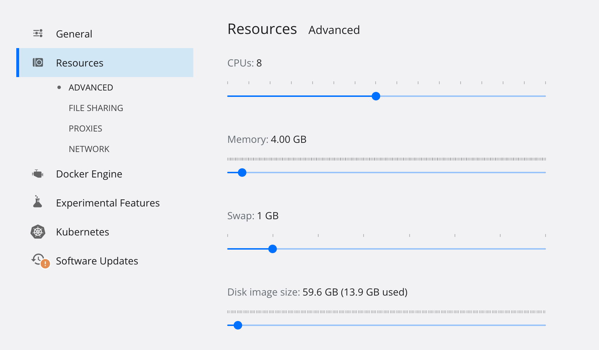

# Tips for Elasticsearch bootstrap failures from Docker

There might be several reasons for elastic search failures during the bootstrap process from the docker container. You 
might get incredibly frustrated in case you don’t have any clue about what is going on. It was such a case for me recently. 
In case you face such clueless failures one of the parts you should check is the resource settings of your docker desktop 
preferences. In my case, the memory upper limit was set to 2GB, which was insufficient for Elasticsearch to bootstrap as 
a docker container. Increasing the memory limit made the trick



Aside from this error, I noticed another error during my trial and error process which is caused by missing environment 
variable discovery.type.

```error
the default discovery settings are unsuitable for production use; at least one of
[discovery.seed_hosts, discovery.seed_providers, cluster.initial_master_nodes] must be configured
```

It should be set as single-node within the docker-compose file if you are starting your container via it, or given as an 
environment variable parameter if you are running the container via docker run.

```yaml
elasticsearch:
    image: docker.elastic.co/elasticsearch/elasticsearch:7.8.1
    container_name: elasticsearch
    environment:
        - xpack.security.enabled=false
        - discovery.type=single-node
```